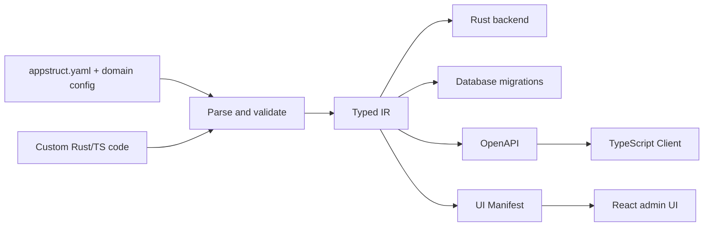

# AppStruct Product Requirements

> Status: Implementation Baseline v1.3<br>
> Date: 2026-08-30<br>
> Product type: configuration-driven Rust full-stack application generation framework<br>
> Document scope: product positioning, user experience, feature boundaries, MVP, and acceptance criteria

This is the product baseline, not a getting-started guide. To build an application, start with the
[overview](README.md).

## 0. Current Implementation Baseline

As of 2026-08-30, the repository has completed M0 through M6, and after M1 it completed a modular refactor of the generator and compiler:

| Milestone | Status | Frozen capabilities |
| --- | --- | --- |
| M0 | Complete | Multi-file YAML, location-aware diagnostics, normalized Typed IR, canonical golden tests, and compilation of a minimal generated artifact |
| M1 | Complete | PostgreSQL schema, SeaORM/Axum CRUD, OpenAPI, TypeScript client, React lists and forms |
| Refactor | Complete | Compiler and Backend Generator split by responsibility; tests cap Rust source files at 400 lines |
| M2 | Complete | Defaults, unique/enum/numeric validation, relations and inverse relations, pagination/filter/search/sort, detail pages, RelationSelect, and schema-diff risk blocking |
| M3 | Complete | Value Object, Hook, Command, Query, Policy, Rust/React registries, SHA-256 ownership manifest, and safe directory swap |
| Consistency hardening | Complete | Explicit write transactions, in-transaction Hook connections, final-state Policy, revision/ETag optimistic concurrency, and conflict-recovery UI |
| M4 | Complete | Email/password auth, opaque sessions, CSRF/Origin checks, password reset, RBAC/owner scope, auth UI, and OpenAPI security contracts |
| Migration Runner | Complete | apply/status, database history, checksums, transaction boundaries, dirty-state blocking, and PostgreSQL schema drift detection |
| Generator Transaction | Complete | Cross-process project lock, append-only recovery journal, crash recovery for directory swap, and protection against ambiguous states |
| M5 Templates | Complete | `appstruct new`, `minimal/dashboard`, pinned Rust/Node dependencies, and a one-shot project skeleton that never overwrites |
| M5 Build/Doctor | Complete | Toolchain and database-mode diagnostics, JSON reports, and production build gates on locked Rust/TypeScript dependencies |
| M5 Dev Server | Complete | managed/external PostgreSQL coordination, configurable migration strategy, generate and build, aggregated API/Vite logs, watch-and-reload, and Ctrl-C cleanup |
| M5 Docs | Complete | Source/archive install, first-run for external/managed, transactional upgrades, and production build/migrate/config/rollback docs |
| M5 Quality Gates | Complete | Cross-directory byte-level determinism, 10/100-entity performance budgets, PostgreSQL + Chromium user journeys, desktop/mobile layout, readiness/request ID |
| M6 Modules | Complete | Tenant, Audit, Mail, Jobs/Outbox, and local/S3 File capabilities, with independent PostgreSQL acceptance |
| M6 Preset | Complete | `appstruct/saas@1` expansion, overlay diffs, digest/module lock checks, and a show CLI |
| M6 Template | Complete | One-shot `saas` skeleton, canonical `examples/saas-demo`, and PostgreSQL/Chromium end-to-end journeys |
| TP contract hardening | Complete | Draft 2020-12 App Spec Schema, warning diagnostics, `check --deny-warnings`, and project-free schema export |
| TP upgrade transaction | Complete | Full generate/build/test in a staging workspace, source-file concurrency detection, and joint lock/generated journal commit and recovery |
| TP release readiness | Complete | crates.io metadata and local package verification, macOS/Linux tag builds, archives, and SHA-256 |
| Runtime/Module boundary | Complete | Standalone `appstruct-runtime` and `appstruct-module-sdk`, official capability graph, generated server composition root |
| Internal contract hardening | Complete | Runtime/Module versions, IR v7-v11 compatibility migrations, isolated local-manifest Artifacts, incremental cache, layout v1/v2, and crash-recovery injection tests |

M2 `migrate plan` remains a read-only diff preview. `migrate dev --accept` accepts only `NonDestructive + Online` changes and commits the migration draft and schema snapshot as staging files. Migration Runner now tracks execution state across on-disk migrations, the snapshot, and the target database: when `DATABASE_URL` is set, dev continues to apply; otherwise migrations stay pending. `migrate apply/status` neither generate nor modify files from the Spec.

M3 pins user implementations to the `app/` boundary. Generated directories store only repeatable contracts and runtime. On the Rust side, a single aggregate object that implements every required Command/Query handler trait completes typed registration; missing any trait fails compilation. Entity Hook and Policy are optional registrations with safe default implementations. Policy also provides a collection-level `can_list` check and per-record read/write checks. On the React side, generated field components and custom pages require registry keys. When references exist, the generated entry imports implementations from user-owned `app/web/registry.tsx` and checks completeness at build time with TypeScript `satisfies`. Real PostgreSQL acceptance already covers input Hooks, an archive Command, a metrics Query, and a Policy that rejects deletes.

CRUD write paths already run inside an explicit SeaORM transaction: `before_create/update/delete`, the primary record write, and `after_create/update/delete` share the transaction connection. Failure at any step aborts the transaction. `after_commit` runs best-effort on a normal connection after commit; failures are logged only. Update Policy sees the old record, the typed patch, and the final candidate record at the same time. The framework manages `revision bigint not null default 1` on every entity. Detail/create/update responses return ETag. Updates and deletes require `If-Match`. A stale revision returns 412. The generated client maintains ETag automatically. On form conflict, user input is kept and reload is allowed.

M4 has folded `modules.auth` and `modules.rbac` into Surface, Typed IR, Compiler validation, and every generator. Auth-enabled apps generate register, login, logout, current-user, and optional password-reset flows. They use Argon2id password hashing, opaque session/reset tokens stored as hashes only, an `HttpOnly` session Cookie, CSRF tokens, and Origin checks. After registration, the app issues a one-time email verification token valid for 24 hours. Auth responses expose `email_verified`. Logged-in users can request a resend. The confirm endpoint marks `email_verified_at` and consumes the token in a transaction. Optional `modules.auth.oauth: true` publishes OIDC authorization-code login. The provider is configured with environment variables. A short-lived state cookie prevents replay. Local users are bound by provider+subject, and provider tokens are not persisted. Authenticated users can also create personal API tokens with a name and optional expiry. Runtime stores only the SHA-256 hash, supports Bearer auth, records last-used time, and returns the plaintext once. Actor is injected into both ordinary and in-transaction `RequestContext`. `public/authenticated/role/owner/any/all` rules execute on the backend. List and read-by-id convert owner/RBAC into SeaORM query conditions. React artifacts include auth state, login/register/password-reset/email-confirm pages, OIDC SSO, an API token management page, route guards, and a logout entry. The TypeScript client sends Cookie by default and CSRF automatically. OpenAPI publishes Cookie/Bearer security schemes and the enabled Auth endpoints.

M4 has been accepted against an isolated local PostgreSQL database. Coverage includes anonymous 401, register and Cookie, CSRF 403, owner data isolation, admin cross-owner access, member delete 403, ETag `rev-1/rev-2`, 428 when `If-Match` is missing, 412 on a stale revision, single-use password-reset tokens, revocation of old sessions, and login with the new password. The acceptance database was reclaimed after the tests.

Migration Runner uses `_appstruct_migrations` to store migration ID, file SHA-256, `applying/applied/failed` status, and timestamps. A session advisory lock prevents concurrent apply against the same database. Migrations share a transaction with history writes by default. Reviewed migrations marked `-- appstruct:transaction=off` run outside a transaction. Failure leaves dirty history and requires manual recovery. Every latest migration produced by `migrate dev` is bound to a schema snapshot checksum. apply/status refuse to continue when an already-applied file has been modified, history is missing/out of order, or the snapshot does not match. After all migrations complete, status checks business tables, column type/null/default/identity, primary/unique keys, enum CHECK, and foreign keys against the PostgreSQL catalog. When pending migrations exist, drift judgment is deferred so a not-yet-applied target schema is not reported as drift.

The ownership manifest records path, category, and SHA-256 for every Artifact. Regeneration first acquires a cross-process exclusive lock on `.appstruct/generation.lock`, then rejects unknown files and generated files whose hash has changed. After a complete staging tree passes manifest checks, the CLI appends to `.appstruct/generation.journal` and persists `prepared/backed_up/installed` phases, then swaps sibling staging/backup directories. The next generate, while holding the lock, commits or rolls back from the journal and the actual combination of the three directories. Legacy directories without a journal can still be recovered. Ambiguous combinations leave the scene intact and fail. `app/` is not part of this transaction.

When inputs have not changed, the generation cache validates inputs, the CLI executable, the ownership manifest, and the full generated tree hash before recompiling. A hit skips Compiler, Codegen, Prettier, and the directory transaction. The dev backend build cache covers generated backend/server and user `app/backend` Rust inputs. The Web install cache covers package/lock and `.pnpm` install state. Deleting the cache allows a full rebuild and cannot bypass ownership or unknown-file checks. Transaction tests can inject failure at the backed-up and installed phases to verify rollback of the old tree and completion of the new tree.

`appstruct new <name> --template minimal|dashboard|saas` already provides one-shot project creation that never overwrites. `minimal` generates a public Note app for external PostgreSQL. `dashboard` generates managed PostgreSQL Compose, Auth/RBAC/owner, and a three-entity User/Project/Task project-management app. `saas` locks `appstruct/saas@1` and generates a Tenant/Audit Project/Task skeleton plus Mail/Jobs/File development configuration. All three templates commit `appstruct.lock` with `project_layout_version = 2`, `rust-toolchain.toml`, `.env.example`, and local-state ignore rules. The first generate then produces a pinned `pnpm-lock.yaml`. Creation aborts if the target or a sibling staging directory already exists. Layout v1 runs the generated backend directly. v2 uses a server composition root. Ordinary build/dev select by the lock protocol only. An unversioned lock is migrated once by an explicit update.

`appstruct doctor --format text|json` checks Rust 1.98/Cargo, rustfmt, Clippy, the pinned pnpm version, and the database development mode. Managed mode validates the Compose file and Docker/Compose services. External mode reads `DATABASE_URL` from the process environment or `.env` and runs migration status. Connection strings are never exposed in output. `appstruct build` first generates canonical Artifacts, then runs fmt, release Clippy, and release build against the pinned Rust dependency lock, and Prettier check, TypeScript check, and Vite build against the pnpm lock. Generated TypeScript is formatted by the lockfile-pinned Prettier before the manifest hash is computed, so `generate --check` and build use the same bytes.

`appstruct dev [--api-port <port>] [--web-port <port>]` already coordinates the full development loop. External mode reads and connects to `DATABASE_URL` from the process environment or `.env`. Managed mode starts only the Compose `postgres` service and, on exit, stops only the service started by this session. Named volumes are kept. `database.dev.migration` supports `auto/prompt/never/unmanaged`. Managed defaults to prompt; external defaults to unmanaged. unmanaged skips AppStruct migration plan/status/apply entirely. never performs a read-only check and blocks reload on inconsistency. After the migration strategy passes, the CLI generates, builds the backend, and frozen-installs Web dependencies. The CLI watches App Spec, lockfile, `spec/`, `modules/`, and `app/backend/`, and aggregates logs as `[api]`/`[web]`. Unix child processes use a separate process group. Reload or Ctrl-C terminates the full process tree. Production backend startup never runs migrations. A separate release job runs status/apply.

M5 delivery docs cover source and verified-binary install, first-run for external/managed PostgreSQL, transactional `appstruct update`, production Artifacts, runtime variables, migration order, health verification, and rollback boundaries. Database down migrations are still unimplemented. Database risk after an upgrade continues to be controlled by explicit `migrate plan/status` and human review.

M5 quality gates are frozen. Complete `generated/` trees of two independent projects are compared byte-for-byte. Backend Entity/API Artifacts are planned in parallel by available CPUs, then given a final unified sort. Measured times are 70 ms IR compile for 10 entities, 518 ms compile-plus-generate, and 7774 ms compile-plus-generate for 100 entities, all under the 500/1000/10000 ms budgets. Playwright 1.62.1 is pinned by the root pnpm lock. External PostgreSQL 17.10 E2E starts from the dashboard Template and covers liveness/readiness, `X-Request-Id` generation and passthrough, registration, owner Project create and edit, logout/re-login, and data retention. Screenshots at 1440x900 dashboard and 390x844 login have no overlap or horizontal overflow. SIGINT during a cold start also verified that Cargo child processes, temporary projects, and ports are all reclaimed.

The M6 SaaS Template gate creates a real `saas` project from the CLI and switches it to a dedicated external PostgreSQL. It verifies Preset lock, the five module tables, migrations, generated Web TypeScript, registration, organization selection, Project/Task writes, Audit events, and empty cross-tenant results. Playwright screenshots the 1440x900 Audit page and the 390x844 Project page. Mobile tables stay inside the viewport and use local horizontal scroll. `examples/saas-demo` is compared byte-for-byte with the CLI template to prevent example drift.

The 2026-08-30 operations hardening completed production semantics for interval-only Schedule, signed Webhook, and Realtime. Schedule accepts only fixed-interval expressions. After process downtime it fires once and skips backlog. Definitions removed from the Spec are disabled at startup. The Webhook worker uses configurable connect/read/total timeouts and provides Admin delivery retry/replay. Realtime trims events by resource/record Policy, fans out across instances through a short-lived PostgreSQL event table, redacts generated CRUD payloads for the browser, and provides database TTL presence plus an optional exclusive edit lease. Saved views are still private named browser state. URLs share only a query snapshot, not a server-side team view.

Entities support ordered composite indexes and partial indexes with a `where` predicate. Indexes enter IR, the schema snapshot, and initial migration SQL, and migration status checks them for drift. Adding an index to an existing table is marked as potentially locking. Deleting or changing an index does not auto-generate destructive SQL.

Entities may declare seed data with stable names. Seeds enter IR and the schema snapshot. Initial/development migrations generate idempotent inserts. Missing primary keys, required fields, or type mismatches fail at compile time. Deleting an existing seed or changing its contents requires human review.

`appstruct migrate lint` emits stable risk codes and action advice for a migration plan. Coverage includes destructive changes, constraints/indexes that may lock a table, non-null columns without defaults, and SQL that must be reviewed by a human. JSON output and `--deny-warnings` are supported for CI.

Every generated resource provides bulk update/delete interfaces with per-record authorization, tenant isolation, Policy/Hook, revision, and audit semantics, plus CSV import/export. React lists support selecting records, bulk update, bulk delete, CSV download, and import. Partial failure returns success and failure details for retry.

React resource lists can save private filter/search/sort views per resource and copy a share link that includes the current query state. Saved views cache query conditions only. They do not bypass server-side actor, tenant, or resource authorization.

Entities can enable a recycle bin with `soft_delete: true`. The Compiler requires a nullable `deleted_at` datetime field. Ordinary queries automatically exclude archived records. Delete advances revision and writes audit. Generated API and React lists provide trash and per-record/bulk restore. Restore still goes through authorization and concurrency checks.

## 1. Product Summary

AppStruct is a configuration-driven full-stack framework for business systems. Developers declare entities, fields, relations, permissions, pages, and custom actions. AppStruct generates a runnable Rust backend, database migrations, an OpenAPI contract, a TypeScript client, and frontend CRUD UI.

AppStruct does not try to express all business logic in configuration. Highly standardized parts are generated from configuration. Complex business is extended by developers in Rust and TypeScript. Generated code, framework runtime, and user code must keep a clear boundary so an application can iterate and regenerate continuously.

The product goal can be summarized as:

> From one validatable application spec, quickly obtain a type-safe, extensible, deployable Rust full-stack business application.

## 2. Background and Problem

Most admin systems, internal tools, and early SaaS products repeatedly implement similar capabilities:

- Data models, database migrations, and basic CRUD APIs
- Pagination, filtering, search, sorting, and relation queries
- List pages, form pages, detail pages, and bulk operations
- Login, role permissions, tenant isolation, and audit logs
- OpenAPI, frontend types, error handling, and form validation
- Field-level read/write permissions; the backend strips invisible response fields and rejects unauthorized writes
- Infrastructure such as mail, file upload, and background jobs

Existing approaches usually have these problems:

1. Generic admin products start quickly, but complex business is hard to extend.
2. Code scaffolds generate quickly the first time; later regeneration easily overwrites hand edits.
3. Frontend and backend maintain models, validation, and permissions separately, so contracts drift.
4. The Rust backend ecosystem is strong on performance and type safety, but lacks high-level productivity tools for complete business applications.
5. SaaS starters provide many prefabricated capabilities, but the business model and UI still have to be built by hand.

The core problem AppStruct must solve is not “generate CRUD once”. It is to let configuration, generated code, and custom business code evolve together over time.

## 3. Product Positioning

AppStruct is positioned as “application compiler + stable runtime + pluggable business modules”.



The product has four parts:

| Part | Responsibility |
| --- | --- |
| App Spec | Declare the application, entities, permissions, pages, and modules |
| Compiler | Parse configuration, semantically validate it, and produce a unified intermediate representation |
| Generators | Generate backend, migrations, interface contracts, and UI metadata from the intermediate representation |
| Runtime | Provide CRUD, auth, query, error handling, and frontend rendering |

## 4. Product Principles

### 4.1 Configuration Describes Intent

Configuration describes “what the application needs”, not arbitrary Rust, SQL, or JavaScript expressions. Complex computation and flows are implemented through typed extension interfaces.

### 4.2 Usable by Default, With an Exit From the Default Path

A standard entity should run without handwritten code. Non-standard business must have extension exits such as Hooks, custom Commands, custom queries, and custom UI components.

### 4.3 Single Source of Truth

After parsing, App Spec becomes Typed IR. Database, backend, OpenAPI, and UI generators consume only Typed IR. They do not each interpret the raw YAML.

### 4.4 Generated Artifacts Are Repeatable

Users should not edit generated directories directly. Running generate again must be deterministic and must not overwrite user code.

### 4.5 Authorization Is Backend-Authoritative

Frontend permissions only improve interaction. The backend always enforces full authorization and tenant isolation.

### 4.6 Progressive Adoption

Developers can start with a single entity and enable Auth, RBAC, Tenant, Audit, File, and Jobs modules over time. They do not have to accept the full platform on day one.

## 5. Target Users

### 5.1 Primary Users

#### Rust Full-Stack or Backend Developers

Need to ship an admin console, internal tool, or SaaS MVP quickly, while keeping Rust type safety and performance and writing complex business logic.

#### Small Product Teams

Have limited headcount and want to spend less time rebuilding frontend/backend infrastructure, and more time on business differentiation.

#### Platform Engineering Teams

Need unified data access, permission, audit, and UI conventions for multiple business systems in an organization.

### 5.2 Secondary Users

- Technical product managers who need business prototypes quickly
- Consulting and outsourcing teams that deliver custom admin consoles for clients
- Solutions teams that want to capture industry models as configuration

### 5.3 Non-Target Users

- Fully no-code users
- Static websites that exist mainly for marketing
- Consumer frontends with highly custom interaction
- Low-code platforms that need configuration to express arbitrary program logic
- Teams that require a multi-language backend or multiple frontend frameworks in phase one

## 6. Typical Use Cases

### Scenario A: Build an Internal Admin System

Developers define Customer, Order, Product, and Invoice entities, configure lists, forms, and role permissions, and get a login-ready admin console in minutes.

### Scenario B: Build a Vertical SaaS MVP

Developers enable organization Tenant, user invitation, subscription, and Audit modules, then write custom Rust Commands and React pages for a few core flows.

### Scenario C: Generate an Admin UI for an Existing Database

Developers import a PostgreSQL schema. AppStruct generates an initial App Spec. Developers add labels, permissions, and UI rules, then generate the admin application.

This capability is not in the first MVP, but the data model must leave room for future reverse generation.

## 7. Core User Journeys

### 7.1 Create an Application

```bash
appstruct new project-hub --template dashboard
cd project-hub
appstruct dev
```

Expected result:

- A project with sample entities is created
- PostgreSQL, the Rust API, and the frontend development server start
- The browser can reach the login page and sample entity lists
- The CLI shows each service address and health status

### 7.2 Add a Business Entity

1. The developer adds the entity and page configuration in a domain file referenced by `appstruct.yaml`.
2. The editor provides completion and error hints from JSON Schema.
3. `appstruct check` validates references, types, permissions, and page configuration.
4. `appstruct generate` updates generated artifacts.
5. `appstruct migrate dev` previews and applies development migrations.
6. The frontend shows the matching navigation, list, create, edit, and detail pages.

### 7.3 Add a Complex Business Action

1. The developer declares the Command input, output, and permissions in configuration.
2. AppStruct generates the trait or function signature, route binding, and TypeScript caller.
3. The developer implements the business logic in the user-code directory.
4. UI pages call the Command through the generated type-safe client.

### 7.4 Change the Database Model

1. The developer changes entity fields or relations.
2. The CLI compares the current schema snapshot with the new configuration.
3. The CLI prints a schema diff and risk warnings.
4. Safe operations such as adding a field can generate a migration automatically.
5. Deletes, renames, and field narrowing require an explicit declaration or confirmation.

## 8. App Spec

### 8.1 File Shape

MVP uses modular YAML. The root entry is always `appstruct.yaml`. Business declarations are split by domain and pulled in explicitly through `includes`. The framework also publishes JSON Schema for editor completion, static validation, and version evolution.

Modular configuration follows these rules:

- The root entry only declares the application, database, Preset, modules, and domain files.
- A domain file usually contains 2 to 8 related entities plus their Commands, Queries, and page overlays.
- Each entity can be fully defined in only one file. Deep merge across files is not supported.
- `includes` uses an explicit file list. It does not rely on YAML anchors or implicit directory scans.
- All files ultimately merge into one Typed IR. Generators do not observe how files were split.

Root configuration includes:

```yaml
version: 1

app:
  name: project-hub

database:
  provider: postgres
  dev:
    mode: managed
    migration: prompt

modules:
  auth:
    enabled: true
  rbac:
    enabled: true
    roles: [member, admin]

includes:
  - spec/identity.yaml
  - spec/project.yaml
```

### 8.2 Entity Example

```yaml
domain: project

entities:
  Project:
    label: 项目
    table: projects

    fields:
      id:
        type: uuid
        primary_key: true
        generated: uuid_v7

      name:
        type: string
        required: true
        max_length: 120
        searchable: true

      status:
        type: enum
        values: [draft, active, archived]
        default: draft

      owner:
        type: relation
        target: auth::User
        required: true
        on_delete: restrict

      created_at:
        type: datetime
        generated: now

    access:
      list:
        role: member
      read:
        role: member
      create:
        role: member
      update:
        any:
          - owner: owner
          - role: admin
      delete:
        role: admin

    views:
      list:
        columns: [name, status, owner, created_at]
        filters: [status, owner]
        default_sort: "-created_at"

      form:
        sections:
          - title: 基本信息
            fields: [name, status, owner]
```

### 8.3 MVP Field Types

| Type | Database representation | Default frontend component |
| --- | --- | --- |
| `string` | varchar/text | TextInput |
| `text` | text | Textarea |
| `integer` | integer/bigint | NumberInput |
| `decimal` | numeric | DecimalInput |
| `boolean` | boolean | Switch |
| `enum` | enum/varchar | Select |
| `date` | date | DatePicker |
| `datetime` | timestamptz | DateTimePicker |
| `uuid` | uuid | Read-only text or hidden field |
| `json` | jsonb | JsonEditor |
| `relation` | foreign key | RelationSelect |

Each field may additionally declare: required, default, uniqueness, length, numeric range, searchable, filterable, sensitive, read-only, and UI hints.

### 8.4 Relations

MVP supports:

- Many-to-one and one-to-many
- One-to-one
- Required or optional foreign keys
- `restrict`, `cascade`, and `set_null` delete strategies
- Display fields and search fields for relation selectors

Many-to-many relations can be modeled with an explicit join entity. Implicit many-to-many is deferred.

Database constraints and API expansion are independent concepts. `required: true` means the foreign key is not nullable. Related objects in the response are still expanded on demand and can be trimmed by permissions. Generated contracts must represent the stable relation reference and the optional expanded object separately. An invisible related object must not violate the response type of a required foreign key.

### 8.5 Configuration Version

- `version` is required.
- Incompatible changes must bump the configuration major version.
- The CLI suggests migrations for deprecated fields.
- Unknown fields error by default so typos are not silently ignored.

## 9. Backend Capabilities

### 9.1 Default CRUD API

For entities with CRUD enabled, generate:

```text
GET    /api/projects
GET    /api/projects/{id}
POST   /api/projects
PATCH  /api/projects/{id}
DELETE /api/projects/{id}
```

Default capabilities include:

- Default page pagination and primary-key cursor pagination for large-data traversal
- Whitelisted field sorting
- Exact, range, enum, and text filters, plus one-hop relation filters constrained by target permissions and tenant scope
- count/sum/average/min/max aggregates and grouped queries constrained by list permissions and tenant scope
- Full-text or fuzzy search on configured fields
- Controlled relation expansion
- Separate Create, Update, and Response DTOs
- Unified error structure and request ID
- Optimistic concurrency based on revision/ETag, so concurrent edits are not silently overwritten
- OpenAPI documentation

### 9.2 Data Access Boundary

Generated APIs do not expose arbitrary SQL:

- Filterable, sortable, searchable, and expandable fields must be explicitly allowed.
- Aggregates and grouping may only use fields declared filterable and type-compatible, and may return at most 500 groups.
- Pagination size and relation depth are limited by default.
- Sensitive fields are excluded from responses and logs by default.
- All entity access must pass an authorization policy.

### 9.3 Custom Command and Query

Write operations beyond CRUD use Command. Read-only business queries use Query.

```yaml
value_objects:
  ArchiveProjectInput:
    fields:
      reason:
        type: string
        required: false

commands:
  ArchiveProject:
    input: ArchiveProjectInput
    output: Project
    access:
      role: admin
```

Transport types for Command and Query must reference Entity, Enum, or Value Object declared in App Spec. Public contracts are not reverse-derived from arbitrary Rust types. AppStruct generates routes, contracts, auth entry points, client functions, and stable registry keys. Users implement the generated handler trait. Missing implementations must fail compilation and point at the exact symbol that must be implemented.

### 9.4 Hook

Entities can register these lifecycle extension points:

- `before_validate`
- `before_create`
- `after_create`
- `before_update`
- `after_update`
- `before_delete`
- `after_delete`
- `after_commit`

In-transaction Hooks and post-transaction side effects must be distinguished. MVP `after_commit` is only for non-critical, idempotent, best-effort side effects. They may be lost on process crash and may repeat on request retry. Mail, messaging, and third-party calls must not run inside the database transaction by default. Behavior that requires reliable delivery must use later Jobs/Outbox capabilities.

If an in-transaction Hook mutates data that will be persisted, Runtime must re-run the affected constraint checks and authorize against the final candidate state. A Hook cannot bypass Policy by rewriting owner, tenant, or protected fields after authorization.

## 10. Frontend Capabilities

### 10.1 Default Application Structure

The generated application includes:

- Login and logout
- Left primary navigation
- Entity list pages
- Create and edit forms
- Detail pages
- Empty, loading, and error states
- Unauthorized and 404 pages
- User menu and basic personal settings

### 10.2 List Pages

List pages support:

- Pagination, sorting, search, and field filters
- Column, detail, and form visibility driven by field-level read/write permissions
- Display-column configuration and persisted column widths
- Row click to open detail
- Permission-controlled single-record delete; bulk operations are enabled in V1 through explicit configuration
- Query conditions synced to the URL for sharing and back-navigation restore
- Desktop tables and a readable narrow-screen layout

### 10.3 Form Pages

Form pages support:

- Controls chosen from field types
- Immediate client validation and server error mapping
- Create and edit modes
- Form sections and field order
- Async search for relation fields
- Unsaved-leave warnings
- In-progress, success, and failure feedback

### 10.4 UI Generation Strategy

AppStruct generates a compile-time UI Manifest and a type-safe client. React Runtime renders standard pages from the Manifest. The framework does not generate large amounts of handwritten JSX per entity, and it does not download executable UI definitions from the server at runtime.

```text
App Spec -> UI Manifest -> React Runtime -> CRUD pages
                       -> Custom Registry -> custom fields/pages
```

This strategy lets new global capabilities upgrade Runtime without rewriting every entity page.

Internally, React Runtime uses a stable three-layer contract. Resource Definition describes resources and views. DataProvider maps unified data operations onto the generated client. The headless Controller owns URL state, request cache, errors, permissions, and concurrency conflicts. Table, form, and detail components consume Controller state only. They do not assemble API requests directly. That both allows visual components to be replaced and prevents custom pages from inventing a second data-access convention.

MVP create, update, and delete default to a conservative mode that updates the UI only after server confirmation. Optimistic updates, undoable deletes, and bulk writes are three independent capabilities. Each must be declared separately and have matching rollback and authorization semantics. The first version does not turn them on implicitly through one generic `mutation mode`.

### 10.5 Custom Components

Fields may reference a registered custom component:

```yaml
fields:
  location:
    type: json
    ui:
      component: MapPicker
```

```ts
export const customComponents = {
  MapPicker,
};
```

Custom components must receive a typed value, errors, read-only state, and a change callback. If the component name does not exist, the build fails.

### 10.6 Custom Pages

Fully non-CRUD pages are written by developers as React components and added to routing and navigation through configuration. The framework owns layout, auth guards, and permission checks.

## 11. Auth, Permissions, and Multi-Tenancy

### 11.1 Auth

MVP provides email/password auth and reserves an OAuth Provider interface. The Auth module includes:

- Register, login, and logout
- Password hashing and reset flows
- Session management
- Current-user endpoint
- Protected routes

Inside MVP, Auth Module provides an `AuthMailSender` interface used only for password reset, a development capturer, and one production-ready SMTP adapter. If production has no mail-sending capability configured, enabling password reset must fail before startup. Registration verification can later extend this narrow interface. V1 Mail Module builds generic templates, provider routing, and business-event mail on top of it. Mail is not a prerequisite for MVP password reset.

### 11.2 RBAC

Configuration can declare roles for entity operations and custom operations. The MVP role set is declared explicitly by RBAC Module configuration or other Module exports. User records store their role assignments. Referencing an undeclared role is a Compiler error. A single rule uses `role`, `owner`, `authenticated`, or `public`. `any` and `all` combine rules. Array order does not affect authorization. Empty combinations error at configuration validation. Complex business authorization continues through the entity Policy trait. MVP does not support YAML-named Policies, negation rules, or arbitrary permission expressions.

For example, a project owner or an admin can both update:

```yaml
access:
  update:
    any:
      - owner: owner
      - role: admin
```

If an entity has no access rules and the application also declares no default rules, configuration validation must fail. Public access must be declared explicitly. It cannot be an implicit default.

### 11.3 Resource-Level Authorization

The value of `owner` is the relation field name used for ownership checks. The Compiler must verify that the field points at the current-user type. Built-in rules and role rules are combined by unified `any`/`all` expressions. More complex rules are implemented by the user as a Policy trait.

Each operation has independent, testable authorization semantics:

- `can_list` runs a collection-level Policy check before list, aggregate, CSV export, and recycle-bin reads. `list` and relation search convert the full static rules into a database query scope. Post-read filtering is forbidden.
- `read` applies the same visibility rules as list to the target record.
- `create` judges the final input after application defaults, Hooks, and validation.
- `update` lets Policy inspect the old record, the typed patch, and the new state about to be written.
- `delete` performs conditional selection and authorization on the target record inside the transaction.
- Command, Query, relation expansion, and later bulk operations must enter the same authorization entry explicitly. They cannot bypass Policy because they are not CRUD.

To reduce existence leaks, records the caller cannot see return `404 NOT_FOUND` on read, update, or delete by ID. Records the caller can read but not write return `403 FORBIDDEN`. Create requests without permission return 403. The frontend must not branch on error copy.

### 11.4 Multi-Tenancy

Tenant Module is enabled with `modules.tenant.enabled: true` and requires Auth Module. Business entities declare tenant scope with
`tenant: true`. The Compiler injects a framework-owned `tenant_id` that clients cannot write
for those entities. Entities without `tenant: true` remain application-level data and cannot
rely on the current tenant for implicit isolation.

Tenant Module provides organizations and membership. Authenticated users can create organizations;
the creator becomes owner automatically. Users can list only organizations they belong to.
The Web Client stores the current organization in browser local state and sends
`X-AppStruct-Tenant` on requests. Switching tenants only changes the explicit context of later
requests. It does not copy or migrate business data.

An organization owner can create, view, and revoke member invitations under the current tenant.
Invitations accept only the `member` role and expire in seven days by default. Inviting the same
address again replaces a still-pending invitation. Runtime generates a one-time random token for
the invitation, stores only its SHA-256 hash, and sends mail with an accept link through Auth Mail
Sender. The accept link must be opened by an authenticated user whose email matches. Membership
write and invitation consumption complete in the same transaction. Expired, revoked, already
consumed, or email-mismatched tokens all fail. Tenant Web pages provide invitation list, send, and
revoke operations.

For every list, read, create, update, and delete request on a tenant-scoped Entity, Runtime must first verify:

- The request is authenticated and carries a valid current tenant ID;
- The actor is a valid member of the current organization;
- On create, Runtime writes the current `tenant_id`;
- Query, update, and delete include the current `tenant_id` in database conditions;
- Client input, Hooks, and Policy cannot rewrite `tenant_id`.

A missing or malformed tenant header returns `400 INVALID_TENANT`. Unauthenticated returns
`401`. Non-members return `403`. By-ID requests for another tenant’s records still return `404`,
so existence is not leaked. Hiding other tenants’ data only in the UI is not tenant isolation.
PostgreSQL cross-tenant integration tests are a module-release gate.

## 12. Database and Migrations

### 12.1 Support Scope

MVP supports PostgreSQL only. Multi-database abstraction is deferred until the product model is stable.

### 12.2 State Files

Dependency resolution and database migrations use different state files:

- `appstruct.lock` pins AppStruct, project layout, Preset, Module, and Template source versions.
- `.appstruct/schema.snapshot.json` stores the latest normalized target schema already carried by migration files. It describes the target of the on-disk migration chain, not that some database has already reached that state.
- `generated/.appstruct-manifest.json` records generated-file ownership and content hashes in a deterministic format and is version-controlled with the generated artifacts.
- `.appstruct/cache/` stores only local incremental cache. It is not version-controlled and does not participate in correctness.

Database migrations compare against the schema snapshot. They do not compare YAML text directly or reuse the dependency lock. Whether the target database has reached that state is judged separately by the migration history table and `migrate status`.

### 12.3 Migration Safety

Migration risk has two dimensions. One “safe” label cannot mean both data safety and online execution safety:

| Change | Schema risk | Execution risk | Default behavior |
| --- | --- | --- | --- |
| Add a nullable field with no default | Non-destructive | Online | May generate a development migration |
| Add an ordinary index | Non-destructive | MayLock | Generate and warn about table-lock risk |
| Add a concurrent index | Non-destructive | NonTransactional | Generate a separate step and require review |
| Add a required field or rename a field | Needs more information | Depends on the plan | Require a default, backfill, or explicit rename |
| Drop a field, shrink length, or change type | Destructive | ManualReview | Block automatic execution and warn clearly |

Production migrations must generate reviewable files. Invisible runtime auto-sync is not provided.

`migrate plan` only computes and displays the diff. It does not write migration files or the snapshot. After interactive confirmation or explicit `--accept`, `migrate dev` commits the migration files and snapshot as one local transaction. If `DATABASE_URL` is present it continues to apply; if not, it reports pending clearly. If database execution fails, accepted files are kept, the snapshot is not rolled back, and later commands recover or report dirty state from migration history instead of regenerating from the same diff. `migrate apply` only executes already committed migrations and updates the database history table. It does not modify Spec or snapshot.

Migration history stores file checksums. If an applied migration is modified, the migration directory disagrees with the snapshot, or the live database structure has drifted, `migrate status` and `migrate apply` fail or report drift explicitly. They do not silently rewrite history. Out-of-transaction migrations are enabled by an explicit file directive, record `applying` before execution, and record `failed` after failure. Schema inspect, diff, plan, lint, and apply are independently testable stages. The first runner uses the PostgreSQL driver and catalog directly. It does not depend on external Atlas or the `psql` CLI.

## 13. CLI Product Experience

### 13.1 Command Scope

```text
appstruct new <name> --template <name>
appstruct schema               emit App Spec JSON Schema
appstruct check [--deny-warnings]
                               validate config, references, and CI warning policy
appstruct generate             generate code and Manifest
appstruct dev [--api-port <port>] [--web-port <port>]
                               start the development environment and watch for changes
appstruct migrate dev          create and apply development migrations
appstruct migrate plan         compute and display the migration plan without writing files
appstruct migrate apply        apply already committed migrations
appstruct migrate status       show migration status
appstruct build                build production artifacts
appstruct doctor               check local dependencies and configuration
appstruct auth bootstrap-admin bootstrap the first admin role
appstruct preset show          show the Preset and its expansion
appstruct update               explicitly update locked dependencies
```

### 13.2 Error Diagnostics

Configuration errors must include:

- File path and line/column location
- A stable error number
- The failing configuration path
- A human-readable reason
- An actionable fix suggestion

Example:

```text
error[AS1024]: unknown relation target `Usr`
  --> spec/project.yaml:31:17
   |
31 |         target: Usr
   |                 ^^^ entity does not exist
   |
help: did you mean `User`?
```

### 13.3 Development Server

`appstruct dev` coordinates backend, frontend, and configuration watching:

- Choose automatic migration, prompt-when-needed, read-only validation, or fully user-managed from `database.dev.migration`.
- After migrations pass, fully recompile and generate, commit only Artifacts whose contents changed, then build the backend and start API/Vite.
- Do not restart services when configuration, migration, generate, or build fails. The previous process stays running.
- Changes to `appstruct.yaml`, `appstruct.lock`, `spec/`, `modules/`, and `app/backend/` trigger a coordinated reload. User React changes are handled by Vite.
- API and Web logs are prefixed `[api]` and `[web]`. `--api-port` and `--web-port` must differ.
- Ctrl-C gracefully terminates the full API and Web child process trees.

`database.dev.mode` decides the local database lifecycle:

- `managed` is the `dashboard` Template default. The CLI starts PostgreSQL with the Docker Compose file provided by the Template, keeps named volumes, and on exit stops containers started by this dev session.
- `external` requires `DATABASE_URL` from the process environment or `.env`, but does not start or stop the database process.
- `managed` migration strategy defaults to `prompt`. `external` defaults to `unmanaged`.
- `auto` creates and applies safe migrations automatically. `prompt` asks only when a plan or pending work exists. `never` checks read-only and blocks inconsistent schemas. `unmanaged` skips all AppStruct migration checks and starts directly.
- Production backends never run migrations. Secrets do not enter App Spec, IR, or generated artifacts.

In managed mode, `appstruct doctor` checks Docker/Compose. In external mode it checks connection parameters. It also gives a clear prompt for switching modes.

## 14. Generated Code and User Code Boundary

Recommended project layout:

```text
project-hub/
  appstruct.yaml
  appstruct.lock
  compose.yaml
  spec/
    identity.yaml
    project.yaml
  .appstruct/
    schema.snapshot.json
    cache/
  generated/
    .appstruct-manifest.json
    backend/
    web/
    openapi/
  app/
    backend/
      hooks/
      commands/
      policies/
    web/
      components/
      pages/
      registry.ts
  migrations/
```

Rules:

1. `generated/` is owned only by the generator. It can be deleted and regenerated at any time. By default it is version-controlled together with the ownership manifest.
2. Before generating, existing contents must be checked against the manifest. Unknown files or generated files that were hand-edited abort generation. The developer must first move, delete, or handle them explicitly. Silent overwrite is not allowed.
3. `app/` contains only user code. The generator must not overwrite it.
4. `migrations/` is reviewable persistent code. After generation, the developer owns it.
5. Generated code calls user implementations only through stable interfaces.
6. When an AppStruct upgrade changes generated artifacts, the CLI prints a change summary.
7. Template files belong to the user after first creation. Later generate and upgrade must not overwrite them automatically.

## 15. Module, Preset, and Template

### 15.1 Feature Modules

Product capabilities are delivered by module over time:

| Module | Capability | Planned stage |
| --- | --- | --- |
| Auth | Register, login, sessions, password reset | MVP |
| RBAC | Roles and operation permissions | MVP |
| Audit | Entity changes and actor records | V1 |
| Tenant | Organizations, members, and tenant isolation | V1 |
| File | Local or S3-compatible object storage | V1 |
| Mail | Generic templates, Provider routing, and business-event mail | V1 |
| Jobs | Delayed tasks, retries, and job status | V1 |
| Billing | Stripe and other subscription providers | V2 |
| Admin | User, Tenant, and system operations console | V1 Preview |

Modules install through an explicit configuration schema, runtime interfaces, and migrations. They must not arbitrarily rewrite other modules’ generated templates. A Module manifest must declare `provides` and `requires` capabilities. Before generating, the Compiler checks missing providers, duplicate providers, and dependency cycles. Modules collaborate only through narrow, typed capabilities. For example, Auth depends on `AuthMailSender`, not on the entire Mail Module.

A project can reference local TOML manifests under `modules/` through root `module_manifests`. The first version accepts only `api_version = 1`, namespaced names, capabilities, and UTF-8 static Artifacts. Manifest, source, and output paths forbid absolute paths, `..`, non-portable separators, and symlinks, and enforce per-file and total size limits. Artifacts may only be written to `generated/modules/<collision-free-namespace>/...`. A local Module’s Runtime starter is a fixed no-op. It does not load dynamic libraries, compile or execute Rust code in the module directory, or go to the network.

Audit Module is enabled with `modules.audit.enabled: true` and requires Auth plus at least one declared
`reader_roles`. Business entities opt into recording create, update, and delete with `audit: true`.
Each event stores entity, record ID, operation, actor, tenant, occurred-at time, and before/after JSON
snapshots. Audit events commit in the same PostgreSQL transaction as the business write. A failed
audit write must roll back the business write.

Audit endpoints may be read only by configured roles. When Tenant is enabled, reads also require a
valid current tenant and return only that tenant’s events. Events from other tenants cannot be
bypassed with filter parameters or record IDs. The Audit table does not provide update/delete APIs.
Application-level Hooks cannot rewrite committed events. Auth credentials, session tokens, password
hashes, and Mail/File private payloads do not enter generic entity snapshots. Related modules write
only specially redacted event metadata.

Mail Module declares a `capture`, `smtp`, or `resend` Provider, a default sender, and named templates
through `modules.mail`. Templates include subject, text, and optional HTML, rendered with restricted
MiniJinja variables. Template syntax is validated when App Spec compiles. Recipients and variable
values are supplied by business Rust code at send time. SMTP/Resend credentials may come only from
environment variables. They do not enter App Spec, Typed IR, generated code, or browser assets.
`capture` is for non-production only and writes rendered results to a dedicated PostgreSQL table.
Choosing capture at production startup must fail.

Generated Runtime exposes a narrow `MailProvider` capability, injectable `MailState`, and a business
send entry that carries the current tenant context. Direct send is explicitly a best-effort external
side effect and should be called from `after_commit` or a Command. Mail that needs retry and crash
recovery must go to Jobs/Outbox. Auth password reset continues to depend only on `AuthMailSender`.
Enabling Mail is not a prerequisite for Auth.

Jobs Module uses a PostgreSQL outbox for delayed execution, crash recovery, exponential backoff, and
dead state. Business code must enqueue in the same `RequestContext`/database transaction as the
domain write. Workers may claim only after the transaction commits. Each Job stores queue, kind, JSON
payload, tenant, scheduled time, attempt/lease, and an optional idempotency key. Workers compete with
`FOR UPDATE SKIP LOCKED`. A running Job whose lease expires can be reclaimed, so delivery is
at-least-once. Handlers must be idempotent and must not claim exactly-once.

Queues declare max attempts and initial backoff explicitly in `modules.jobs.queues`. After the limit,
a Job becomes dead and is not retried forever. Error text has a length cap and must not store
credentials or Mail/File private payloads. Runtime exposes typed enqueue, `JobHandler`, a single-step
Worker, and a background Worker handle with explicit shutdown. Idempotency keys are unique in the
database. A duplicate enqueue returns the original Job ID and does not create a second record.

File Module chooses local or S3-compatible object storage through `modules.file` and declares a
per-file size cap and allowed MIME types. Before write, runtime rejects absolute paths, `..`, empty
path segments, path-like filenames, control characters, oversize content, and MIME/actual-content
mismatches. The same object key cannot be overwritten. Text requires UTF-8 with no NUL. JSON must
parse. Binary types such as images are identified by content signatures. On download, SHA-256 is
recomputed and compared with PostgreSQL metadata. Tampering that bypassed the Provider fails closed.

Each file metadata record stores object key, original filename, MIME, size, checksum, tenant, and
created time. Read and delete must match the current tenant. Object key alone cannot access another
tenant. S3 endpoint, bucket, region, and credentials come only from the runtime environment. They do
not enter App Spec, IR, generated assets, or logs. HTTP endpoints must be explicitly allowed through
a dedicated environment variable. File contents must not enter Audit snapshots or Jobs error text.

Each module may include Rust Runtime, database migrations, React pages, UI Manifest, and resource templates. YAML only enables the module and supplies business parameters. Payment webhooks, session security, job retries, and similar behavior must be implemented by tested module code.

Runtime starts Modules in capability-graph topological order. Each Module is responsible for the routes, jobs, connections, and other side effects it registers, and returns a handle that can be cleaned up in reverse order. If startup fails partway, Runtime cleans up modules already started in this round and reports the full dependency chain. MVP does not support dynamically installing, uninstalling, or loading Rust dynamic libraries in a running production process.

### 15.2 Preset

A Preset is a versioned combination of validated modules, default configuration, and pages used to deliver a complete product starting point. AppStruct Core is the generic application compiler. The official `appstruct/saas` Preset is an Open SaaS-style SaaS starter.

```yaml
preset:
  name: appstruct/saas
  version: 1

modules:
  auth:
    registration: false

  mail:
    provider: smtp
```

`appstruct/saas@1` only combines already implemented Auth, RBAC, Tenant, Audit, Mail, Jobs, and File. It enables registration and password reset by default, provides `member/admin` roles, enables Tenant and Audit, uses capture Mail in development, local file storage, and two Jobs queues `default/mail`. Billing is not in version 1. Admin provides an operations overview, module entries, and protected Jobs retry/replay.

Preset expansion enters the unified Typed IR. Users maintain only overlay configuration that overrides defaults. Mapping nodes merge recursively. Scalars and lists are replaced wholesale by user values. `appstruct.lock` pins Preset name, version, expanded-content SHA-256, and exact module names and lockstep versions. If the lock is missing, the digest mismatches, or the module set is incomplete, `check`, `generate`, and `build` all fail closed. `appstruct preset show` displays the locked digest. `--expanded` prints the normalized effective module configuration after project overlays are merged. Only an explicit `appstruct update` may canonicalize and transactionally commit a new lock after full staging validation. Ordinary commands do not upgrade implicitly.

### 15.3 Template

A Template is a user-code and resource skeleton copied once at project creation. It may reference a Preset, but it does not carry runtime implementations that need long-term upgrades.

| Template | Positioning | Release stage |
| --- | --- | --- |
| `minimal` | Minimal AppStruct project and single-entity example | Technical Preview |
| `dashboard` | Auth, RBAC, and project-management admin example | MVP |
| `saas` | V1 provides Tenant, Audit, Mail, Jobs, File, and an operations overview/Jobs recovery; V2 then adds payments and full operations | V1 Preview, complete in V2 |

A Template may include initial domain configuration, user-editable React pages, mail templates, brand assets, Hooks, Commands, and tests. After copy, files belong to the user. AppStruct does not three-way merge them automatically. Long-term upgrades happen through Runtime, Module, and Preset versions.

Product and repository both use **AppStruct SaaS** as the official SaaS Template name. They do not reuse the Open SaaS brand.

## 16. Recommended Technical Baseline

The following is the first-version default stack. It is not a long-term multi-implementation promise:

| Layer | Default choice |
| --- | --- |
| Backend | Axum + Tokio |
| ORM | SeaORM |
| Database | PostgreSQL |
| OpenAPI | Utoipa |
| Configuration | Serde + YAML + JSON Schema |
| Frontend | React + TypeScript + Vite |
| Data fetching | TanStack Query |
| Routing | TanStack Router |
| Tables | TanStack Table |
| Forms | TanStack Form + Zod |
| UI foundation | shadcn/ui-style component layer |

What the product promises is contracts and capabilities, not that users can freely replace every technical layer during MVP.

## 17. Non-Functional Requirements

### 17.1 Performance

- On a typical development machine, 10 entities from configuration change to generate complete should take under 1 second. Whether MVP uses full or incremental planning does not change this budget.
- Full generate for 100 entities should take under 10 seconds.
- Default list APIs must paginate. Unbounded returns are forbidden.
- Generated basic APIs should not produce obvious N+1 relation queries.

### 17.2 Reliability

- The same App Spec, dependency lock, pinned Rust toolchain, Node lockfile, and formatting configuration must produce byte-identical output. All text artifacts are normalized to UTF-8 and LF.
- Configuration validation failure must not produce a half-finished generated tree.
- Generation uses same-filesystem staging, a generation lock, and recoverable directory swap. On commit failure, the previous complete generated tree must be kept or restored.
- Migration files and the schema snapshot must commit as one local transaction. If either file fails to generate, neither may change.
- `appstruct update` must finish lock, Spec, generated artifacts, compile, and tests in a staging workspace first, then commit only if all succeed. On failure the current project stays unchanged.

### 17.3 Security

- Passwords use an industry-accepted slow hash.
- Secure Cookie and CSRF or equivalent session protection are enabled by default.
- All input runs both structural and business validation.
- Error responses must not leak SQL, secrets, or internal stack traces.
- Sensitive fields are excluded from responses, logs, and audit details by default.
- Generated dependencies and template versions must be traceable.

### 17.4 Observability

- The backend uses structured logs.
- Every request carries a request ID.
- Health checks and readiness checks are provided.
- Error types and HTTP status have a unified mapping.
- OpenTelemetry is supported later and is not an MVP blocker.

### 17.5 Maintainability

- App Spec, IR, and generated templates are versioned separately.
- The core generate path has golden tests.
- Example applications participate in end-to-end tests.
- Generated Rust and TypeScript must pass their own formatting and static checks.

## 18. MVP Scope

### 18.1 In Scope

- Modular YAML App Spec with a root entry plus domain files
- Configuration JSON Schema, explicit `includes`, and `appstruct check`
- PostgreSQL entity and migration generation
- Axum + SeaORM CRUD API
- OpenAPI and TypeScript client
- React list, detail, create, and edit pages
- Pagination, sorting, search, and basic filtering
- Many-to-one, one-to-many, and one-to-one relations
- Email/password auth
- Basic RBAC and owner policies
- Rust Hooks, custom Commands, and custom React components
- `minimal` and `dashboard` Templates
- Development server and example application

### 18.2 Out of Scope (Historical MVP Boundary)

- Visual drag-and-drop configurator
- Databases other than PostgreSQL
- Frontend frameworks other than React
- Paid subscriptions
- Full multi-tenancy (not in original MVP; delivered in M6)
- Workflow orchestrator
- Hosted online platform
- Arbitrary SQL or arbitrary code-expression DSL
- Automatically executing dangerous production migrations

## 19. MVP Acceptance Criteria

Use `examples/saas-demo` and independent module fixtures for end-to-end acceptance, covering the `User`, `Project`, and `Task` entities plus Tenant/Audit/Mail/Jobs/File modules. Module fixtures concentrate on App Spec syntax, relation shapes, and generator compatibility. They are not required to serve as a product demo.

### 19.1 Initialization and Run

- In a clean environment, `appstruct new saas-demo --template saas` can start the application by following the generated instructions.
- `appstruct dev` can start API and Web together and print access URLs.
- After the first migration, a user can register, log in, and enter the admin console.

### 19.2 Data Model

- Configured fields, defaults, unique constraints, and relations enter PostgreSQL correctly.
- Illegal entity references, duplicate table names, and incompatible field options error before generate.
- Changing configuration can produce a readable migration draft.
- Dropping a field is not applied automatically without explicit confirmation.
- Foreign-key ownership, inverse relations, and delete strategies for one-to-one, one-to-many, and explicit join entities stay consistent in IR, database, and API.
- A modified checksum on an already-applied migration refuses further apply. Non-transactional migration steps are not wrapped in an ordinary transaction.

### 19.3 API

- All three entities can complete create, read, update, and delete.
- List APIs support pagination, sorting, filtering, and configured-field search.
- Requests and responses match the OpenAPI description.
- Unauthenticated, missing-role, and non-owner callers each get the correct error status.
- list, read, create, update, and delete each cover allow and deny cases. update at least verifies old-record, patch, and post-update-state conditions.
- Relation expansion and RelationSelect do not return data invisible under the target entity Policy. Invisible records versus visible-but-not-writable records follow the 404/403 convention.
- Custom Command and Query cannot bypass auth, resource scope, or tenant context.
- When two clients edit the same record concurrently, the later stale revision gets `412 CONCURRENT_MODIFICATION` and cannot silently overwrite the earlier result.

### 19.4 Frontend

- All three entities appear in navigation automatically.
- List, detail, create, and edit pages can complete the matching operations.
- Form field types, required, enum, and relation selects render correctly.
- Server field errors can display next to the matching control.
- On concurrency conflict, user input is kept and an action reloads the latest data.
- List filters, pagination, and sort can be shared through the URL and restored on return. RelationSelect uses the same permission scope as ordinary lists.
- MVP writes wait for server confirmation. Failures do not show a fake success state, and there is no generic undo entry without a rollback protocol.
- At phone and desktop widths there is no control occlusion or inoperable content.

### 19.5 Extensibility

- A Rust Hook can automatically write the Task creator.
- A custom Command can complete “archive project”.
- A custom React component can replace one JSON field editor.
- Regenerating does not overwrite the user implementations above.

### 19.6 Quality

- The example application passes Rust unit tests, API integration tests, and frontend critical-path tests.
- Rust, OpenAPI, TypeScript, and UI Manifest generated from module fixtures all pass format, parse, or compile verification. Text-snapshot comparison alone is not enough.
- After two complete generates, the Git working tree has no diff.
- Generated Rust passes `cargo fmt` and `cargo clippy` on the project-locked toolchain.
- Generated TypeScript passes formatting, typecheck, and lint at lockfile-pinned versions.

## 20. Success Metrics

The MVP stage first validates developer value. Sign-up volume is not a core metric.

| Metric | Target |
| --- | --- |
| Time to first run | A new user runs the example application within 15 minutes |
| Time to first entity | Permissioned CRUD within 30 minutes |
| Reduction in standard business code | At least 60% less than a handwritten implementation |
| Regeneration stability | Consecutive generates lose no user code and produce reproducible output |
| Diagnosability of configuration problems | Common errors can be located without reading generated code |
| Example upgrade success rate | After a framework minor upgrade, the example application migrates automatically and passes tests |

After public Beta, add: active project count, generate success rate, upgrade failure rate, module adoption rate, and time from initialization to first deploy.

## 21. Roadmap

### Stage 0: Technical Validation (Complete)

- App Spec to Typed IR
- Single-entity CRUD backend generation
- UI Manifest to generic lists and forms
- Freeze the generated-code versus user-code boundary
- Publish a `minimal` Template used only for validation

### Stage 1: MVP (Complete)

- Complete section 18 scope
- Publish the project-management example
- Publish a `dashboard` Template that can create a real admin project
- Provide local development docs and an upgrade guide

### Stage 2: V1 (Complete)

- Tenant, Audit, File, Mail, and Jobs modules
- `appstruct/saas@1` Preset, SaaS Template, and end-to-end example
- Official Module capability graph and generated Runtime/server boundary
- Reverse-generate App Spec from a PostgreSQL database schema (complete; complex schema shapes still need human review)
- Third-party module and custom field-component distribution protocol (later)
- Publish AppStruct SaaS Preview without full Billing/Admin. Admin Preview provides an operations overview, module entries, and Jobs recovery operations

### Stage 3: V2

- Paid subscriptions and an operations console
- Publish the complete AppStruct SaaS Template
- Hosted deployment integration
- Visual Spec editor
- Third-party module distribution protocol

## 22. Main Risks and Mitigations

### 22.1 Configuration Language Expands Without Bound

Risk: Keep adding conditions, expressions, and control flow to YAML until it becomes an undebuggable programming language.

Mitigation: Configuration only declares structure and policy. Any need that includes complex branching, loops, or external side effects goes into the Rust/TypeScript extension layer.

### 22.2 Regeneration Destroys User Code

Risk: Developers edit generated files, then upgrade or generate, and code is lost.

Mitigation: Generated directories are read-only, user directories are separate, extension interfaces are stable, and generated artifacts have determinism tests. Mark generated in file headers when needed.

### 22.3 ORM Capabilities Constrain the Product Model

Risk: Complex queries, bulk updates, and migrations are limited by ORM abstractions.

Mitigation: CRUD uses a unified data-access layer. Custom Query/Command may use controlled SQL or a database client. The migration layer does not fully depend on ORM auto-sync.

### 22.4 Permission Rules Leak Data

Risk: Lists, relation expansion, or bulk operations bypass entity-level policy.

Mitigation: Authorization is a mandatory stage of query construction. All entries share the policy engine. Dedicated security tests cover cross-tenant, relation, and bulk operations.

### 22.5 Generated Frontend Lacks Product Feel

Risk: Pages work, but information density, interaction states, and mobile experience are insufficient.

Mitigation: Use a stable React Runtime and design system. Treat lists, forms, errors, and empty states as product components that improve continuously, not as fragments scattered through entity templates.

### 22.6 Initial Support Surface Is Too Wide

Risk: Supporting multiple ORMs, databases, and frontend frameworks at once keeps the core contract unstable.

Mitigation: MVP pins PostgreSQL, Axum, SeaORM, and React. Validate the product workflow first, then open an adapter layer.

### 22.7 Templates Drift From Framework Upgrades

Risk: Templates are treated as a long-term code distribution mechanism, and created projects never receive auth, payment, and security fixes.

Mitigation: Templates only copy the user skeleton. Security and runtime capabilities come from Modules, Presets, and Runtime that can be lock-upgraded. The SaaS Template and Core MVP are released in stages.

## 23. Open Decisions

The following is the historical open-decision list. Items marked “Decided” are already frozen in code and tests and remain here to track decision origin:

1. Decided: SeaORM is the standard CRUD ORM. Repository keeps a SeaQuery/custom Query escape hatch.
2. Follow-up: Whether large projects need remote or package-level Spec dependencies beyond local `includes`.
3. Decided: Resource-level Policy uses generated traits and a unified Access IR.
4. Follow-up: Whether Session adds a Redis Provider.
5. Follow-up: Freeze scope for third-party Module APIs and remote distribution protocol.
6. Decided: Module capability graph, provider uniqueness, topological startup order, and reverse-order cleanup.
7. Partially complete: The current Web resource contract is stable. Generated list/detail pages and custom pages can reuse the same headless Controller query keys, permissions, request state, and mutation invalidation. URL parameters and form/conflict state still need further convergence.
8. Decided: CRUD, relations, and Command/Query all go through the backend authorization entry. Bulk operations are implemented and reuse per-record authorization and concurrency control.
9. Decided: Migration rename/dangerous-change blocking, checksums, non-transactional steps, and drift diagnostic protocol.
10. Follow-up: IR fragments injectable by third-party Modules and Artifact ownership boundaries.

## 24. Product Decision Record

This document has already decided the following directions:

- AppStruct is a spec-driven framework for developers, not a no-code platform.
- Typed IR is the only input to every generator.
- App Spec uses an `appstruct.yaml` root entry and YAML files split by domain.
- Configuration owns standard business. Complex logic is carried by Rust and TypeScript.
- Public transport types for Command and Query are defined by App Spec Entity, Enum, and Value Object. They are not reverse-generated from user Rust types.
- The backend generates code. The frontend generates a compile-time Manifest and renders with a stable React Runtime.
- React Runtime separates transport, state, and presentation with Resource Definition, DataProvider, and headless Controller. MVP writes wait for server confirmation by default.
- React is the first official Renderer, but UI IR does not contain React-specific concepts.
- Default pagination is page-based. Current cursor pagination traverses stably in primary-key ascending order. User-selected sort-key cursors need to be added after freezing
  token, null-order, and primary-key tie-breaker contracts.
- Entities must declare authorization explicitly or inherit application-level authorization defaults. They cannot be implicitly public.
- `appstruct.lock` and the database schema snapshot own dependency locking and the migration baseline separately.
- `generated/` and its deterministic ownership manifest enter version control by default. User code must not be placed in that directory.
- Module provides executable capabilities, Preset composes modules, and Template is responsible only for first-time project creation.
- MVP pins PostgreSQL, Axum, SeaORM, and React.
- Local development manages PostgreSQL with Docker Compose by default, and allows an existing database through `database.dev.mode: external`.
- Production database changes must keep reviewable migration files.
- Create permission applies to the final input. Update permission may inspect the old record, patch, and post-update state. Invisible records return 404 on by-ID operations.
- Modules use an explicit capability graph and cleanup-capable lifecycle handles. MVP does not support dynamic Rust plugins.
- The first compiler closed loop must generate and compile a minimal Rust artifact in addition to canonical IR.
- Open SaaS-style capabilities are composed by the official `appstruct/saas` Preset. Payment, mail, and operations modules do not enter the minimal core. Admin Preview does not change the minimal-core boundary.

## 25. One-Sentence Release Description

AppStruct is a configuration-driven Rust full-stack application framework: declare the data model, permissions, and pages, and generate an extensible Rust API, database migrations, and React business UI.
