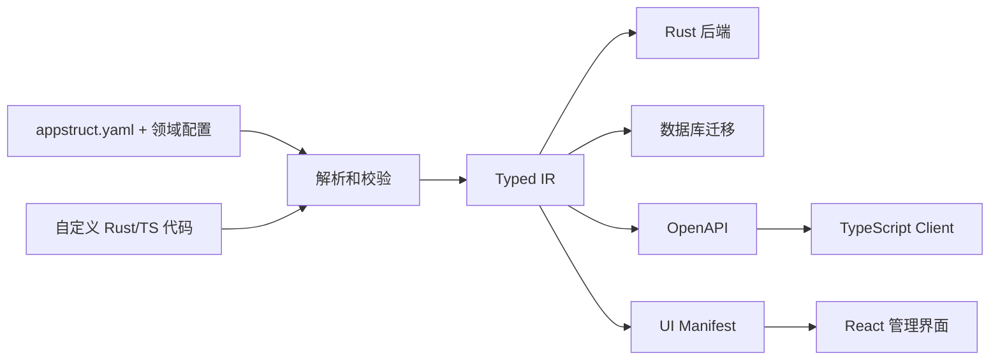

# AppStruct 产品需求文档

> 状态：Implementation Baseline v1.3<br>
> 日期：2026-08-27<br>
> 产品类型：配置驱动的 Rust 全栈应用生成框架<br>
> 文档范围：产品定位、用户体验、功能边界、MVP 和验收标准

## 0. 当前实现基线

截至 2026-08-27，仓库已完成 M0 至 M6，并在 M1 后完成生成器与编译器的模块化重构：

| 里程碑 | 状态 | 已固化能力 |
| --- | --- | --- |
| M0 | 已完成 | 多文件 YAML、带位置诊断、规范化 Typed IR、canonical golden 和最小生成物编译 |
| M1 | 已完成 | PostgreSQL schema、SeaORM/Axum CRUD、OpenAPI、TypeScript client、React 列表与表单 |
| 重构 | 已完成 | Compiler 和 Backend Generator 按职责拆分，Rust 源文件由测试限制为最多 400 行 |
| M2 | 已完成 | 默认值、唯一/枚举/数值校验、关系与反向关系、分页/过滤/搜索/排序、详情页、RelationSelect 和 schema diff 风险阻断 |
| M3 | 已完成 | Value Object、Hook、Command、Query、Policy、Rust/React registry、SHA-256 ownership manifest 和安全目录交换 |
| 一致性加固 | 已完成 | 显式写事务、事务内 Hook connection、final-state Policy、revision/ETag 乐观并发和冲突恢复 UI |
| M4 | 已完成 | 邮箱密码认证、opaque session、CSRF/Origin、密码重置、RBAC/owner scope、认证 UI 和 OpenAPI 安全契约 |
| Migration Runner | 已完成 | apply/status、数据库历史、checksum、事务边界、dirty-state 阻断和 PostgreSQL schema drift 检测 |
| Generator Transaction | 已完成 | 跨进程项目锁、追加式恢复 journal、目录交换崩溃恢复和歧义状态保护 |
| M5 Templates | 已完成 | `appstruct new`、`minimal/dashboard`、固定 Rust/Node 依赖和不覆盖的一次性项目骨架 |
| M5 Build/Doctor | 已完成 | 工具链与数据库模式诊断、JSON 报告、锁定依赖的 Rust/TypeScript 生产构建门禁 |
| M5 Dev Server | 已完成 | managed/external PostgreSQL 协调、安全迁移、生成与构建、API/Vite 日志聚合、监听重启和 Ctrl-C 清理 |
| M5 Docs | 已完成 | 源码/归档安装、external/managed 首次运行、事务升级、生产构建/迁移/配置/回滚文档 |
| M5 Quality Gates | 已完成 | 跨目录字节确定性、10/100 实体性能预算、PostgreSQL + Chromium 用户旅程、桌面/移动布局、readiness/request ID |
| M6 Modules | 已完成 | Tenant、Audit、Mail、Jobs/Outbox 和本地/S3 File 能力及独立 PostgreSQL 验收 |
| M6 Preset | 已完成 | `appstruct/saas@1` 展开、差异覆盖、摘要/模块 lock 校验和查看 CLI |
| M6 Template | 已完成 | `saas` 一次性骨架、canonical `examples/saas-demo` 和 PostgreSQL/Chromium 端到端旅程 |
| TP 契约加固 | 已完成 | Draft 2020-12 App Spec Schema、warning diagnostics、`check --deny-warnings` 和无项目 schema 导出 |
| TP 升级事务 | 已完成 | staging workspace 全量生成/构建/测试、源文件并发检测及 lock/generated 联合 journal 提交与恢复 |
| TP 发布准备 | 已完成 | crates.io 元数据与本地 package 验证、macOS/Linux tag 构建、压缩包及 SHA-256 |
| Runtime/Module 边界 | 已完成 | 独立 `appstruct-runtime` 与 `appstruct-module-sdk`、官方 capability graph、生成 server composition root |
| 内部契约加固 | 已完成 | Runtime/Module 版本、IR v9 兼容迁移、本地 manifest Artifact 隔离、增量缓存、布局 v1/v2 和故障恢复注入测试 |

M2 的 `migrate plan` 保持纯只读差异预览；`migrate dev --accept` 只接受 `NonDestructive + Online` 变更，并以 staging 文件提交迁移草稿和 schema snapshot。Migration Runner 已补齐磁盘迁移、snapshot 与目标数据库之间的执行状态：配置 `DATABASE_URL` 时 dev 会继续 apply，未配置时迁移保留为 pending；`migrate apply/status` 不从 Spec 生成或修改文件。

M3 将用户实现固定在 `app/` 边界，生成目录只保存可重复构建的契约和运行时。Rust 端以一个实现全部必需 Command/Query handler trait 的聚合对象完成类型状态注册，缺少任一 trait 时编译失败；Entity Hook 和 Policy 是有安全默认实现的可选注册项。React 端生成字段组件和自定义页面的必需 registry key；存在引用时，生成入口从用户所有的 `app/web/registry.tsx` 导入实现，并通过 TypeScript `satisfies` 在构建期检查完整性。真实 PostgreSQL 验收已覆盖输入 Hook、归档 Command、指标 Query 和拒绝删除 Policy。

CRUD 写路径已在显式 SeaORM 事务内执行：`before_create/update/delete`、主记录写入和 `after_create/update/delete` 共享事务连接，任一步失败都会放弃事务；`after_commit` 在提交后以普通连接 best-effort 执行，失败只记录日志。Update Policy 同时看到旧记录、类型化 patch 和最终候选记录。每个实体由框架管理 `revision bigint not null default 1`，详情/创建/更新返回 ETag，更新和删除要求 `If-Match`；陈旧 revision 返回 412，生成客户端自动维护 ETag，表单冲突时保留输入并允许重新加载。

M4 已将 `modules.auth` 和 `modules.rbac` 纳入 Surface、Typed IR、Compiler 校验与全部生成器。启用认证的应用会生成注册、登录、退出、当前用户和可选密码重置流程，使用 Argon2id 密码哈希、只保存 hash 的 opaque session/reset token、`HttpOnly` session Cookie、CSRF token 和 Origin 校验。Actor 被注入普通及事务内 `RequestContext`，`public/authenticated/role/owner/any/all` 规则在后端执行；列表和按 ID 读取会将 owner/RBAC 转换为 SeaORM 查询条件。React 生成物包含认证状态、登录/注册/密码重置页面、路由守卫和退出入口，TypeScript client 默认携带 Cookie 并自动发送 CSRF，OpenAPI 同步发布 Cookie security scheme 和启用的 Auth endpoint。

M4 已通过独立本地 PostgreSQL 数据库验收：覆盖匿名 401、注册与 Cookie、CSRF 403、owner 数据隔离、admin 跨 owner 访问、member 删除 403、ETag `rev-1/rev-2`、缺少 `If-Match` 的 428、陈旧 revision 的 412，以及密码重置 token 单次使用、旧 session 撤销和新密码登录。验收数据库在测试后已回收。

Migration Runner 使用 `_appstruct_migrations` 保存 migration ID、文件 SHA-256、`applying/applied/failed` 状态和时间；session advisory lock 阻止同一数据库并发 apply。迁移默认与历史写入共享事务；带 `-- appstruct:transaction=off` 的审查后迁移在事务外执行，失败会留下 dirty history 并要求人工恢复。每次 `migrate dev` 生成的最新迁移都绑定 schema snapshot checksum；已执行文件被修改、历史缺失/乱序或 snapshot 不匹配时 apply/status 会拒绝继续。全部迁移完成后，status 从 PostgreSQL catalog 校验业务表、列类型/null/default/identity、主键/唯一、enum CHECK 和外键；存在 pending 时明确延后 drift 判断，避免把尚未执行的目标 schema 误报为漂移。

ownership manifest 为每个 Artifact 记录路径、类别和 SHA-256。重新生成先获取 `.appstruct/generation.lock` 的跨进程排他锁，再拒绝未知文件和 hash 已变化的生成文件。完整 staging 通过 manifest 校验后，CLI 向 `.appstruct/generation.journal` 追加并持久化 `prepared/backed_up/installed` phase，随后交换同级 staging/backup 目录。下次生成在持锁状态下根据 journal 和三个目录的实际组合完成提交或回滚；缺少 journal 的旧版遗留目录也能恢复，歧义组合则保留现场并失败。`app/` 不进入该事务。

无输入变化时，generation cache 在重新编译前校验输入、CLI executable、ownership manifest 和完整 generated tree hash，命中后跳过 Compiler、Codegen、Prettier 与目录事务。dev backend build cache 覆盖 generated backend/server 和用户 `app/backend` Rust 输入；Web install cache 覆盖 package/lock 和 `.pnpm` 安装状态。缓存删除后可完整重建，不能绕过 ownership 或未知文件检查。事务测试可在 backed-up 与 installed phase 注入失败，分别验证回滚旧树和完成新树。

`appstruct new <name> --template minimal|dashboard|saas` 已提供不覆盖的一次性项目创建。`minimal` 生成 external PostgreSQL 的公开 Note 应用；`dashboard` 生成 managed PostgreSQL Compose、Auth/RBAC/owner 和 User/Project/Task 三实体项目管理应用；`saas` 锁定 `appstruct/saas@1`，生成 Tenant/Audit 化的 Project/Task 骨架和 Mail/Jobs/File 开发配置。三个模板都提交带 `project_layout_version = 2` 的 `appstruct.lock`、`rust-toolchain.toml`、`.env.example` 和本地状态忽略规则，首次 generate 再产生固定的 `pnpm-lock.yaml`；目标或 sibling staging 已存在时创建会中止。布局 v1 直接运行 generated backend，v2 使用 server composition root；普通 build/dev 只按 lock 协议选择，未版本化 lock 由显式 update 一次性迁移。

`appstruct doctor --format text|json` 检查 1.98 Rust/Cargo、rustfmt、Clippy、固定 pnpm 版本和数据库开发模式。managed 模式验证 Compose 文件及 Docker/Compose 服务；external 模式从进程环境或 `.env` 读取 `DATABASE_URL` 并执行 migration status，不在输出中暴露连接串。`appstruct build` 先生成 canonical Artifact，再对固定 Rust dependency lock 执行 fmt、release Clippy 和 release build，并对 pnpm lock 执行 Prettier check、TypeScript 检查和 Vite build。生成 TypeScript 在 manifest hash 计算前由 lockfile 固定的 Prettier 格式化，`generate --check` 与 build 因此使用同一份字节输出。

`appstruct dev [--api-port <port>] [--web-port <port>]` 已实现完整开发协调。external 模式从进程环境或 `.env` 读取并连接 `DATABASE_URL`；managed 模式只启动 Compose 的 `postgres` service，并只在退出时停止本次 session 启动的 service，命名 volume 保留。启动与重载均先拒绝破坏性或需要人工审查的迁移，只自动提交并应用安全迁移，再生成、构建后端并 frozen install Web 依赖。CLI 监听 App Spec、lockfile、`spec/`、`modules/` 和 `app/backend/`，以 `[api]`/`[web]` 聚合日志；Unix 子进程使用独立进程组，重载或 Ctrl-C 会终止完整进程树。外部 PostgreSQL 17.10 验收已覆盖自定义端口、健康检查、Vite 页面、安全字段变更热重载、破坏性删除阻断、保留上一版服务和端口释放。

M5 交付文档已提供源码与校验后二进制安装、external/managed PostgreSQL 首次运行、事务化 `appstruct update`、生产 Artifact、运行时变量、迁移顺序、健康验证和回滚边界。数据库 down migration 仍未实现，升级后的数据库风险继续由显式 `migrate plan/status` 和人工审查控制。

M5 质量门禁已固化。两个独立项目的完整 `generated/` 树逐字节比较；后端 Entity/API Artifact 按可用 CPU 并行规划但最终统一排序，实测 10 实体 IR 编译 70 ms、编译加生成 518 ms，100 实体编译加生成 7774 ms，分别低于 500/1000/10000 ms 预算。Playwright 1.62.1 由根 pnpm lock 固定，external PostgreSQL 17.10 E2E 从 dashboard Template 启动，覆盖 liveness/readiness、`X-Request-Id` 生成与透传、注册、owner Project 创建与编辑、退出重登录和数据保持；1440x900 dashboard 与 390x844 登录页截图无重叠或水平溢出。启动冷构建期间的 SIGINT 也验证了 Cargo 子进程、临时项目和端口全部回收。

M6 SaaS Template 门禁从 CLI 创建真实 `saas` 项目并切换到专用 external PostgreSQL，验证 Preset lock、五个模块数据表、迁移、生成 Web TypeScript、注册、组织选择、Project/Task 写入、Audit 事件和跨租户空结果。Playwright 对 1440x900 Audit 页面和 390x844 Project 页面截图，移动表格保持在视口内并使用局部横向滚动。`examples/saas-demo` 与 CLI 模板逐文件字节比对，防止示例漂移。

## 1. 产品摘要

AppStruct 是一套面向业务系统的配置驱动全栈开发框架。开发者通过声明实体、字段、关系、权限、页面和自定义操作，由 AppStruct 生成可运行的 Rust 后端、数据库迁移、OpenAPI 契约、TypeScript 客户端以及前端 CRUD 界面。

AppStruct 不试图通过配置表达所有业务逻辑。标准化程度高的部分由配置生成，复杂业务由开发者使用 Rust 和 TypeScript 扩展。生成代码、框架运行时和用户代码之间必须保持清晰边界，使应用可以持续迭代和重复生成。

产品目标可以概括为：

> 用一份可校验的应用规格，快速获得一个类型安全、可扩展、可部署的 Rust 全栈业务应用。

## 2. 背景与问题

多数管理系统、内部工具和早期 SaaS 产品都反复实现相似能力：

- 数据模型、数据库迁移和基础 CRUD API
- 分页、过滤、搜索、排序和关联查询
- 列表页、表单页、详情页和批量操作
- 登录、角色权限、租户隔离和审计日志
- OpenAPI、前端类型、错误处理和表单校验
- 邮件、文件上传、后台任务等基础设施能力

现有方案通常存在以下问题：

1. 通用后台产品启动快，但复杂业务扩展受限。
2. 代码脚手架首次生成快，后续重新生成容易覆盖人工修改。
3. 前后端分别维护模型、校验和权限，容易产生契约漂移。
4. Rust 后端生态性能和类型安全较好，但缺少面向完整业务应用的高层生产力工具。
5. SaaS starter 提供大量预制能力，但业务模型和 UI 仍需手工搭建。

AppStruct 需要解决的核心问题不是“生成一次 CRUD”，而是让配置、生成代码和自定义业务代码能够长期共同演进。

## 3. 产品定位

AppStruct 的定位是“应用编译器 + 稳定运行时 + 可插拔业务模块”。



产品由四个部分组成：

| 部分 | 职责 |
| --- | --- |
| App Spec | 声明应用、实体、权限、页面和模块 |
| Compiler | 解析配置、语义校验并生成统一中间表示 |
| Generators | 从中间表示生成后端、迁移、接口契约和 UI 元数据 |
| Runtime | 提供 CRUD、鉴权、查询、错误处理和前端渲染能力 |

## 4. 产品原则

### 4.1 配置描述意图

配置描述“应用需要什么”，而不是包含任意 Rust、SQL 或 JavaScript 表达式。复杂计算和流程通过类型明确的扩展接口实现。

### 4.2 默认可用，同时允许退出默认路径

标准实体应无需手写代码即可运行。非标准业务必须有 Hook、自定义 Command、自定义查询和自定义 UI 组件等扩展出口。

### 4.3 单一事实来源

App Spec 经过解析后形成 Typed IR。数据库、后端、OpenAPI 和 UI 生成器只消费 Typed IR，不各自解释原始 YAML。

### 4.4 生成物可重复构建

用户不应直接修改生成目录。再次执行生成命令必须得到确定性结果，且不能覆盖用户代码。

### 4.5 权限以后端为准

前端权限只改善交互体验，后端始终执行完整授权和租户隔离。

### 4.6 渐进式采用

开发者可以从单个实体开始，逐步启用认证、RBAC、租户、审计、文件和任务模块，不要求首日接受完整平台。

## 5. 目标用户

### 5.1 主要用户

#### Rust 全栈或后端开发者

需要快速交付管理后台、内部工具或 SaaS MVP，希望保留 Rust 类型安全和性能，并能编写复杂业务逻辑。

#### 小型产品团队

团队人数有限，希望减少前后端基础设施重复建设，将时间投入在业务差异化上。

#### 平台工程团队

需要为组织内多个业务系统提供统一的数据访问、权限、审计和 UI 规范。

### 5.2 次要用户

- 需要快速制作业务原型的技术产品经理
- 为客户交付定制后台的咨询和外包团队
- 希望以配置形式沉淀行业模型的解决方案团队

### 5.3 非目标用户

- 完全无代码用户
- 以营销展示为主的静态网站
- 高度定制交互的消费级前端产品
- 需要通过配置表达任意程序逻辑的低代码平台
- 第一阶段要求多语言后端或多个前端框架的团队

## 6. 典型使用场景

### 场景 A：搭建内部管理系统

开发者定义客户、订单、产品和发票实体，配置列表、表单和角色权限，在数分钟内得到可登录的管理后台。

### 场景 B：开发垂直 SaaS MVP

开发者启用组织租户、用户邀请、订阅和审计模块，再为少数核心流程编写自定义 Rust Command 和 React 页面。

### 场景 C：为已有数据库生成管理界面

开发者导入 PostgreSQL schema，AppStruct 生成初始 App Spec。开发者补充标签、权限和 UI 规则后生成后台应用。

此能力不在首个 MVP 中，但数据模型必须为未来反向生成保留空间。

## 7. 核心用户旅程

### 7.1 创建应用

```bash
appstruct new project-hub --template dashboard
cd project-hub
appstruct dev
```

预期结果：

- 创建包含示例实体的项目
- 启动 PostgreSQL、Rust API 和前端开发服务器
- 浏览器可访问登录页和示例实体列表
- CLI 显示各服务地址和健康状态

### 7.2 新增业务实体

1. 开发者在 `appstruct.yaml` 引用的领域配置中添加实体及页面配置。
2. 编辑器根据 JSON Schema 提供补全和错误提示。
3. `appstruct check` 校验引用、类型、权限和页面配置。
4. `appstruct generate` 更新生成物。
5. `appstruct migrate dev` 预览并执行开发迁移。
6. 前端出现对应导航、列表、创建、编辑和详情页面。

### 7.3 添加复杂业务动作

1. 开发者在配置中声明 Command 的输入、输出和权限。
2. AppStruct 生成 trait 或函数签名、路由绑定和 TypeScript 调用方法。
3. 开发者在用户代码目录实现业务逻辑。
4. UI 页面通过生成的类型安全客户端调用 Command。

### 7.4 修改数据库模型

1. 开发者修改实体字段或关系。
2. CLI 对比当前 schema snapshot 和新配置。
3. CLI 输出 schema diff 和风险提示。
4. 新增字段等安全操作可自动生成迁移。
5. 删除、重命名、缩窄字段等操作要求显式声明或确认。

## 8. App Spec

### 8.1 文件形式

MVP 使用模块化 YAML。根入口固定为 `appstruct.yaml`，业务声明按领域拆分，通过 `includes` 显式引入。框架同时发布 JSON Schema，用于编辑器补全、静态校验和版本演进。

模块化配置遵守以下规则：

- 根入口只声明应用、数据库、Preset、模块和领域文件。
- 领域文件通常包含 2 到 8 个相关实体及其 Command、Query 和页面覆盖。
- 每个实体只能在一个文件中完整定义，不支持跨文件深度合并。
- `includes` 使用显式文件列表，不依赖 YAML anchor 或隐式目录扫描。
- 所有文件最终合并为同一个 Typed IR，生成器不感知文件拆分方式。

根配置包含：

```yaml
version: 1

app:
  name: project-hub

database:
  provider: postgres
  dev:
    mode: managed

modules:
  auth:
    enabled: true
  rbac:
    enabled: true
    roles: [member, admin]

includes:
  - spec/identity.yaml
  - spec/project.yaml
```

### 8.2 实体示例

```yaml
domain: project

entities:
  Project:
    label: 项目
    table: projects

    fields:
      id:
        type: uuid
        primary_key: true
        generated: uuid_v7

      name:
        type: string
        required: true
        max_length: 120
        searchable: true

      status:
        type: enum
        values: [draft, active, archived]
        default: draft

      owner:
        type: relation
        target: auth::User
        required: true
        on_delete: restrict

      created_at:
        type: datetime
        generated: now

    access:
      list:
        role: member
      read:
        role: member
      create:
        role: member
      update:
        any:
          - owner: owner
          - role: admin
      delete:
        role: admin

    views:
      list:
        columns: [name, status, owner, created_at]
        filters: [status, owner]
        default_sort: "-created_at"

      form:
        sections:
          - title: 基本信息
            fields: [name, status, owner]
```

### 8.3 MVP 字段类型

| 类型 | 数据库表示 | 默认前端组件 |
| --- | --- | --- |
| `string` | varchar/text | TextInput |
| `text` | text | Textarea |
| `integer` | integer/bigint | NumberInput |
| `decimal` | numeric | DecimalInput |
| `boolean` | boolean | Switch |
| `enum` | enum/varchar | Select |
| `date` | date | DatePicker |
| `datetime` | timestamptz | DateTimePicker |
| `uuid` | uuid | 只读文本或隐藏字段 |
| `json` | jsonb | JsonEditor |
| `relation` | foreign key | RelationSelect |

每个字段可以额外声明：必填、默认值、唯一性、长度、数值范围、可搜索、可过滤、敏感字段、只读和 UI 提示。

### 8.4 关系

MVP 支持：

- 多对一和一对多
- 一对一
- 必填或可选外键
- `restrict`、`cascade` 和 `set_null` 删除策略
- 关联选择器的展示字段和搜索字段

多对多关系可以通过显式中间实体建模。隐式多对多放入后续版本。

关系的数据库约束和 API 展开是两个独立概念。`required: true` 表示外键不可为空；响应中的关联对象仍是按需展开且可被权限裁剪。生成契约必须分别表示稳定的关系引用和可选的展开对象，不能因为关联对象不可见而违反必填外键的响应类型。

### 8.5 配置版本

- `version` 为必填字段。
- 不兼容变更必须提升配置主版本。
- CLI 对过期字段给出迁移建议。
- 未知字段默认报错，避免拼写错误被静默忽略。

## 9. 后端能力

### 9.1 默认 CRUD API

对启用 CRUD 的实体生成：

```text
GET    /api/projects
GET    /api/projects/{id}
POST   /api/projects
PATCH  /api/projects/{id}
DELETE /api/projects/{id}
```

默认能力包括：

- 默认页码分页和面向大数据遍历的主键游标分页
- 白名单字段排序
- 精确、范围、枚举、文本过滤，以及受目标权限和租户范围约束的一跳关联过滤
- 受列表权限和租户范围约束的 count/sum/average/min/max 聚合与分组查询
- 配置字段的全文或模糊搜索
- 受控的关联展开
- Create、Update 和 Response DTO 分离
- 统一错误结构和请求 ID
- 基于 revision/ETag 的乐观并发控制，避免静默覆盖并发修改
- OpenAPI 文档

### 9.2 数据访问边界

生成的 API 不直接暴露任意 SQL 能力：

- 可过滤、排序、搜索和展开的字段必须显式允许。
- 聚合和分组只能使用声明为可过滤且类型兼容的字段，并限制最多返回 500 个分组。
- 默认限制分页大小和关联深度。
- 敏感字段默认不进入响应和日志。
- 所有实体访问必须经过授权策略。

### 9.3 自定义 Command 和 Query

CRUD 之外的写操作使用 Command，只读业务查询使用 Query。

```yaml
value_objects:
  ArchiveProjectInput:
    fields:
      reason:
        type: string
        required: false

commands:
  ArchiveProject:
    input: ArchiveProjectInput
    output: Project
    access:
      role: admin
```

Command 和 Query 的传输类型必须引用 App Spec 中声明的 Entity、Enum 或 Value Object，不从任意 Rust 类型反向推导公开契约。AppStruct 负责生成路由、契约、鉴权入口、客户端函数和稳定注册键；用户负责实现生成的 handler trait。缺失实现时编译必须失败，并指向需要实现的明确符号。

### 9.4 Hook

实体可以注册以下生命周期扩展点：

- `before_validate`
- `before_create`
- `after_create`
- `before_update`
- `after_update`
- `before_delete`
- `after_delete`
- `after_commit`

事务内 Hook 和事务后副作用必须区分。MVP 的 `after_commit` 只适合非关键、可幂等的 best-effort 副作用：进程崩溃时可能丢失，请求重试时也可能重复。邮件、消息和第三方调用不得默认在数据库事务中执行；要求可靠投递的行为必须使用后续 Jobs/Outbox 能力。

事务内 Hook 如果修改了将要持久化的数据，Runtime 必须重新执行受影响的约束校验，并以最终候选状态执行授权。Hook 不能通过在授权后改写 owner、租户或受保护字段绕过 Policy。

## 10. 前端能力

### 10.1 默认应用结构

生成应用包含：

- 登录和退出
- 左侧主导航
- 实体列表页
- 新建和编辑表单
- 详情页
- 空状态、加载状态和错误状态
- 无权限页面和 404 页面
- 用户菜单和基础个人设置

### 10.2 列表页

列表页支持：

- 分页、排序、搜索和字段过滤
- 显示列配置和列宽持久化
- 行点击进入详情
- 受权限控制的单条删除；批量操作在 V1 通过显式配置启用
- URL 同步查询条件，支持分享和返回恢复
- 桌面端表格和窄屏可读布局

### 10.3 表单页

表单页支持：

- 根据字段类型选择控件
- 客户端即时校验与服务端错误映射
- 创建和编辑模式
- 表单分区和字段顺序
- 关系字段异步搜索
- 未保存离开提醒
- 提交中、成功和失败反馈

### 10.4 UI 生成策略

AppStruct 生成编译期 UI Manifest 和类型安全客户端，React Runtime 根据 Manifest 渲染标准页面。框架不为每个实体生成大量需要人工维护的 JSX，也不在运行时从服务端下载可执行 UI 定义。

```text
App Spec -> UI Manifest -> React Runtime -> CRUD 页面
                       -> Custom Registry -> 自定义字段/页面
```

该策略确保新增全局能力时可以升级 Runtime，而无需重写每个实体页面。

React Runtime 内部采用稳定的三层契约：Resource Definition 描述资源和视图，DataProvider 将统一数据操作映射到生成客户端，headless Controller 负责 URL 状态、请求缓存、错误、权限和并发冲突。表格、表单和详情组件只消费 Controller 状态，不直接拼接 API 请求。这样既允许替换视觉组件，也避免自定义页面形成另一套数据访问约定。

MVP 的创建、更新和删除默认采用服务端确认后再更新界面的保守模式。乐观更新、可撤销删除和批量写入是三种独立能力，必须分别声明并具备对应的回滚与授权语义；首版不以一个通用 `mutation mode` 隐式开启。

### 10.5 自定义组件

字段允许引用注册过的自定义组件：

```yaml
fields:
  location:
    type: json
    ui:
      component: MapPicker
```

```ts
export const customComponents = {
  MapPicker,
};
```

自定义组件必须获得类型化的值、错误、只读状态和变更回调。组件名称不存在时，构建阶段失败。

### 10.6 自定义页面

完全非 CRUD 的页面由开发者编写 React 组件，并通过配置加入路由和导航。框架负责布局、认证守卫和权限检查。

## 11. 认证、权限与多租户

### 11.1 认证

MVP 提供邮箱密码认证，并预留 OAuth Provider 接口。认证模块包括：

- 注册、登录和退出
- 密码哈希和重置流程
- 会话管理
- 当前用户接口
- 受保护路由

Auth Module 在 MVP 内提供仅用于密码重置的 `AuthMailSender` 接口、开发捕获器以及一个生产可用的 SMTP adapter。生产环境未配置邮件发送能力时，启用密码重置必须在启动前失败。注册验证可在后续扩展这一窄接口；V1 的 Mail Module 在其上提供通用模板、Provider 路由和业务事件邮件，不作为 MVP 密码重置的前置依赖。

### 11.2 RBAC

配置可以为实体操作和自定义操作声明角色。MVP 角色集合由 RBAC Module 配置或其他 Module export 显式声明，用户记录保存其角色分配；引用未声明角色时 Compiler 报错。单条规则使用 `role`、`owner`、`authenticated` 或 `public`；`any` 和 `all` 用于组合规则。数组顺序不影响授权结果，空组合在配置校验阶段报错。复杂业务授权继续通过实体 Policy trait 扩展，MVP 不支持 YAML 命名 Policy、否定规则或任意权限表达式。

例如，项目所有者或管理员均可更新：

```yaml
access:
  update:
    any:
      - owner: owner
      - role: admin
```

实体没有访问规则且应用也没有声明默认规则时，配置校验必须失败。公开访问必须显式声明，不能成为隐式默认值。

### 11.3 资源级授权

`owner` 的值是用于所有权判断的关系字段名；Compiler 必须验证该字段指向当前用户类型。内置规则和角色规则由统一的 `any`/`all` 表达式组合，更复杂的规则由用户实现 Policy trait。

每种操作具有独立、可测试的授权语义：

- `list` 和关系搜索将完整规则转换为数据库查询范围，禁止读取后过滤。
- `read` 对目标记录应用与列表一致的可见性规则。
- `create` 针对应用默认值、Hook 和校验后的最终输入判断。
- `update` 同时允许 Policy 检查旧记录、类型化 patch 和将要写入的新状态。
- `delete` 在事务内对目标记录执行条件选择和授权。
- Command、Query、关系展开和后续批量操作必须显式进入同一授权入口，不能因为不是 CRUD 而绕过 Policy。

为减少记录存在性泄露，调用者看不到的记录在按 ID 读取、更新或删除时统一返回 `404 NOT_FOUND`；调用者可以读取记录但没有写权限时返回 `403 FORBIDDEN`。创建请求没有权限时返回 403。前端不得依赖错误文案判断这些分支。

### 11.4 多租户

Tenant Module 通过 `modules.tenant.enabled: true` 启用，并要求 Auth Module。业务实体用
`tenant: true` 声明租户范围；Compiler 为这类实体注入框架拥有且不可由客户端写入的
`tenant_id`。没有声明 `tenant: true` 的实体仍是应用级数据，不能依赖当前租户进行隐式隔离。

Tenant Module 提供组织和成员关系。已认证用户可以创建组织，创建者自动成为 owner；用户只能列出
自己所属的组织。Web Client 将当前组织保存在浏览器本地状态，并在请求中发送
`X-AppStruct-Tenant`。切换租户只改变后续请求的显式上下文，不复制或迁移业务数据。

对 tenant-scoped Entity 的所有 list、read、create、update 和 delete 请求，Runtime 必须先验证：

- 请求已认证且携带合法的当前租户 ID；
- actor 是当前组织的有效成员；
- 创建时由 Runtime 写入当前 `tenant_id`；
- 查询、更新和删除在数据库条件中同时包含当前 `tenant_id`；
- 客户端输入、Hook 和 Policy 都不能改写 `tenant_id`。

缺少或格式错误的租户 header 返回 `400 INVALID_TENANT`，未认证返回 `401`，不是组织成员返回
`403`。按 ID 请求其他租户的记录仍返回 `404`，避免泄露记录是否存在。仅在 UI 隐藏其他租户数据
不构成租户隔离；PostgreSQL 跨租户集成测试是模块发布门槛。

## 12. 数据库与迁移

### 12.1 支持范围

MVP 只支持 PostgreSQL。多数据库抽象会推迟到产品模型稳定之后。

### 12.2 状态文件

依赖解析和数据库迁移使用不同状态文件：

- `appstruct.lock` 锁定 AppStruct、项目布局、Preset、Module 和 Template 来源版本。
- `.appstruct/schema.snapshot.json` 保存已由迁移文件承载的最新规范化目标 schema；它描述磁盘迁移链的目标，不代表某个数据库已经执行到该状态。
- `generated/.appstruct-manifest.json` 以确定性格式记录生成文件 ownership 和内容 hash，与生成物一起进入版本控制。
- `.appstruct/cache/` 只保存本地增量缓存，不进入版本控制，也不参与正确性判断。

数据库迁移对比 schema snapshot，而不是直接对比 YAML 文本或复用依赖 lock。目标数据库是否已经到达该状态由迁移历史表和 `migrate status` 单独判断。

### 12.3 迁移安全

迁移风险分为两个维度，不能用一个“安全”标签同时代表数据安全和线上执行安全：

| 变更 | Schema 风险 | 执行风险 | 默认行为 |
| --- | --- | --- | --- |
| 新增无默认值的可空字段 | 非破坏 | Online | 可生成开发迁移 |
| 新增普通索引 | 非破坏 | MayLock | 生成并提示锁表风险 |
| 新增并发索引 | 非破坏 | NonTransactional | 生成独立步骤并要求审查 |
| 新增必填字段、字段重命名 | 需补充信息 | 取决于方案 | 要求默认值、backfill 或显式 rename |
| 删除字段、缩小长度、改变类型 | 破坏性 | ManualReview | 阻止自动执行并明确警告 |

生产环境的迁移必须生成可审查文件，不提供不可见的运行时自动同步。

`migrate plan` 只计算和展示差异，不写迁移文件或 snapshot。`migrate dev` 在开发者交互确认或显式 `--accept` 后，将迁移文件和 snapshot 作为同一次本地事务提交；存在 `DATABASE_URL` 时继续应用，未配置时明确报告 pending。若数据库执行失败，已接受文件保留，snapshot 不回退，后续命令根据 migration history 恢复或报告 dirty state，而不从同一 diff 重复生成。`migrate apply` 只执行已提交迁移并更新数据库历史表，不修改 Spec 或 snapshot。

迁移历史保存文件 checksum。已执行迁移被修改、迁移目录与 snapshot 不一致、或数据库实际结构发生漂移时，`migrate status` 和 `migrate apply` 明确失败或报告漂移，不静默重写历史。事务外迁移以显式文件指令启用，并在执行前记录 `applying`，失败后记录 `failed`。Schema inspect、diff、plan、lint 和 apply 是可独立测试的阶段；首版 runner 直接使用 PostgreSQL driver 与 catalog，不依赖外部 Atlas 或 `psql` CLI。

## 13. CLI 产品体验

### 13.1 命令范围

```text
appstruct new <name> --template <name>
appstruct schema               输出 App Spec JSON Schema
appstruct check [--deny-warnings]
                               校验配置、引用和 CI warning 策略
appstruct generate             生成代码和 Manifest
appstruct dev [--api-port <port>] [--web-port <port>]
                               启动开发环境并监听变更
appstruct migrate dev          创建并执行开发迁移
appstruct migrate plan         只计算和展示迁移计划，不写文件
appstruct migrate apply        只执行已提交迁移
appstruct migrate status       查看迁移状态
appstruct build                构建生产产物
appstruct doctor               检查本地依赖和配置
appstruct auth bootstrap-admin 初始化首个管理员角色
appstruct preset show          查看 Preset 及展开结果
appstruct update               显式更新锁定依赖
```

### 13.2 错误诊断

配置错误必须包含：

- 文件路径和行列位置
- 稳定的错误编号
- 出错配置路径
- 人类可读的原因
- 可执行的修复建议

示例：

```text
error[AS1024]: unknown relation target `Usr`
  --> spec/project.yaml:31:17
   |
31 |         target: Usr
   |                 ^^^ entity does not exist
   |
help: did you mean `User`?
```

### 13.3 开发服务器

`appstruct dev` 负责协调后端、前端和配置监听：

- 初次启动和输入变化时先规划迁移；只自动接受 `NonDestructive + Online` 变更，危险迁移失败关闭。
- 迁移通过后完整重新编译和生成，只提交内容发生变化的 Artifact，再构建后端并启动 API/Vite。
- 配置、迁移、生成或构建失败时不重启服务；上一版进程保持运行。
- `appstruct.yaml`、`appstruct.lock`、`spec/`、`modules/` 和 `app/backend/` 变化触发协调重载，用户 React 变化由 Vite 处理。
- API 和 Web 日志分别带 `[api]`、`[web]` 前缀；`--api-port` 与 `--web-port` 必须不同。
- Ctrl-C 优雅终止 API 和 Web 的完整子进程树。

`database.dev.mode` 决定本地数据库生命周期：

- `managed` 是 `dashboard` Template 默认值。CLI 调用 Template 提供的 Docker Compose 启动 PostgreSQL，保留命名 volume，并在退出时停止由本次 dev session 启动的容器。
- `external` 要求通过进程环境或 `.env` 提供 `DATABASE_URL`。CLI 连接并迁移该数据库，但不启动或停止数据库进程。
- 生产构建始终使用外部数据库配置；secret 不进入 App Spec、IR 或生成物。

`appstruct doctor` 在 managed 模式检查 Docker/Compose，在 external 模式检查连接参数，并给出切换模式的明确提示。

## 14. 生成代码与用户代码边界

推荐项目结构：

```text
project-hub/
  appstruct.yaml
  appstruct.lock
  compose.yaml
  spec/
    identity.yaml
    project.yaml
  .appstruct/
    schema.snapshot.json
    cache/
  generated/
    .appstruct-manifest.json
    backend/
    web/
    openapi/
  app/
    backend/
      hooks/
      commands/
      policies/
    web/
      components/
      pages/
      registry.ts
  migrations/
```

规则如下：

1. `generated/` 只归生成器所有，可以随时删除并重新生成，默认连同 ownership manifest 一起进入版本控制。
2. 生成前必须根据 manifest 检查已有内容；发现未知文件或已被人工修改的生成文件时中止，并要求开发者先移动、删除或明确处理，不能静默覆盖。
3. `app/` 只包含用户代码，生成器不得覆盖。
4. `migrations/` 是可审查的持久代码，生成后由开发者负责。
5. 生成代码只通过稳定接口调用用户实现。
6. AppStruct 升级导致生成物变化时，CLI 输出变更摘要。
7. Template 文件首次创建后归用户所有，后续生成和升级不得自动覆盖。

## 15. Module、Preset 与 Template

### 15.1 功能模块

产品能力按模块逐步提供：

| 模块 | 能力 | 计划阶段 |
| --- | --- | --- |
| Auth | 注册、登录、会话、密码重置 | MVP |
| RBAC | 角色和操作权限 | MVP |
| Audit | 实体变更和操作者记录 | V1 |
| Tenant | 组织、成员和租户隔离 | V1 |
| File | 本地或 S3 兼容对象存储 | V1 |
| Mail | 通用模板、Provider 路由和业务事件邮件 | V1 |
| Jobs | 延迟任务、重试和任务状态 | V1 |
| Billing | Stripe 等订阅 Provider | V2 |
| Admin | 用户、租户和系统运营后台 | V2 |

模块通过明确的配置 schema、运行时接口和迁移安装，不允许任意修改其他模块的生成模板。Module manifest 必须声明 `provides` 和 `requires` capability；Compiler 在生成前检查缺失 provider、重复 provider 和依赖环。模块间只通过窄化、类型化 capability 协作，例如 Auth 依赖 `AuthMailSender`，而不是依赖整个 Mail Module。

项目可以通过根配置的 `module_manifests` 引用 `modules/` 下的本地 TOML manifest。首版只接受 `api_version = 1`、命名空间化名称、capability 和 UTF-8 静态 Artifact；manifest、source 和输出路径禁止绝对路径、`..`、非可移植分隔符与 symlink，且执行单文件和总大小限制。Artifact 只能写入 `generated/modules/<collision-free-namespace>/...`。本地 Module 的 Runtime starter 固定为 no-op，不加载动态库、不编译或执行模块目录中的 Rust 代码，也不联网。

Audit Module 通过 `modules.audit.enabled: true` 启用，并要求 Auth 和至少一个声明过的
`reader_roles`。业务实体用 `audit: true` 选择记录 create、update 和 delete。每条事件保存实体、记录
ID、操作、actor、tenant、发生时间，以及变更前后的 JSON snapshot；Audit 事件与业务写入在同一
PostgreSQL 事务提交，审计写入失败必须回滚业务写入。

Audit endpoint 只允许配置角色读取。启用 Tenant 时读取还要求有效的当前租户，并只返回该租户的
事件；其他租户的事件不能通过筛选参数或记录 ID 绕过。Audit 表不提供 update/delete API，应用级
Hook 也不能改写已提交事件。认证凭据、session token、密码 hash 和 Mail/File 私密 payload 不进入
通用实体 snapshot；相关模块只写经过专门脱敏的事件元数据。

Mail Module 通过 `modules.mail` 声明 `capture`、`smtp` 或 `resend` Provider、默认 sender 和命名模板。
模板包含 subject、text 和可选 HTML，使用受限的 MiniJinja 变量渲染；模板语法在 App Spec 编译时
校验，收件地址和变量值由业务 Rust 代码在发送时提供。SMTP/Resend 凭据只能来自环境变量，不进入
App Spec、Typed IR、生成代码或浏览器资产。`capture` 只用于非生产环境，将渲染结果写入专用
PostgreSQL 表；生产启动时选择 capture 必须失败。

生成 Runtime 暴露窄化的 `MailProvider` capability、可注入的 `MailState` 和带当前 tenant context 的
业务发送入口。直接发送明确属于 best-effort 外部副作用，应从 `after_commit` 或 Command 调用；需要
重试和崩溃恢复的邮件必须交给 Jobs/Outbox。Auth 的密码重置继续只依赖 `AuthMailSender`，启用 Mail
不是 Auth 的前置条件。

Jobs Module 使用 PostgreSQL outbox 提供延迟执行、崩溃恢复、指数退避和 dead 状态。业务代码必须
在与领域写入相同的 `RequestContext`/数据库事务中 enqueue；只有事务提交后 Worker 才能 claim。
每个 Job 保存 queue、kind、JSON payload、tenant、计划时间、attempt/lease 和可选幂等键。Worker 通过
`FOR UPDATE SKIP LOCKED` 竞争任务，lease 超时的 running Job 可以重新 claim，因此交付语义是
at-least-once，Handler 必须幂等，不能宣称 exactly-once。

队列在 `modules.jobs.queues` 中显式声明最大尝试次数和初始退避。达到上限后 Job 进入 dead，不自动
无限重试；错误文本有长度上限，不能保存凭据或 Mail/File 私密 payload。Runtime 暴露类型化 enqueue、
`JobHandler`、单步 Worker 和带显式 shutdown 的后台 Worker handle。幂等键在数据库中唯一，重复
enqueue 返回原 Job ID，不创建第二条记录。

File Module 通过 `modules.file` 选择本地或 S3 兼容对象存储，并声明单文件大小上限与允许的 MIME
类型。运行时在写入前拒绝绝对路径、`..`、空路径片段、路径化文件名、控制字符、超限内容和
MIME/实际内容不匹配；同一 object key 不允许覆盖。文本要求无 NUL 的 UTF-8，JSON 必须可解析，
图片等二进制类型使用内容特征识别。下载时重新计算 SHA-256 并与 PostgreSQL 元数据比较，发现对象
被绕过 Provider 篡改时失败关闭。

每条文件元数据保存 object key、原始文件名、MIME、大小、checksum、tenant 和创建时间。读取和删除
都必须匹配当前 tenant，不能仅凭 object key 跨租户访问。S3 endpoint、bucket、region 和凭据只来自
运行环境，不进入 App Spec、IR、生成资产或日志；HTTP endpoint 必须通过专用环境变量显式允许。
File 内容不得进入 Audit snapshot 或 Jobs 错误文本。

每个模块可以包含 Rust Runtime、数据库迁移、React 页面、UI Manifest 和资源模板。YAML 只负责启用模块及提供业务参数，支付 webhook、会话安全、任务重试等行为必须由经过测试的模块代码实现。

运行时按 capability 图的拓扑顺序启动 Module。每个 Module 对自己注册的路由、任务、连接和其他副作用负责，并返回可逆序清理的 handle；启动部分失败时，Runtime 清理本轮已经启动的模块并报告完整依赖链。MVP 不支持在运行中的生产进程动态安装、卸载或加载 Rust 动态库。

### 15.2 Preset

Preset 是一组经过验证的模块、默认配置和页面的版本化组合，用于交付完整的产品起点。AppStruct Core 对应通用应用编译器，官方 `appstruct/saas` Preset 对应 Open SaaS 类型的 SaaS starter。

```yaml
preset:
  name: appstruct/saas
  version: 1

modules:
  auth:
    registration: false

  mail:
    provider: smtp
```

`appstruct/saas@1` 只组合已经实现的 Auth、RBAC、Tenant、Audit、Mail、Jobs 和 File。默认启用注册与密码重置，提供 `member/admin` 角色，启用租户和审计，使用开发期 capture Mail、本地文件存储，以及 `default/mail` 两个 Jobs 队列。Billing 和 Admin 不属于版本 1。

Preset 的展开结果进入统一 Typed IR，用户只维护覆盖默认行为的差异配置。映射节点递归合并，标量和列表由用户值整体替换。`appstruct.lock` 锁定 Preset 名称、版本、展开内容 SHA-256，以及精确的模块名和锁步版本；缺失、摘要不匹配或模块集不完整时，`check`、`generate` 和 `build` 都失败关闭。`appstruct preset show` 显示锁定摘要，`--expanded` 输出合并项目覆盖后的规范化有效模块配置。只有显式 `appstruct update` 可在完整 staging 验证后规范化并事务提交新 lock；普通命令不隐式升级。

### 15.3 Template

Template 是创建项目时复制一次的用户代码和资源骨架，可以引用 Preset，但不承载需要长期升级的运行时实现。

| Template | 定位 | 发布阶段 |
| --- | --- | --- |
| `minimal` | 最小 AppStruct 工程和单实体示例 | Technical Preview |
| `dashboard` | 认证、RBAC 和项目管理后台示例 | MVP |
| `saas` | V1 提供租户、审计、邮件、任务和文件骨架；V2 再加入支付和运营能力 | V1 Preview，V2 完整版 |

Template 可以包含初始领域配置、用户可修改的 React 页面、邮件模板、品牌资源、Hook、Command 和测试。文件复制后归用户所有，AppStruct 不对其执行自动三方合并。长期升级由 Runtime、Module 和 Preset 版本完成。

产品和仓库均使用 **AppStruct SaaS** 作为官方 SaaS Template 名称，不沿用 Open SaaS 品牌。

## 16. 推荐技术基线

以下是首版默认技术栈，不作为长期多实现承诺：

| 层 | 默认选择 |
| --- | --- |
| 后端 | Axum + Tokio |
| ORM | SeaORM |
| 数据库 | PostgreSQL |
| OpenAPI | Utoipa |
| 配置 | Serde + YAML + JSON Schema |
| 前端 | React + TypeScript + Vite |
| 数据请求 | TanStack Query |
| 表格 | TanStack Table |
| 表单 | React Hook Form + Zod |
| UI 基础 | shadcn/ui 风格组件层 |

产品层面承诺的是契约和能力，不是让用户在 MVP 阶段自由替换每一层技术组件。

## 17. 非功能需求

### 17.1 性能

- 典型开发机上，10 个实体从配置变更到生成完成的目标小于 1 秒；MVP 是否采用完整或增量规划不改变该预算。
- 100 个实体的完整生成目标小于 10 秒。
- 默认列表 API 必须分页，禁止无上限返回。
- 生成的基础 API 不应产生明显的 N+1 关联查询。

### 17.2 可靠性

- 相同 App Spec、依赖 lock、固定 Rust toolchain、Node lockfile 和格式化配置必须逐字节产生相同输出；所有文本生成物规范化为 UTF-8 与 LF。
- 配置校验失败不得产生半完成生成物。
- 生成过程采用同文件系统 staging、生成锁和可恢复的目录交换；提交失败时必须保留或恢复上一份完整生成物。
- 迁移文件和 schema snapshot 必须作为同一次本地事务提交；任一文件生成失败时两者都不得改变。
- `appstruct update` 必须先在 staging workspace 完成 lock、Spec、生成物、编译和测试，全部成功后再提交；失败时当前项目保持不变。

### 17.3 安全

- 密码使用行业认可的慢哈希算法。
- 默认启用安全 Cookie、CSRF 或等效会话保护策略。
- 所有输入同时执行结构和业务校验。
- 错误响应不得泄露 SQL、密钥和内部调用栈。
- 敏感字段默认从响应、日志和审计详情中排除。
- 生成依赖和模板版本必须可追踪。

### 17.4 可观测性

- 后端使用结构化日志。
- 每个请求携带 request ID。
- 提供健康检查和就绪检查。
- 错误类型和 HTTP 状态具有统一映射。
- 后续支持 OpenTelemetry，不作为 MVP 阻塞项。

### 17.5 可维护性

- App Spec、IR 和生成模板分别版本化。
- 核心生成路径具有 golden tests。
- 示例应用参与端到端测试。
- 生成的 Rust 和 TypeScript 必须通过各自格式化和静态检查。

## 18. MVP 范围

### 18.1 包含

- 根入口加领域文件的模块化 YAML App Spec
- 配置 JSON Schema、显式 `includes` 和 `appstruct check`
- PostgreSQL 实体和迁移生成
- Axum + SeaORM CRUD API
- OpenAPI 和 TypeScript 客户端
- React 列表、详情、创建和编辑页面
- 分页、排序、搜索和基础过滤
- 多对一、一对多和一对一关系
- 邮箱密码认证
- 基础 RBAC 和 owner 策略
- Rust Hook、自定义 Command 和自定义 React 组件
- `minimal` 和 `dashboard` Template
- 开发服务器和示例应用

### 18.2 不包含（MVP 历史边界）

- 可视化拖拽配置器
- PostgreSQL 以外的数据库
- React 以外的前端框架
- 支付订阅
- 完整多租户（原 MVP 不包含，已在 M6 交付）
- 工作流编排器
- 在线托管平台
- 任意 SQL 或任意代码表达式 DSL
- 自动执行生产环境危险迁移

## 19. MVP 验收标准

使用 `examples/saas-demo` 和独立模块 fixtures 进行端到端验收，覆盖 `User`、`Project` 和 `Task` 三个实体及 Tenant/Audit/Mail/Jobs/File 模块。模块 fixtures 集中覆盖 App Spec 语法、关系形态和生成器兼容性，不要求它承担产品演示职责。

### 19.1 初始化和运行

- 在干净环境执行 `appstruct new saas-demo --template saas` 后可以按照生成说明启动应用。
- `appstruct dev` 能同时启动 API 和 Web，并输出访问地址。
- 首次迁移后可以注册、登录并进入后台。

### 19.2 数据模型

- 配置中的字段、默认值、唯一约束和关系正确进入 PostgreSQL。
- 非法实体引用、重复表名和不兼容字段选项在生成前报错。
- 修改配置可生成可读的迁移草稿。
- 删除字段不会在无明确确认时自动执行。
- 一对一、一对多和显式中间实体的外键所有权、反向关系与删除策略在 IR、数据库和 API 中保持一致。
- 已执行迁移的 checksum 被修改时拒绝继续应用；非事务迁移步骤不会被包入普通事务。

### 19.3 API

- 三个实体均可完成增删改查。
- 列表 API 支持分页、排序、过滤和配置字段搜索。
- 请求和响应与 OpenAPI 描述一致。
- 未登录、无角色、非资源所有者分别得到正确的错误状态。
- list、read、create、update 和 delete 分别覆盖允许与拒绝场景；update 至少验证旧记录、patch 和更新后状态三类条件。
- 关系展开和 RelationSelect 不返回目标实体 Policy 不可见的数据；不可见记录与可见但不可写记录分别遵守 404/403 约定。
- 自定义 Command 和 Query 不能绕过认证、资源范围或租户上下文。
- 两个客户端并发编辑同一记录时，后提交的陈旧 revision 得到 `412 CONCURRENT_MODIFICATION`，不能静默覆盖先提交结果。

### 19.4 前端

- 三个实体自动出现在导航中。
- 列表、详情、创建和编辑页面可以完成对应操作。
- 表单字段类型、必填、枚举和关系选择正确渲染。
- 服务端字段错误能够显示在对应控件附近。
- 并发冲突时保留用户输入，并提供重新加载最新数据的操作。
- 列表筛选、分页和排序可以通过 URL 分享并在返回页面时恢复；RelationSelect 使用与普通列表一致的权限范围。
- MVP 写操作等待服务端确认；失败时不展示虚假的成功状态，也不提供没有回滚协议的通用撤销入口。
- 手机和桌面宽度下不存在控件遮挡或不可操作内容。

### 19.5 扩展

- 可以通过 Rust Hook 自动写入 Task 创建人。
- 可以通过自定义 Command 完成“归档项目”。
- 可以通过自定义 React 组件替换一个 JSON 字段编辑器。
- 重新生成后以上用户实现不被覆盖。

### 19.6 质量

- 示例应用通过 Rust 单元测试、API 集成测试和前端关键流程测试。
- 模块 fixtures 生成的 Rust、OpenAPI、TypeScript 和 UI Manifest 均通过格式化、解析或编译验证，不能只比较文本快照。
- 完整生成两次后 Git 工作区不出现差异。
- 生成的 Rust 代码通过项目锁定 toolchain 的 `cargo fmt` 和 `cargo clippy`。
- 生成的 TypeScript 通过 lockfile 固定版本的格式化、类型检查和 lint。

## 20. 成功指标

MVP 阶段先验证开发者价值，不以注册量作为核心指标。

| 指标 | 目标 |
| --- | --- |
| 首次可运行时间 | 新用户 15 分钟内运行示例应用 |
| 首个实体交付时间 | 30 分钟内完成带权限的 CRUD |
| 标准业务代码减少量 | 相比手工实现减少至少 60% |
| 重新生成稳定性 | 连续生成无用户代码丢失，输出可复现 |
| 配置问题可诊断性 | 常见错误无需阅读生成代码即可定位 |
| 示例升级成功率 | 框架小版本升级后示例应用自动迁移并通过测试 |

进入公开 Beta 后再补充：活跃项目数、生成成功率、升级失败率、模块采用率和从初始化到首次部署的时间。

## 21. 路线图

### 阶段 0：技术验证（已完成）

- App Spec 到 Typed IR
- 单实体 CRUD 后端生成
- UI Manifest 到通用列表和表单
- 确定生成代码与用户代码边界
- 发布仅用于验证的 `minimal` Template

### 阶段 1：MVP（已完成）

- 完成第 18 节范围
- 发布项目管理示例
- 发布可创建真实后台项目的 `dashboard` Template
- 提供本地开发文档和升级指南

### 阶段 2：V1（已完成）

- 多租户、审计、文件、邮件和任务模块
- `appstruct/saas@1` Preset、SaaS Template 和端到端示例
- 官方 Module capability graph 与生成 Runtime/server 边界
- 数据库 schema 反向生成 App Spec（后续）
- 第三方模块和自定义字段组件分发协议（后续）
- 发布不含完整 Billing/Admin 的 AppStruct SaaS Preview

### 阶段 3：V2

- 支付订阅和运营后台
- 发布完整 AppStruct SaaS Template
- 托管部署集成
- 可视化 Spec 编辑器
- 第三方模块分发协议

## 22. 主要风险与对策

### 22.1 配置语言无限膨胀

风险：不断向 YAML 添加条件、表达式和流程控制，最终形成难以调试的编程语言。

对策：配置只声明结构和策略；任何包含复杂分支、循环或外部副作用的需求进入 Rust/TypeScript 扩展层。

### 22.2 重新生成破坏用户代码

风险：开发者修改生成文件后升级或生成导致代码丢失。

对策：生成目录只读、用户目录独立、稳定扩展接口、生成物确定性测试；必要时在文件头明确标记 generated。

### 22.3 ORM 能力限制产品模型

风险：复杂查询、批量更新和迁移能力被 ORM 抽象限制。

对策：CRUD 使用统一数据访问层，自定义 Query/Command 允许使用受控 SQL 或数据库客户端；迁移层不完全依赖 ORM 自动同步。

### 22.4 权限规则产生数据泄露

风险：列表、关联展开或批量操作绕过实体级策略。

对策：授权作为查询构建的强制阶段；所有入口共享策略引擎；为跨租户、关联和批量操作建立专门安全测试。

### 22.5 前端生成结果缺少产品感

风险：页面虽然可用，但信息密度、交互状态和移动端体验不足。

对策：使用稳定的 React Runtime 和设计系统；将列表、表单、错误、空状态等作为产品组件持续改进，而不是散落在实体模板中。

### 22.6 初期支持面过宽

风险：同时支持多个 ORM、数据库和前端框架，导致核心契约长期不稳定。

对策：MVP 固定 PostgreSQL、Axum、SeaORM 和 React，先验证产品工作流，再开放适配层。

### 22.7 Template 与框架升级脱节

风险：Template 被当成长期代码分发机制，创建后的项目无法获得认证、支付和安全修复。

对策：Template 只复制用户骨架；安全和运行时能力由可锁定升级的 Module、Preset 和 Runtime 提供。SaaS Template 与 Core MVP 分阶段发布。

## 23. 待决策问题

以下是历史待决策清单；带“已决策”的项目已经固化在代码和测试中，保留在这里用于追踪决策来源：

1. 已决策：SeaORM 作为标准 CRUD ORM，Repository 保留 SeaQuery/自定义 Query 逃生口。
2. 后续：大型项目是否需要本地 `includes` 之外的远程或包级 Spec 依赖。
3. 已决策：资源级 Policy 使用生成 trait 和统一 Access IR。
4. 后续：Session 是否增加 Redis Provider。
5. 后续：第三方 Module API 和远程分发协议的冻结范围。
6. 已决策：Module capability graph、provider 唯一性、拓扑启动顺序和逆序清理。
7. 部分完成：当前 Web 资源契约已稳定；完整可复用 headless Controller 仍是后续 Runtime 演进项。
8. 已决策：CRUD、关系和 Command/Query 统一经过后端授权入口；批量操作尚未实现。
9. 已决策：迁移 rename/危险变更阻断、checksum、非事务步骤和 drift 诊断协议。
10. 后续：第三方 Module 可注入的 IR fragment 和 Artifact ownership 边界。

## 24. 产品决策记录

当前文档已经确定以下方向：

- AppStruct 是面向开发者的 spec-driven 框架，不是无代码平台。
- 采用 Typed IR 作为所有生成器的唯一输入。
- App Spec 使用 `appstruct.yaml` 根入口和按领域拆分的 YAML 文件。
- 配置负责标准业务，复杂逻辑由 Rust 和 TypeScript 承担。
- Command 和 Query 的公开传输类型由 App Spec 的 Entity、Enum 和 Value Object 定义，不从用户 Rust 类型反向生成。
- 后端生成代码，前端生成编译期 Manifest 并使用稳定 React Runtime 渲染。
- React Runtime 以 Resource Definition、DataProvider 和 headless Controller 分离传输、状态与展示；MVP 写操作默认等待服务端确认。
- React 是首个官方 Renderer，但 UI IR 不包含 React 专属概念。
- 默认使用页码分页；游标分页在大数据实体需求明确后增加。
- 实体必须显式声明授权或继承应用级授权默认值，不能隐式公开。
- `appstruct.lock` 与数据库 schema snapshot 分别承担依赖锁定和迁移基线。
- `generated/` 及其确定性 ownership manifest 默认进入版本控制，用户代码不得放入该目录。
- Module 提供可执行能力，Preset 组合模块，Template 只负责首次创建项目。
- MVP 固定 PostgreSQL、Axum、SeaORM 和 React。
- 本地开发默认由 Docker Compose 管理 PostgreSQL，并允许通过 `database.dev.mode: external` 使用已有数据库。
- 生产数据库变更必须保留可审查迁移文件。
- Create 权限作用于最终输入，Update 权限可以检查旧记录、patch 和更新后状态；不可见记录按 ID 操作时返回 404。
- Module 使用显式 capability 图和可清理的生命周期 handle，MVP 不支持动态 Rust 插件。
- 首个编译器闭环除 canonical IR 外还必须生成并编译最小 Rust artifact。
- Open SaaS 类型的能力由官方 `appstruct/saas` Preset 组合，支付、邮件和运营模块不进入最小核心。

## 25. 一句话发布描述

AppStruct 是一个配置驱动的 Rust 全栈应用框架：声明数据模型、权限和页面，即可生成可扩展的 Rust API、数据库迁移和 React 业务界面。
