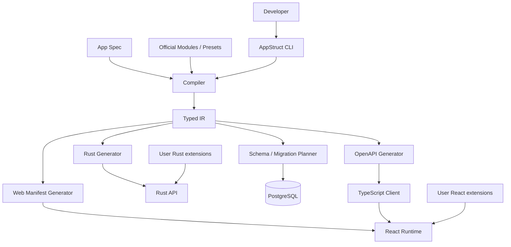

# AppStruct Technical Design

> Status: Implementation Baseline v1.2<br>
> Date: 2026-08-30<br>
> Product document: [`PRODUCT.en.md`](PRODUCT.en.md)<br>
> Target versions: Technical Preview through MVP

This is the architecture record. For day-to-day usage, start with the [overview](README.md).

## 1. Document Goals

This document defines AppStruct's first-version technical architecture, core protocols, code boundaries, and delivery order. It guides implementation and review. It focuses on:

- How a multi-file App Spec is parsed, validated, and merged reliably
- How Typed IR unifies database, backend, OpenAPI, and frontend generation
- How regeneration avoids overwriting user code
- How to implement safe CRUD, authorization, relation queries, and database migrations
- How the React Runtime consumes a UI Manifest and allows custom components
- How Module, Preset, and Template are installed, locked, and upgraded
- How MVP is delivered as verifiable vertical slices

This document does not define a public plugin marketplace, a hosted cloud platform, multi-database adapters, or a visual editor.

### 1.1 Current Implementation Status

The current implementation has passed M0 through M6 acceptance. The compile chain keeps a one-way data flow of `App Spec -> Surface -> Typed IR -> Generators`. Post-M1 refactors split the Compiler into load, naming, field options, validation, access rules, and lowering; the Backend Generator is split into API, Entity, query, validation, and manifest. `source_size` tests enforce a 400-line limit on Rust source files.

M2 added a standalone `appstruct-migrate` crate. It extracts a canonical PostgreSQL schema from IR, persists a deterministic JSON snapshot, classifies diffs by schema risk and execution risk, and generates SQL only for `NonDestructive + Online` plans. Dropping tables/columns, renames, type or primary-key changes, NOT NULL tightening, unique-constraint changes, and adding foreign keys to existing tables are blocked before the snapshot is written. Migration files and the snapshot commit via staging files; a partial commit rolls back newly created local files.

The Migration Runner implements the section 12.4 protocol. `migrate dev --accept` first commits migrations and the snapshot atomically; if `DATABASE_URL` is present it then applies, otherwise it reports pending. `migrate apply/status` loads ordered SQL files, validates the SHA-256 of the snapshot bound to the latest migration, and reconciles IDs, file checksums, and status in `_appstruct_migrations`. The runner uses a PostgreSQL advisory lock and, by default, commits SQL and history in the same transaction; `transaction=off` migrations use `applying/failed` status to prevent blind retries after a crash or failure. When no pending migrations remain, catalog introspection checks managed tables, columns, constraints, and foreign-key drift.

M3 added Value Object, Command, Query, custom page, and field UI component references to IR. The Backend Generator emits DTOs, Entity Hook/Policy traits, Command/Query handler traits, routes, and a typed-state registry. OpenAPI and the TypeScript Generator produce operation contracts and the client from the same IR. The Web Generator emits required component/page keys and, when references exist, makes the generated entry statically import the user's `app/web/registry.tsx`; that registry uses TypeScript `satisfies` for completeness checking. The M3 fixture verifies that a missing Rust handler or React page fails the build, that a complete implementation builds, and that Hook, Command, Query, and Policy behavior works against real PostgreSQL.

CRUD consistency hardening is complete: write paths run in an explicit SeaORM transaction, and in-transaction `RequestContext` delegates Hook/Policy queries to the same `DatabaseTransaction`. Update/Delete lock the target row and compare the `If-Match` revision; Update Policy sees the final candidate state before write. `after_commit` keeps best-effort error isolation. M4 already provides actor context and identity-based data scope; tenant context and tenant isolation still come from M6.

M4 lowers `modules.auth`/`modules.rbac` to `AuthIr` and canonical `AccessRuleIr`. The Compiler validates Auth User UUID primary keys and required unique email, role declarations, owner-relation targets, and non-empty combinators. The migration schema generates `_appstruct_auth_accounts`, `sessions`, `password_resets`, and the development mail-capture table plus foreign keys, in addition to business tables. The generated backend uses Argon2id, opaque token hashes, revocable/expiring sessions, CSRF/Origin checks, and a narrowed development capture/SMTP sender. Actor is injected into both connection and transaction `RequestContext`; owner/RBAC scope is pushed down as SeaORM `Condition`. OpenAPI, the TypeScript client, and React routes generate Cookie security schemes, enabled endpoints, Cookie/CSRF calls, and auth pages from the same Auth IR. Dedicated PostgreSQL acceptance covers anonymous, owner, admin, CSRF, concurrent preconditions, and password-reset/session-revocation paths.

The CLI generation path is split into orchestration, ownership, and transaction modules. `generated/.appstruct-manifest.json` stores Artifact paths, categories, Generator versions, and SHA-256 in deterministic JSON. Generation refuses unknown files or owned files that were edited by hand. `target/`, `node_modules/`, `dist/`, `.vite/`, and Cargo-created `Cargo.lock` are treated as disposable build transients and do not participate in ownership conflicts. A project-level exclusive file lock covers recover, compile, plan, and commit. An append-only journal calls `sync_all` after each directory-swap phase. The next command validates the candidate tree's manifest/hash, then completes the commit or restores the backup. Ambiguous states keep all directories and fail closed.

M5 Template initialization is in the CLI. `new` runs before project discovery, using the current directory or a global `--project` directory as parent. Names are restricted to portable lowercase ASCII package/directory names. Built-in `minimal/dashboard/saas` file tables are embedded at compile time, written through a fixed sibling staging directory, then committed; existing target or staging is not overwritten. Template artifacts belong to the user and include `appstruct.lock`, a `rust-toolchain.toml` pinned to 1.98.0, the `app/backend` user-extension crate, environment examples, and local-state ignore rules. `generate` still owns only `generated/`.

M5 build/doctor is implemented. Project `.env` is read with a dotenv parser without mutating the CLI process environment; explicit environment variables always win. Errors and diagnostics report only variable names or connection results. doctor chooses Docker/Compose or PostgreSQL migration status checks from IR `database.dev.mode`, and provides deterministic text/JSON structures. build first completes the generation transaction; if backend `Cargo.lock` is missing it generates one, then directory swap preserves that transient lock when Cargo.toml is unchanged. Clippy and release build both use `--locked` and `.appstruct/cache/backend-target`. Web Artifacts are formatted with Prettier 3.9.6 pinned by the pnpm lock, inside a temporary directory, before the ownership manifest is computed. build then runs frozen install, format check, `tsc6 --noEmit`, and Vite build.

M5 dev server is implemented. In external mode the CLI explicitly passes the database URL from the process environment or `.env` and does not mutate the parent process environment. Managed mode only coordinates the Compose `postgres` service and records whether this session owns its lifecycle. `database.dev.migration` provides `auto/prompt/never/unmanaged`; managed defaults to prompt, external defaults to unmanaged. never also performs read-only checks of Spec diff, pending/history, and catalog drift; unmanaged does not call the migration subsystem. After policy checks pass, the coordinator runs canonical generation, a debug backend build, and a frozen Web install. Coordinator fingerprints cover `appstruct.yaml`, `appstruct.lock`, `spec/`, and `app/backend/`. On reload, API and pnpm/Vite get independent Unix process groups; TERM stops the whole group and kill follows on timeout, so Vite is not left behind after a wrapper exits. Ctrl-C and Drop paths clean child processes idempotently and stop only managed PostgreSQL started by this session. The production backend runtime never runs migrations.

M5 delivery docs live in the root README and `docs/installation.md`, `docs/upgrading.md`, `docs/deployment.md`. Installation supports workspace-locked source builds and keeps a protocol for post-release checksummed binary packages and a crates.io CLI. Upgrades use an explicit `appstruct update` staging transaction, then independent database plan/status. Deployment docs separate build-time `VITE_API_URL` from backend runtime environment, and define migration status/apply, immutable Artifacts, health/business smoke, and rollback boundaries with no automatic down migrations.

M5 determinism, performance, and browser gates are implemented. CLI integration tests generate in two independent project roots and recursively compare all Artifact bytes. Prettier dependencies are cached under `.appstruct/cache/web-formatter/` by package/lock SHA-256; a cache hit requires both the ready marker and the executable. The Backend Generator plans Entity/API files in chunks using `available_parallelism`; the top-level planner finally sorts by path for determinism. Rust Artifacts from the same plan are batch-formatted by one `rustfmt` subprocess. Generated crate tests derive isolated package names from the manifest and `src/` contents, and share dependency cache at `target/appstruct-generated-tests` to avoid a cold compile per temporary project. The performance gate includes Compiler and Generator: currently 518 ms for 10 entities and 7774 ms for 100 entities. The root pnpm lock pins Playwright 1.62.1. `scripts/run-m5-browser-e2e.sh` creates a temporary external project from the dashboard Template, waits for database readiness, then verifies request ID, Auth, and Project owner CRUD, and captures screenshots of the desktop dashboard and mobile login page. The generated backend adds a database ping at `/health/ready`; `SetRequestIdLayer`/`PropagateRequestIdLayer` provide `X-Request-Id` on responses. The dev signal handler is installed before any startup action. The test script runs in an independent process group, so interrupting a cold build still cleans child processes and temporary directories.

M6 is complete. Tenant, Audit, Mail, Jobs, and File modules plus the `appstruct/saas@1` Preset are in the Compiler. Surface configuration first expands official default module maps, then recursively merges user map overrides, and finally lowers to versioned `PresetIr` and module IR. IR `modules` records each enabled module's source, exact version, provides/requires capabilities, deterministic startup order, and isolated static Artifacts. The Compiler fail-closes on AppStruct version, Preset name/version/content digest, and the exact module version set in `appstruct.lock`. CLI `preset show [--expanded]` inspects the contract. The `saas` Template and `examples/saas-demo` provide a locked Preset, managed PostgreSQL, development Mail/File configuration, and a Tenant/Audit Project/Task skeleton. Dedicated external PostgreSQL/Chromium E2E verifies the five module tables, user journeys, tenant isolation, Audit, and desktop/mobile layouts.

Internal contract hardening is complete. IR v7-v10 can migrate in memory to v11; old IR database migration policy safely degrades to unmanaged. Future versions and semantically unsafe old module graphs fail closed. Root `module_manifests` loads only local TOML under `modules/`, and rejects traversal, symlink, non-UTF-8, and oversized files. Local Artifacts write into the module-owned generated namespace; the local Runtime starter is a no-op. `appstruct.lock` `project_layout_version` distinguishes v1 generated backend from v2 server composition root; directory probing is used only by explicit update to migrate unversioned old projects. Generation and dev build/install use content caches but still run ownership checks. Module Runtime emits structured lifecycle phases; the generated backend records start, failure, rollback, and stop with tracing. Generation-transaction test failpoints cover recovery after backup and after install.

Technical Preview contract hardening is complete. The Compiler embeds Draft 2020-12 JSON Schema; `appstruct schema` can emit it without a project. Compile reports keep non-fatal warnings; currently `AS3070` detects anonymous write operations, and `check --deny-warnings` gives CI a fail policy. `appstruct update` holds both generation and update locks, writes a candidate lock in an in-project staging workspace, compiles the full Spec, generates, runs release Rust/Web builds and backend tests, then compares user-file hashes. It finally jointly swaps `appstruct.lock` and ownership-managed `generated/` with a dedicated journal. Crash recovery either rolls both back or finishes an already-installed candidate. Ordinary generate fail-closes if it sees leftover update state.

Operations correctness hardening completed on 2026-08-30. Jobs Schedule uses interval-only, fire-once/skip-missed semantics; definition reconcile and enqueue/advance both use PostgreSQL transactions. The Webhook outbox HTTP client has compile-time-validated connect/read/request timeouts; Admin can inspect and recover terminal deliveries. Realtime SSE must carry a resource scope; collection/record run list/read Policy respectively. CRUD raw models are used only on the server for per-subscriber authorization; the browser receives only resource/record IDs. Each API instance broadcasts local events immediately and fans out across replicas by polling `_appstruct_realtime_events` with a database sequence cursor, retained for five minutes. Presence and opt-in exclusive leases are coordinated with PostgreSQL TTL. Dedicated dual-API PostgreSQL E2E covers missed runs, definition deletion, HMAC, timeouts, cross-instance SSE, presence renewals, lease takeover, and Admin retry/replay; CI runs this gate independently.

## 2. Architecture Decision Summary

| Topic | First-version decision |
| --- | --- |
| Configuration entry | `appstruct.yaml` plus explicit `includes` domain files |
| Configuration format | YAML; script expressions, merge keys, and implicit directory scans are forbidden |
| Single source of truth | Canonical, versioned Typed IR |
| Backend | Axum + Tokio + SeaORM + PostgreSQL |
| Rust toolchain | Start development on the local latest stable, then pin `1.98.0` via `rust-toolchain.toml` |
| API contract | Build OpenAPI directly from IR; Utoipa supplies OpenAPI data models |
| Frontend | React + TypeScript + Vite, using a compile-time UI Manifest |
| API client | Generate TypeScript types and client from OpenAPI |
| Frontend data boundary | Resource Definition + DataProvider + headless Controller |
| Generation strategy | Generate Rust backend code; generate Manifest, routes, and client for the frontend |
| Extension mechanism | Rust trait/handler + TypeScript registry; do not edit generated files |
| Migrations | IR schema snapshot diff; generate reviewable migration files |
| Packaging model | Module provides implementation; Preset composes modules; Template creates a project once |
| Module assembly | Build-time capability graph + startup-time typed services and cleanup handles |
| Local database | `managed` mode invokes Docker Compose; `external` mode only connects to an existing PostgreSQL |
| Versioning | During MVP, core, Runtime, official modules, and templates ship lockstep |
| Default pagination | Page-number pagination; large scans use primary-key cursor mode |
| Security defaults | Compilation fails without an authorization declaration; entities are not implicitly public |

## 3. System Context



The AppStruct compiler does not run user business logic. It only parses declarations, resolves modules, generates code, and builds contracts. Business logic runs when the generated application compiles or executes.

## 4. Repository Layout

The early repository is a monorepo so the compiler, Runtime, official modules, and end-to-end examples can evolve atomically.

```text
appstruct/
  Cargo.toml
  PRODUCT.md
  TECHNICAL_DESIGN.md

  crates/
    appstruct-cli/
    appstruct-compiler/
    appstruct-ir/
    appstruct-codegen/
    appstruct-migrate/
    appstruct-runtime/
    appstruct-module-sdk/

  packages/
    react/
    client-runtime/

  modules/
    auth/
    rbac/
    tenant/
    audit/
    mail/
    file/
    jobs/
    billing/
    admin/

  presets/
    base/
    saas/

  templates/
    minimal/
    dashboard/
    saas/

  examples/
    saas-demo/

  tests/
    fixtures/
      m0-project/
      m6-*-project/
    golden/
    e2e/
```

Do not split a crate per Generator before MVP. Split `appstruct-codegen` only when compile time, dependency isolation, or independent publishing creates a real need.

## 5. Core Crate Responsibilities

### 5.1 `appstruct-cli`

- Workspace discovery and command-argument parsing
- Invokes the Compiler, Migration Planner, and development process manager
- Unified diagnostics, exit codes, and interactive confirmation
- Contains neither Spec semantic rules nor template-rendering logic

### 5.2 `appstruct-compiler`

- Reads the root configuration and domain files
- Parses a Surface AST with source locations
- Resolves includes, Presets, and Modules
- Builds the symbol table, resolves references, and applies defaults
- Runs semantic validation and produces Typed IR
- Plans and coordinates generation tasks

### 5.3 `appstruct-ir`

- Defines stable, serializable IR types
- Defines strong identifiers such as `EntityId`, `FieldId`, and `TypeRef`
- Owns canonical sorting, hashing, and IR version migration
- Does not depend on YAML, Axum, SeaORM, or React

### 5.4 `appstruct-codegen`

- Generates Rust, OpenAPI, UI Manifest, and TypeScript client from IR
- Maintains the generated-file ownership manifest
- Performs staging writes, verification, and recoverable directory transactions
- Does not re-interpret raw YAML

### 5.5 `appstruct-migrate`

- Extracts a canonical database schema from IR
- Diffs schema snapshots and classifies change risk
- Generates SeaQuery/SQL migration drafts
- Checks database migration status

### 5.6 `appstruct-runtime`

- Request context, unified errors, and response format
- CRUD service pipeline
- Query-parameter parsing, pagination, and relation loading
- Policy, Hook, Command, and transaction protocols
- Runtime does not read App Spec

### 5.7 `appstruct-module-sdk`

- Module manifest v1 schema, portable path checks, and collision-free namespaces
- Module `provides`/`requires` capabilities and dependency-graph declarations
- Typed service assembly, Module start/stop, and resource-cleanup protocol
- Generator extension permissions and Artifact ownership constraints

The current crate supplies manifest types, static Artifact declarations, and capability-graph resolution. The Compiler loads only local manifests under the project `modules/` directory; Codegen isolates their Artifacts under `generated/modules/`. Local modules do not inject IR fragments or executable code. Remote artifact distribution, signing, and third-party compatibility matrices remain later Module API work.

## 6. Generated Application Layout

Projects created by `appstruct new` use a one-way dependency flow so generated crates and user crates do not depend on each other.

```text
project-hub/
  appstruct.yaml
  appstruct.lock
  compose.yaml
  rust-toolchain.toml
  pnpm-workspace.yaml
  pnpm-lock.yaml
  prettier.config.mjs
  spec/
  migrations/

  .appstruct/
    schema.snapshot.json
    cache/

  generated/
    .appstruct-manifest.json
    backend/
      Cargo.toml
      runtime/
      src/
    server/
      Cargo.toml
      src/main.rs
    web/
      manifest.ts
      routes.tsx
      api/
    openapi/
      openapi.json

  app/
    backend/
      Cargo.toml
      src/lib.rs
    web/
      src/

  web/
    package.json
    src/main.tsx
```

Rust dependency direction:

```text
appstruct-runtime <- generated-backend <- app-backend
                         ^                  ^
                         +------ server ----+
```

- `generated-backend` defines Entity, DTO, Policy/Hook traits, and route builders.
- `app-backend` depends on the generated crate and implements user extensions.
- `server` is the composition root; it registers user implementations with generated routes.
- The generated crate does not reference user module paths, so there is no crate cycle.

Frontend dependency direction (the current implementation ships Runtime source with the generated Web Artifact):

```text
generated/web React runtime <- app/web registry
                         ^               ^
                         +---- web ------+
```

## 7. Configuration Loading

### 7.1 Root Entry

```yaml
version: 1

app:
  name: project-hub

database:
  provider: postgres
  dev:
    mode: managed
    migration: prompt

modules:
  auth:
    enabled: true
  rbac:
    enabled: true
    roles: [member, admin]

includes:
  - spec/identity.yaml
  - spec/project.yaml
```

The root entry is the only place allowed to declare:

- App metadata
- Database Provider
- Template source records
- Preset and Module configuration
- `module_manifests` local manifest paths
- `includes`
- Application-level default access policy

Domain files own Entity, Value Object, Enum, Command, Query, and page overrides.

### 7.2 Include Rules

1. Paths resolve relative to the project root.
2. Canonical absolute paths detect duplicates and cycles.
3. Paths must not escape the project root.
4. MVP does not support glob, remote URL, or recursive domain includes.
5. The same entity or Command can be owned by only one file.
6. File order does not affect the final IR or generated output.
7. YAML anchors, aliases, and merge keys are hard errors.

Explicit includes reduce implicit behavior and keep editors, cache keys, and diagnostics more stable.

### 7.3 Location-Preserving Parse

Plain Serde deserialization is not enough for high-quality diagnostics. Parsing is two-stage:

```text
YAML text
  -> Spanned YAML AST
  -> Surface Spec + SourceMap
  -> Typed IR
```

`SourceMap` stores the mapping from configuration paths to source locations:

```rust
pub struct SourceSpan {
    pub file: SourceFileId,
    pub start: ByteOffset,
    pub end: ByteOffset,
}

pub struct Located<T> {
    pub value: T,
    pub span: SourceSpan,
}
```

The YAML parser must:

- Return byte offsets for tokens/nodes
- Recognize anchors, aliases, and merge keys
- Error on duplicate mapping keys
- Support converting the AST into a Serde-consumable data structure

Before Technical Preview, run a small evaluation of `saphyr-parser`, `yaml-rust2`, or another span-preserving implementation. Do not use a pure `serde_yaml` path that cannot keep locations.

### 7.4 Surface Spec and Defaults

Surface Spec stays close to user input; many fields are `Option<T>`. Defaults are applied only when building IR, not as a text merge on the YAML AST.

```rust
pub struct SurfaceEntity {
    pub name: Located<String>,
    pub table: Option<Located<String>>,
    pub fields: Vec<SurfaceField>,
    pub access: Option<SurfaceAccess>,
    pub views: Option<SurfaceViews>,
}
```

Defaults have a fixed priority:

```text
framework defaults
  < Template defaults
  < Preset defaults
  < Module configuration
  < App root configuration
  < domain entity configuration
```

Only nodes the schema marks as overridable participate in override. Entity, Command, and Query do not deep-merge arbitrarily.

## 8. Compile Pipeline


### 8.1 Workspace Discovery

The CLI walks upward from the current directory to the nearest `appstruct.yaml`. Commands may set the project root explicitly with `--project`. CI should always set it explicitly.

### 8.2 Package Resolution

- Read Template source, Preset, and Module constraints.
- Prefer exact versions from `appstruct.lock`.
- Ordinary `check` and `generate` do not implicitly update versions.
- Only `appstruct update` may resolve new versions and rewrite the lock.
- Official components ship lockstep during MVP; there is no general SAT dependency solver.

### 8.3 Symbol Registration and Reference Resolution

All declarations are registered first, then relations and type references are resolved, so forward references are independent of file order.

Symbols use namespaces:

```text
app::Project
app::Task
auth::User
tenant::Organization
```

Unqualified names inside the application resolve to `app::` by default. Types exported by modules must use qualified names or explicit aliases, so module upgrades do not become ambiguous.

### 8.4 Semantic Validation

The validator runs in stages and returns as many errors as possible in one pass:

1. Identifier and reserved-word checks
2. Type and field-option compatibility
3. Table name, column name, route, and enum-value collisions
4. Relation targets, foreign keys, and delete strategies
5. Defaults and validation constraints
6. Permission-role declaration sources, owner fields, and Policy references
7. Page field, sort, and filter references
8. Command/Query input and output types
9. Module dependencies and capability conflicts
10. Database Provider capability limits

Warnings must not change generated output. CI can treat warnings as failures with `--deny-warnings`.

### 8.5 Determinism

- IR collections sort by stable ID or canonical name.
- Do not write the current time or absolute paths into output.
- Generated headers contain only generator version and input hash.
- All text Artifacts use UTF-8, LF newlines, and a fixed trailing-newline rule. They do not depend on host locale or path separators.
- `rust-toolchain.toml` pins the `rustfmt`/Clippy toolchain; `packageManager` and `pnpm-lock.yaml` pin Node tool dependencies; formatter configuration enters the input hash.
- The same Spec, `appstruct.lock`, Rust toolchain, Node lockfile, formatter configuration, and AppStruct version must produce byte-identical output.

## 9. Typed IR

### 9.1 Design Requirements

Typed IR must:

- Be decoupled from YAML spelling
- Contain all defaults and retain no pending `Option`
- Use resolved strong IDs; Generators must not look up by string
- Be serializable and version-migratable
- Be jointly consumed by database, backend, OpenAPI, and frontend generators
- Contain no passwords, API keys, or actual environment-variable values

### 9.2 Core Structures

```rust
pub struct AppIr {
    pub ir_version: IrVersion,
    pub app: AppMeta,
    pub database: DatabaseIr,
    pub auth: AuthIr,
    pub enums: Vec<EnumIr>,
    pub value_objects: Vec<ValueObjectIr>,
    pub entities: Vec<EntityIr>,
    pub relations: Vec<RelationIr>,
    pub commands: Vec<CommandIr>,
    pub queries: Vec<QueryIr>,
    pub pages: Vec<PageIr>,
    pub modules: Vec<ResolvedModule>,
}

pub struct EntityIr {
    pub id: EntityId,
    pub rust_name: RustIdent,
    pub api_name: ApiName,
    pub table_name: SqlIdent,
    pub fields: Vec<FieldIr>,
    pub access: CrudAccessIr,
    pub views: EntityViewsIr,
    pub hooks: HooksIr,
    pub concurrency: ConcurrencyIr,
}

pub struct FieldIr {
    pub id: FieldId,
    pub entity: EntityId,
    pub rust_name: RustIdent,
    pub api_name: ApiName,
    pub column_name: SqlIdent,
    pub ty: FieldTypeIr,
    pub nullable: bool,
    pub generated: Option<GeneratedValueIr>,
    pub validation: ValidationIr,
    pub capabilities: FieldCapabilities,
}

pub struct RelationIr {
    pub id: RelationId,
    pub source: EntityId,
    pub target: EntityId,
    pub cardinality: Cardinality,
    pub foreign_key_owner: EntityId,
    pub foreign_key_fields: Vec<FieldId>,
    pub inverse: Option<RelationId>,
    pub required: bool,
    pub unique: bool,
    pub on_delete: OnDeleteIr,
}
```

`RustIdent`, `SqlIdent`, and `ApiName` are separate so one naming rule cannot pollute every output.

Relations are not re-derived by each Generator from field names. The Compiler must explicitly resolve forward edges, inverse edges, cardinality, foreign-key ownership, composite foreign keys, uniqueness, and delete strategy. SeaORM Entity, Repository, Database Schema IR, OpenAPI, and UI RelationInput all consume the same `RelationIr`. Explicit join entities remain ordinary Entity values and are expressed with two relations, so many-to-many does not get a second implicit semantics.

### 9.3 Stable Identifiers

IDs in IR must not depend on Vec indexes. MVP computes stable IDs from namespace plus canonical logical name, and stores them in the schema snapshot. Renames must establish old-ID to new-ID mapping through an explicit migration hint.

### 9.4 IR Versions

- App Spec version describes user configuration syntax.
- IR version describes the compiler's internal persisted structure.
- Module API version describes the module-to-compiler protocol.
- The three evolve independently and must not share one version number.

## 10. Diagnostics

Unified diagnostic structure:

```rust
pub struct Diagnostic {
    pub severity: Severity,
    pub code: DiagnosticCode,
    pub message: String,
    pub primary: Label,
    pub secondary: Vec<Label>,
    pub help: Option<String>,
}
```

Error numbers are assigned by range:

| Range | Kind |
| --- | --- |
| `AS1xxx` | YAML, include, and Surface Spec |
| `AS2xxx` | Types, entities, and relations |
| `AS3xxx` | Permissions, modules, and extensions |
| `AS4xxx` | Database and migrations |
| `AS5xxx` | Code generation and formatting |
| `AS6xxx` | Development server and environment |

CLI text, JSON output, and the language server use the same diagnostic model. `--format json` must expose stable fields for editors and CI.

## 11. Code Generation

### 11.1 Generator Interface

```rust
pub trait Generator {
    fn name(&self) -> &'static str;
    fn plan(&self, ir: &AppIr, ctx: &GenerateContext)
        -> Result<Vec<Artifact>>;
}

pub struct Artifact {
    pub relative_path: Utf8PathBuf,
    pub content: Vec<u8>,
    pub executable: bool,
    pub kind: ArtifactKind,
}
```

Generators return an in-memory Artifact plan and do not write the final directory themselves. Path collisions, determinism, and safety boundaries can then be checked in one layer.

### 11.2 Rust Generation

- Build Rust tokens with `proc_macro2` and `quote`.
- Re-parse with `syn` to ensure the generated syntax is valid.
- First normalize the syntax tree with `prettyplease` locked as an AppStruct dependency, then hand every Rust Artifact in the same plan to one `rustfmt` process pinned by `rust-toolchain.toml` for final formatting.
- Templates are only for static skeletons such as Cargo.toml; do not concatenate complex Rust syntax.

Generated content includes:

- SeaORM Entity and relation definitions
- Create, Update, and Read DTOs
- Validation types and conversion implementations
- Axum route and handler glue
- Policy, Hook, and Command traits
- Metadata constants required by UI/OpenAPI

### 11.3 OpenAPI Generation

OpenAPI for core CRUD, AppStruct Command, and Query is built directly from IR. Utoipa only supplies OpenAPI types and serialization. It does not reverse-derive the contract by scanning generated Rust attributes.

This keeps the dependency direction:

```text
App Spec -> IR -> Rust API
               -> OpenAPI
```

rather than:

```text
App Spec -> Rust API -> OpenAPI -> frontend
```

Direct generation can detect contract conflicts before Rust is compiled, and keeps macro behavior from becoming a second source of truth.

### 11.4 TypeScript Generation

- OpenAPI owns wire types and the endpoint client.
- The UI Generator owns resource Manifest, routes, and field-component references.
- TypeScript output is formatted with project-local Prettier pinned by `pnpm-lock.yaml`, then verified with `tsc6 --noEmit`. Calling unlocked global tools from PATH is forbidden.
- The custom-component registry uses `satisfies` for compile-time checks against Manifest references.

### 11.5 Safe Writes

```text
acquire the project-level generation lock
  -> validate generated/ ownership and hashes with the existing manifest
  -> validate Artifact relative paths and collisions
  -> write a sibling staging directory on the same filesystem
  -> format, statically verify, and write a deterministic manifest
  -> record a recovery journal
  -> rename the old directory to backup, then rename staging to generated/
  -> delete the journal and backup
```

`generated/` is exclusive to generators and, by default, is version-controlled together with `generated/.appstruct-manifest.json`. If the existing directory contains a file not recorded in the manifest, or a recorded file's hash does not match disk, ordinary generation must abort. The CLI does not silently delete unknown files or overwrite hand edits. If any directory-swap step fails, restore the backup immediately. After a process crash, the next command finishes recovery from the journal before starting a new generation.

The guarantee is a recoverable directory transaction, not the non-portable assumption that one rename can overwrite a non-empty directory. `app/`, `migrations/`, and other user directories never enter this transaction.

The current implementation covers ownership/hash checks, path checks, a project-level cross-process file lock, sibling staging/backup, rollback on sync failure, and automatic recovery after a crash. The journal is append-only JSON records of `prepared`, `backed_up`, and `installed` in order. Even if the last line is incomplete because of a crash, recovery can use the previous complete phase plus the directory combination. Legacy staging/backup without a journal rolls back to the existing complete tree. Ambiguous combinations such as all three directories present are not deleted by guessing. Rust Artifacts are rustfmt'd during in-memory planning; TypeScript Artifacts are Prettier-formatted with the lockfile-pinned tool before the manifest is computed. Production build also runs Clippy, Prettier check, TypeScript check, and Vite build against the final staging result.

## 12. Database Model and Migrations

### 12.1 Schema IR

The Migration Planner does not diff Entity IR directly. It first converts to a database-specific Schema IR:

```rust
pub struct DatabaseSchema {
    pub provider: DatabaseProvider,
    pub tables: Vec<TableSchema>,
    pub enums: Vec<EnumSchema>,
    pub indexes: Vec<IndexSchema>,
    pub foreign_keys: Vec<ForeignKeySchema>,
}
```

UI or permission changes therefore do not accidentally trigger database migrations.

### 12.2 Separated State Files

| File | Committed | Purpose |
| --- | --- | --- |
| `appstruct.lock` | yes | Locks AppStruct, project layout, Preset, Module, and template source versions |
| `.appstruct/schema.snapshot.json` | yes | Stores the canonical target schema for the accepted migration chain; it does not represent database apply progress |
| `generated/.appstruct-manifest.json` | yes | Deterministically records generated-file ownership, content hashes, and Generator versions |
| `.appstruct/cache/` | no | Incremental compile cache |

Dependency resolution and database migration must not share one fuzzy lock concept.

### 12.3 Diff Classification

```rust
pub enum SchemaRisk {
    NonDestructive,
    RequiresInput,
    Destructive,
}

pub enum ExecutionRisk {
    Online,
    MayLock,
    NonTransactional,
    ManualReview,
}

pub struct ChangeRisk {
    pub schema: SchemaRisk,
    pub execution: ExecutionRisk,
}
```

Example rules:

| Change | Schema risk | Execution risk | Default handling |
| --- | --- | --- | --- |
| Add a nullable column with no default | NonDestructive | Online | Generate a migration |
| Add an ordinary index | NonDestructive | MayLock | Warn about PostgreSQL write-blocking risk |
| `CREATE INDEX CONCURRENTLY` | NonDestructive | NonTransactional | Generate a separate non-transactional step |
| Add a unique index | NonDestructive | ManualReview | Require a check of duplicate data and lock behavior |
| Add a NOT NULL column | RequiresInput | MayLock | Require a default/backfill plan |
| Rename a column | RequiresInput | Online | Require `renamed_from` |
| Drop a column | Destructive | ManualReview | Block automatic execution |
| Shorten a varchar | Destructive | MayLock | Block automatic execution |
| Remove an enum value | Destructive | ManualReview | Require a handwritten migration |

Only `NonDestructive + Online` may be executed by development `auto` or confirmed `prompt`. Every other combination needs a handwritten migration. Production always runs already-reviewed, committed migration files. The Migration Runner must let a single migration declare its transaction boundary; it must not wrap `CREATE INDEX CONCURRENTLY` in an ordinary transaction.

Rename hints may be written into Spec temporarily:

```yaml
name:
  type: string
  renamed_from: title
```

After the migration file and snapshot are accepted, the hint can be removed without producing a new schema diff. Whether the target database has already applied that migration is still determined by the migration history table.

### 12.4 Migration Execution

- `appstruct migrate plan` only computes and displays a plan. It does not connect to the database, and it does not write migration files or the snapshot.
- `appstruct migrate dev` displays the plan. After interactive confirmation or `--accept`, it commits the migration files and snapshot as one recoverable local transaction, then executes them on the development database.
- If development-database execution fails, the migration files and snapshot are kept, and the database is marked behind or partially failed. Retry prefers recovering or applying that pending migration; it does not generate files again from the same diff.
- `appstruct migrate apply` only executes existing migration files and updates the database migration history table. It does not modify Spec or the snapshot.
- CI/production must not sync the database directly from an uncommitted Spec.
- A non-TTY environment without `--accept` must not create migration files. Dangerous or input-required changes cannot be bypassed with a generic `--accept` alone.

The current implementation uses the migration file name as a stable ID and executes in lexicographic file-name order. The latest generated migration includes `-- appstruct:schema-sha256=<sha256>`, binding the on-disk migration chain to `.appstruct/schema.snapshot.json`. Default migrations run in a transaction and insert `_appstruct_migrations` in the same transaction on success. Reviewed `-- appstruct:transaction=off` files first persist `applying`, then become `applied` on success, or `failed` on failure, which blocks later automatic apply. Apply holds a session advisory lock. A PostgreSQL URL with `sslmode=disable` uses a cleartext connection; other SSL modes use system-certificate TLS.

### 12.5 Database Drift

`migrate status` compares the snapshot, on-disk migrations, the migration history table, and the target database. The history table records migration ID, content checksum, `applying/applied/failed` status, and time. Modified already-applied migration files, missing/out-of-order files, or dirty history fail immediately. When pending migrations exist, drift is marked deferred. After everything is applied, introspection compares managed table, column type/null/default/identity, primary/unique, enum CHECK, and foreign key, and reports missing/unexpected/changed items. The database catalog is diagnostic only; it does not overwrite App Spec or the snapshot.

## 13. Backend Runtime

### 13.1 Request Pipeline

```mermaid
flowchart LR
    A[Decode and Limit] --> B[Shape Validate]
    B --> C[Authenticate]
    C --> D[Before Validate Hook]
    D --> E[Constraint Validate]
    E --> F[Begin Transaction for Write]
    F --> G[Load Target with Read Scope]
    G --> H[Before Write Hook]
    H --> I[Build and Revalidate Candidate]
    I --> J[Authorize Final State]
    J --> K[Conditional Repository Write]
    K --> L[After Write Hook]
    L --> M[Commit]
    M --> N[After Commit Effect]
    N --> O[Encode Response]
```



All CRUD endpoints use the same pipeline. Generated handlers must not assemble security steps themselves.

Shape validation only builds typed input that cannot trigger undefined states; optional fields that still need defaults are allowed. `before_validate` fills contextual defaults and normalizes content outside a transaction. Constraint validation then runs required, range, and cross-field constraints. Hooks cannot mutate actor or tenant context. Only input that passes final validation may enter authorization and the transaction phase.

The diagram describes the write branch. Create skips target load. Update/Delete load and lock the target inside the transaction using read scope, so authorization and write cannot TOCTOU. `before_create/update` may fill business fields, but their output must re-run the affected constraint checks. Update then builds `before + patch -> after`; Policy authorizes the final candidate state, and Repository writes with a revision condition. No Hook may rewrite data awaiting persistence after final authorization.

List, Read, RelationSelect, and relation include do not enter a write transaction, but they must push `read_scope` down into the database query. After Hooks may only perform derived writes in the same transaction. They must not change the primary record and bypass already-completed final-state authorization.

### 13.2 Request Context

```rust
pub struct RequestContext {
    pub request_id: RequestId,
    pub actor: Option<Actor>,
    pub tenant: Option<TenantId>,
    pub locale: Locale,
}
```

Context is built by authentication and tenant middleware and passed as an explicit argument to Service, Policy, and Hook. The current user or tenant must not be read from a process-level global.

The M6 Tenant contract is:

```yaml
modules:
  auth:
    enabled: true
    user_entity: User
  tenant:
    enabled: true

entities:
  Project:
    tenant: true
```

`TenantIr.enabled` and `EntityIr.tenant_scoped` are the only generation inputs. The Compiler refuses to enable Tenant when Auth is disabled, and refuses a business field occupying the reserved column `tenant_id`. Lowering injects a `GeneratedValueIr::Tenant` UUID field for tenant-scoped entities. That field enters Entity and the migration schema, but it does not enter Create/Update DTOs and is not shown as a configurable filter.

Module migrations install `_appstruct_tenant_organizations` and `_appstruct_tenant_memberships`. Membership uses composite primary key `(organization_id, user_id)`; both references use `ON DELETE CASCADE`. Organization `created_by` references Auth User with `RESTRICT`. Module endpoints provide the organization list visible to the current actor and organization creation. Creating an organization and the owner membership commit in the same transaction.

The generated backend parses a UUID from `X-AppStruct-Tenant` and validates the actor against the membership table when constructing `RequestContext`. Ordinary non-tenant endpoints may receive `tenant: None`. Tenant-scoped CRUD must call `context.require_tenant()`, then AND `tenant_id = current_tenant` with the Condition produced by AccessRule. Create ActiveModel uses the context tenant directly. Update/Delete first lock the row with the same condition, so IDs from other tenants stay `404`. Both in-transaction and `after_commit` contexts keep the same actor/tenant; Hook and Policy can only read that value.

The TypeScript runtime exposes `tenantApi.listOrganizations/createOrganization/select/clear/current`, stores the selected tenant ID in `localStorage`, and attaches the header to all API requests. The UI switcher only selects context; the security boundary remains on the backend. OpenAPI declares the required `X-AppStruct-Tenant` header for tenant-scoped operations and documents Tenant endpoints.

The M6 Audit contract is:

```yaml
modules:
  audit:
    enabled: true
    reader_roles: [admin]

entities:
  Project:
    audit: true
```

The Compiler lowers configuration to `AuditIr { enabled, reader_roles }` and `EntityIr.audit_enabled`, and validates that Audit depends on Auth, that reader roles are declared by RBAC, and that `audit: true` appears only when the module is enabled. Migrations install append-only `_appstruct_audit_events` with a UUID primary key, entity/record_id/operation, nullable actor/tenant, nullable before/after JSONB, and `occurred_at`. Actor deletion uses `SET NULL`. When Tenant is available, tenant deletion also uses `SET NULL`, preserving audit records.

The CRUD write pipeline serializes the final Model and writes Audit after successful `after_create/after_update/after_delete` Hooks and before transaction commit: Create is `(null, after)`, Update is `(before, after)`, Delete is `(before, null)`. Event writes use the same `DatabaseTransaction` and `RequestContext`, so a business commit cannot succeed without audit. It does not use best-effort `after_commit`. Generic Audit observes only explicitly marked business entities. It does not record Auth internal tables, password hashes, sessions, Mail bodies, or File contents.

`GET /api/audit/events` supports capped pagination ordered by `occurred_at, id` descending. Runtime first verifies that the actor has one of `reader_roles`. When Tenant is enabled it also calls `require_tenant()` and pushes the tenant condition into SQL. The endpoint has no arbitrary entity/record SQL expressions and provides no routes to modify or delete events. OpenAPI and the TypeScript client generate a read-only contract from the same Audit IR.

The M6 Mail contract is:

```yaml
modules:
  mail:
    enabled: true
    provider: capture # capture | smtp | resend
    from: "AppStruct <notifications@example.com>"
    templates:
      welcome:
        subject: "Welcome {{ name }}"
        text: "Your workspace is ready."
        html: "<p>Your workspace is ready.</p>"
```

The Compiler lowers configuration to `MailIr { enabled, provider, from, templates }`, sorts by template name, and validates subject/text/HTML syntax with the MiniJinja parser before generation. IR stores only Provider type, sender, and template source. SMTP passwords and Resend API keys are read at Runtime startup from `APPSTRUCT_SMTP_*` and `APPSTRUCT_RESEND_API_KEY` respectively. The `capture` Provider fails startup when `APPSTRUCT_ENV=production`.

The generated backend exports object-safe `MailProvider`, `MailState`, `MailMessage`, `MailDelivery`, and `MailError`. `MailState::with_provider` supports injecting a test or user Provider; the default Provider is chosen by Mail IR. `RequestContext` keeps a `MailState` reference and provides a template-send entry that automatically carries the current tenant. Development capture writes `_appstruct_mail_deliveries`. Bodies in that table do not enter Audit snapshots; tenant deletion uses `SET NULL`.

Direct Mail Provider calls are not a reliable queue. Business code should call them only from `after_commit` or an explicit Command. When retry, delay, or crash recovery is required, write Jobs/Outbox in the same business transaction and let a Worker deliver after commit. Auth continues to use a separate `AuthMailSender` capability, so the Mail Module is not a hard dependency of password reset.

The M6 Jobs/Outbox contract is:

```yaml
modules:
  jobs:
    enabled: true
    poll_interval_ms: 250
    lease_seconds: 30
    queues:
      default: { max_attempts: 5, backoff_seconds: 2 }
      mail: { max_attempts: 8, backoff_seconds: 5 }
```

The Compiler lowers configuration to name-sorted `JobsIr`/`JobQueueIr` and limits poll, lease, attempt, and backoff ranges. Migrations install `_appstruct_jobs` with queue/kind/payload, nullable unique idempotency key, nullable tenant, status, attempt/max_attempts/backoff, run_at, lease owner/expiry, last_error, and completion time. The Tenant foreign key uses `SET NULL`, so job lifetime does not block tenant deletion.

`RequestContext::enqueue_job` performs a parameterized INSERT on the current connection or transaction. When called during the CRUD Hook transaction phase, it commits atomically with the business write. Idempotency-key conflicts use a database unique constraint and return the existing ID. `JobWorker` claims a due queued Job or a running Job whose lease has expired with a single `UPDATE ... FROM (SELECT ... FOR UPDATE SKIP LOCKED)`, and commits the claim before calling the object-safe `JobHandler`. Success is marked succeeded. Failure requeues with `backoff * 2^(attempt-1)`, capped at one hour, and marks dead after max_attempts.

The Worker is at-least-once: a process can crash after Handler success and before status update, so Handler and downstream Providers must be idempotent. `spawn` returns a `JobWorkerHandle` holding a shutdown channel and JoinHandle; service stop waits for cleanup explicitly. last_error is truncated to 2000 characters and does not record secrets. When Mail and Jobs are both enabled, `MailJobPayload`/`MailJobHandler` can handle `mail.send`, but Auth does not depend on Jobs.

The Admin Jobs API publishes recent job metadata only to an `admin` actor and does not return payload. Dead-letter retry reuses the original ID inside a row-lock transaction, resets attempts, and enqueues immediately. succeeded/dead replay copies queue, kind, payload, tenant, and retry budget to a new ID after locking the source row, and clears the idempotency key. Cookie mutations must pass CSRF; Bearer tokens reuse Actor authorization. queued/running jobs cannot be replayed, so in-flight side effects are not actively duplicated.

The M6 File contract is:

```yaml
modules:
  file:
    enabled: true
    provider: local # local | s3
    local_root: .appstruct/files
    max_bytes: 10485760
    allowed_content_types: [text/plain, application/json, image/png]
```

The Compiler lowers this to `FileIr`, validates provider, a safe relative local root, a 1 to 100 MiB per-file limit, and a canonical MIME allowlist, then sorts and deduplicates MIME types. Migrations install `_appstruct_files` with a globally unique object key, original name, MIME, size, SHA-256, nullable tenant, and created time. The Tenant foreign key uses `SET NULL`. The generated backend exports object-safe `FileProvider`, injectable `FileState`, `FileMetadata`, and `FileError`; `RequestContext` automatically forwards tenant.

The default adapters use `object_store` LocalFileSystem or AmazonS3Builder. S3 runtime reads `APPSTRUCT_S3_ENDPOINT`, `APPSTRUCT_S3_BUCKET`, `APPSTRUCT_S3_ACCESS_KEY`, `APPSTRUCT_S3_SECRET_KEY`, and an optional region. Cleartext HTTP is allowed only when `APPSTRUCT_S3_ALLOW_HTTP=true`. Object writes are create-only and do not overwrite an existing key. If metadata insert fails, the just-written object is deleted best-effort. Path validation rejects absolute paths, backslashes, NUL, `.`/`..`, empty segments, and non-canonical paths. Text, JSON, and sniffed binary content must match the declared MIME; reads re-check the checksum. get/delete SQL binds tenant with `tenant_id IS NOT DISTINCT FROM`, so cross-tenant access uniformly looks like missing metadata. `RequestContext` passes its own `ConnectionTrait` into metadata operations so metadata writes inside a hook join the current business transaction. Direct `FileState` calls still use its default connection. Delete first calls idempotent object-store delete, then deletes metadata, so a failed metadata delete can be retried without first losing the tracking record for the object.

### 13.3 Repository

The generated Repository is responsible for:

- Converting a allowlisted filter AST into SeaORM Condition
- Applying data scope produced by Policy
- Pagination, stable sort, and relation loader
- Mapping database models to response DTOs
- Unifying the leak boundary between not found and forbidden

MVP provides only a PostgreSQL implementation, but Runtime interfaces do not leak PostgreSQL-specific types to Policy and Hook.

## 14. API Conventions

### 14.1 Routes

```text
GET    /api/projects
POST   /api/projects
GET    /api/projects/{id}
PATCH  /api/projects/{id}
DELETE /api/projects/{id}
POST   /api/commands/archive-project
GET    /api/queries/project-summary
```

Entity routes use plural kebab-case. Command and Query name collisions are compile errors.

### 14.2 List Queries

The default is page-number pagination, which fits admin tables and total counts:

```text
GET /api/projects?page=1&page_size=25
    &sort=-created_at,name
    &filter[status]=active
    &filter[created_at][gte]=2026-01-01
    &q=search-text
    &include=owner
```

- `page` is 1-based.
- Default `page_size=25`, maximum 100.
- Sort fields must be allowed in Spec.
- Each filter operator is validated against the field type.
- `filter[relation.field]` may traverse only one hop, and both the relation field and the target field must be declared filterable. The target Entity's list permission and tenant condition run inside the subquery.
- `include` defaults to maximum depth 1 and must be explicitly allowed.
- Every sort must form a unique total order. If the user sort does not end with a unique key, Repository appends the primary key automatically. It must not append only when there is no explicit sort.

This rule keeps page numbers stable on a static dataset. Concurrent inserts or deletes can still move offset pages; clients should invalidate and refetch related lists after a write. When `limit` or `cursor` is passed, the same route switches to primary-key ascending cursor mode. That mode does not compute totals, returns `next_cursor` and `has_more`, and refuses to mix with `page`, `page_size`, or `sort`. Cursors use versioned Base64URL encoding; clients may only echo them unchanged.

Each resource also generates `GET /api/<table>/_aggregate`. `count` is available by default. Numeric fields declared `filterable` support `sum`/`avg`; numeric, string, enum, and datetime fields support `min`/`max`; non-JSON scalars may be used for `group_by`. The query reuses list search, field filters, relation filters, access conditions, and tenant scope, restricting to visible data before aggregating. Results use stable `group_<field>` and `<metric>_<field>` aliases, and `limit` caps grouped results to 1 through 500 rows. OpenAPI and the TypeScript client generate that allowlist and call contract from the same IR.

Fields may declare independent `read`/`write` AccessRule; when omitted they inherit entity operation permissions. Reads are stripped before JSON serialization. Writes are checked both before and after Hooks and validation. Filter, sort, search, relation filter, and aggregate cannot bypass field read permission.

### 14.3 Responses

```json
{
  "data": [],
  "meta": {
    "page": 1,
    "page_size": 25,
    "total": 0
  }
}
```

Error response:

```json
{
  "error": {
    "code": "VALIDATION_FAILED",
    "message": "The request is invalid.",
    "fields": {
      "name": ["Name is required."]
    },
    "request_id": "req_..."
  }
}
```

Error codes are a stable machine interface. Messages may be localized and must not be used by clients as branch conditions.

Authentication and record visibility use a fixed status boundary: unauthenticated requests return 401. ID operations return 404 both when the record does not exist and when it is outside the caller's `read_scope`. When the record is readable but the current operation is not allowed, return 403. The same order applies to Read, Update, and Delete, so different endpoints cannot leak invisible records through error differences.

### 14.4 Optimistic Concurrency

Every entity that enables update or delete includes a framework-managed `revision bigint not null` by default. It starts at 1 on create and increments atomically on each successful update. The field enters Database Schema IR but is not exposed as an ordinary editable business field.

- Detail reads and successful create/update responses return `ETag: "rev-<revision>"`.
- `PATCH` and `DELETE` must carry the `If-Match` from the latest detail read; missing it returns `428 PRECONDITION_REQUIRED`.
- Repository locks the target row with `SELECT ... FOR UPDATE` inside the write transaction, runs read Policy first, then compares revision, and increments revision atomically on a successful update. A revision mismatch returns `412 CONCURRENT_MODIFICATION`. Missing records or records invisible to read Policy continue to follow the 404 anti-leak rule. The row lock serializes concurrent writes to the same record, so there is no lost update between compare and the subsequent write.
- The generated TypeScript client stores ETag and automatically sends `If-Match`. On 412, React Runtime keeps unsubmitted form values and offers an action to reload the latest record.
- Custom Commands that mutate entities must explicitly accept an expected revision or call the Repository conditional-write API. They cannot bypass concurrency control and still claim conflict protection.

OpenAPI must describe `ETag`, `If-Match`, 428, and 412 responses.

## 15. Authentication and Authorization

### 15.1 Default Authentication

The Web SPA uses server-side opaque sessions and `HttpOnly` Cookies:

- Passwords use Argon2id
- Session Cookies are always `HttpOnly` and `SameSite=Lax`; production defaults to `Secure`. Local HTTP development may explicitly use a non-Secure Cookie
- Login and sensitive operations have rate-limit entry points
- State-changing requests run CSRF/Origin checks
- Sessions support revocation, expiry, and current-session logout. Password reset revokes that user's existing sessions
- CORS by default allows only the configured frontend Origin and includes credentials

The Auth Module also defines a narrowed `AuthMailSender` capability that currently sends only password-reset messages. MVP provides a development capturer and a production SMTP adapter. If production enables password reset without SMTP configured, the server must fail before startup. Reset tokens store only a hash, must be single-use, and have a short expiry. Registration verification can later extend this capability. Generic templates, Provider routing, and business-event mail belong to the V1 Mail Module.

JWT and API tokens are later Providers, not the browser default authentication method.

### 15.2 Authorization Model

```rust
pub enum AccessRuleIr {
    Public,
    Authenticated,
    Role { role: String },
    Owner { field: FieldId },
    Any(Vec<AccessRuleIr>),
    All(Vec<AccessRuleIr>),
}
```

`Any` and `All` contain at least one subexpression. The Compiler flattens same-kind nesting, sorts by stable ID, and deduplicates. MVP does not provide YAML-named Policy or `Not`. The entity Policy trait is a separate business-authorization stage after the access expression. If there is no entity-level or application-level default authorization declaration, the Compiler errors. `public` must be written explicitly.

### 15.3 Query Scope

List, ID read, RelationSelect, and relation include must convert the full read `AccessExprIr` into a database query scope. `Any` becomes OR and `All` becomes AND. Loading a whole page and then filtering row by row is forbidden; it would break pagination, totals, and data isolation.

Field permissions use the same `public`, `authenticated`, `role`, `any`, and `all` expressions as entities, but do not support `owner`. OpenAPI keeps dynamic rules in `x-appstruct-read-access`/`x-appstruct-write-access`. The Web Manifest passes rules to column, detail, and form runtimes. These client hints are not a security boundary.

```rust
pub trait EntityPolicy<E>: Send + Sync {
    fn read_scope(&self, ctx: &RequestContext) -> PolicyFilter<E>;
    fn can_create(&self, ctx: &RequestContext, final_input: &E::Create) -> Decision;
    fn can_update(
        &self,
        ctx: &RequestContext,
        before: &E,
        patch: &E::Update,
        after: &E,
    ) -> Decision;
    fn can_delete(&self, ctx: &RequestContext, row: &E) -> Decision;
}
```

Create `final_input` already has defaults and `before_create` applied, with constraints revalidated. Update `after` is the candidate record after applying the typed patch and `before_update` to `before`. Policy must see it before Repository writes. The built-in `owner` rule checks final input on Create, and on Update requires both the old record and the new state to belong to the current actor. Ownership-transfer operations must be authorized by other explicit rules or a dedicated Command.

Custom `PolicyFilter` may only compose typed expressions the framework supports. Business that needs arbitrary SQL becomes a custom Query, and the user owns review. Custom Queries must still declare access rules and use RequestContext explicitly. "Custom" does not mean skipping authentication or tenant boundaries.

### 15.4 Relation Authorization

- relation include re-runs read scope on the target entity.
- The RelationSelect search endpoint also enforces target-entity permissions.
- Database relation fields generate independent reference values, for example required `owner_id`. Expanded object `owner` is always optional or nullable in the response contract.
- When expansion was not requested or the caller cannot read the target entity, the expanded object is uniformly absent. `required: true` must not imply that the expanded object exists.
- Whether the relation reference itself appears in the response is decided by field sensitivity and read capability. It cannot bypass target-entity authorization.
- Inferring unauthorized records through counts, error differences, or autocomplete is forbidden.

## 16. Hook, Command, and Query

### 16.1 Hook Phases

| Hook | Transaction state | Purpose |
| --- | --- | --- |
| `before_validate` | no transaction | Fill contextual defaults and normalize input |
| `before_create/update/delete` | in transaction | Business validation and same-transaction mutation |
| `after_create/update/delete` | in transaction | Write related records and audit information |
| `after_commit` | committed | Mail, messaging, and third-party side effects |

MVP `after_commit` is best-effort, not end-to-end at-most-once. A process may crash after commit and before the call; request or Command retries may also fire it twice. Runtime records structured logs and metrics on handler failure, but it cannot roll back a committed transaction, and it cannot disguise a successful database write as failure. Handlers must be idempotent and may carry only non-critical side effects. Modules that need reliable delivery must write a transactional outbox once Jobs/Outbox is available.

### 16.2 Command

A Command is a side-effecting business operation. It must declare input, output, and permissions. Input and output may only reference Entity, Enum, or Value Object already resolved into IR. The Compiler does not scan user Rust types and does not write user module paths into the generated crate. Generated code defines a handler trait and registration key from the Command's stable ID. The user crate implements:

```rust
#[async_trait]
pub trait ArchiveProjectHandler: Send + Sync {
    async fn execute(
        &self,
        ctx: &RequestContext,
        input: ArchiveProjectInput,
    ) -> AppResult<ProjectDto>;
}
```

### 16.3 Query

A Query is a read-only business query. It runs by default on a read-only transaction or ordinary connection. Queries must not bypass permissions. Complex reports may return a Value Object declared in Spec; they do not have to map to an Entity.

### 16.4 Extension Registration

The generated crate exposes a typed-state aggregate registration interface. The server completes assembly at startup. M3 uses one handler bundle for every required Command/Query trait. The `RequiredHandlers` blanket implementation holds only when the bundle implements every trait:

```rust
let extensions = AppExtensions::builder()
    .handlers(ApplicationHandlers::new())
    .project_hooks(ProjectHooksImpl::new())
    .project_policy(ProjectPolicyImpl::new())
    .build();

let app = generated::router(state, extensions);
```

The builder provides `build()` only after moving from `Missing` to `Present<H>`, and `H: RequiredHandlers`. Adding a Command/Query therefore makes an existing handler bundle that lacks the matching trait implementation a Rust compile error, not a server-startup error or a 500 on the first request. Entity Hook and Policy have no-op/allow defaults. They can be replaced per entity and do not enter the required-state set.

## 17. React Runtime

### 17.1 Boundaries

React is the first official Renderer. App Spec and core IR do not store React components, hooks, or JSX. UI IR uses framework-independent concepts such as resources, fields, actions, layouts, and component capabilities.

```text
UI IR
  -> React Manifest Generator
  -> @appstruct/react
  -> user Component Registry
```

### 17.2 Compile-Time Manifest

MVP generates the Manifest as TypeScript instead of downloading it from an API at runtime:

- Type checking can finish in CI
- Custom components can be tree-shaken
- The first screen does not depend on an extra metadata request
- Frontend and backend versions are fixed in the same build
- UI Manifest is not a security authorization boundary

When dynamic tenant customization is needed later, add a restricted runtime UI configuration layer. Do not ship arbitrary component code.

### 17.3 Manifest Example

```ts
export const projectResource = defineResource({
  name: "Project",
  label: "项目",
  api: projectApi,
  fields: {
    name: { kind: "string", required: true },
    status: {
      kind: "enum",
      options: ["draft", "active", "archived"],
    },
  },
  views: {
    list: {
      columns: ["name", "status"],
      defaultSort: [{ field: "created_at", direction: "desc" }],
    },
  },
});
```

### 17.4 Component Registry

```ts
export const registry = defineAppStructRegistry({
  fields: {
    MapPicker,
  },
  pages: {
    ProjectDashboard,
  },
});
```

Registry keys are constrained by generated types. `tsc` fails when the Manifest references a missing component.

### 17.5 State Management

- Server state is managed by TanStack Query.
- Client routing and URL state are managed by TanStack Router.
- List filters, pagination, and sort sync to the URL.
- Local form state is managed by TanStack Form; Zod supplies validation directly through Standard Schema.
- Do not introduce a global Redux-style store for MVP.
- Permission data is used to show and disable actions; the backend still runs full authorization.

### 17.6 UI Quality Baseline

- Keyboard can complete the main CRUD flows.
- Form controls have labels, descriptions, and associable errors.
- Loading, empty, unauthorized, network error, and submit conflict each have a distinct state.
- Fixed-format components use stable sizes to avoid layout shift after load.
- Default information density fits a repetitive admin, not a marketing-page layout.

## 18. Module, Preset, and Template

### 18.1 Module

A Module is an executable capability unit:

```text
modules/auth/
  module.yaml
  backend/
  migrations/
  web/
  manifest/
  templates/
```

Conceptual manifest:

```yaml
api_version: 1
name: appstruct/auth
version: 0.1.0

requires:
  appstruct: ">=0.1,<0.2"

exports:
  entities: [auth::User, auth::Session]
  capabilities: [auth.principal]

backend:
  crate: appstruct-module-auth

web:
  package: "@appstruct/module-auth"
```

Modules may contribute IR fragments, but they cannot override entities owned by other modules or the application. Cross-module collaboration happens through capabilities and explicit dependencies.

### 18.2 Preset

A Preset only composes modules and default configuration. It does not copy module implementations:

```yaml
name: appstruct/saas
version: 1

modules:
  auth: { enabled: true, user_entity: User, registration: true, password_reset: true }
  rbac: { roles: [member, admin], default_role: member }
  tenant: { enabled: true }
  audit: { enabled: true, reader_roles: [admin] }
  mail: { enabled: true, provider: capture }
  jobs: { enabled: true }
  file: { enabled: true, provider: local }
```

Version 1 does not include Billing. Admin provides Preview through an operations overview, module entry points, and Jobs recovery actions. Default Mail also provides invitation/welcome templates. Jobs provide default/mail queues. File is limited to 10 MiB and an explicit MIME allowlist. The fully effective configuration after merging project overrides is printed by `appstruct preset show --expanded`.

User `modules` maps merge recursively on top of Preset defaults; scalars and sequences replace wholesale. All modules still run ordinary Compiler dependency and safety checks, so overrides cannot bypass Auth, Tenant, or Audit contracts. `appstruct.lock` must contain the lockstep AppStruct version, Preset name/version, expanded-text SHA-256, and exact versions of the seven modules. The compiler does not implicitly backfill or upgrade the lock in ordinary commands.

### 18.3 Template

A Template is a one-time user-code skeleton for creating a project:

```bash
appstruct new acme --template saas
```

A Template may provide:

- Initial `appstruct.yaml` and domain configuration
- User-editable landing, mail templates, and brand assets
- Local development environment configuration
- Example Hooks, Commands, and tests
- A reference to a Preset

After copy, Template files belong to the user. `generate` never overwrites them. Upgrading a Template does not automatically merge user files. Long-term upgrades happen through Runtime, Module, and Preset versions.

### 18.4 Publishing Boundary

AppStruct Core does not contain SaaS-specific entities or payment logic. `templates/saas`, `presets/saas`, and `examples/saas-demo` live in the same monorepo initially, but they must use Core through the public Module API.

During MVP, all official packages share lockstep versions, so a complex module resolver and compatibility matrix are not built early. Third-party module publishing opens after the Module API is stable.

## 19. CLI Design

### 19.1 Commands

```text
appstruct new <name> --template <name>
appstruct schema
appstruct check [--deny-warnings] [--format text|json]
appstruct generate [--check]
appstruct dev [--api-port <port>] [--web-port <port>]
appstruct build
appstruct doctor
appstruct auth bootstrap-admin --email <address>

appstruct migrate plan
appstruct migrate dev
appstruct migrate apply
appstruct migrate status

appstruct preset show [--expanded]
appstruct update
```

### 19.2 Exit Codes

| Exit code | Meaning |
| --- | --- |
| 0 | Success |
| 1 | Spec or generation validation failed |
| 2 | CLI argument error |
| 3 | Environment or dependency missing |
| 4 | Database connection or migration failed |
| 5 | User declined an operation that requires confirmation |

### 19.3 Non-Interactive Mode

When CI detects a non-TTY:

- Do not ask interactive questions
- Operations that need confirmation fail immediately
- Provide input through explicit flags
- Output contains no color control sequences unless forced on

## 20. Development Server

`appstruct dev` is a process coordinator. It does not reimplement Vite, Cargo, Docker Compose, or the database server.

Responsibilities:

- Load environment variables and require distinct API/Web ports
- Coordinate managed PostgreSQL or connect to external PostgreSQL from `database.dev.mode`
- From `database.dev.migration`, auto-migrate, prompt as needed, read-only validate, or skip migration checks entirely, then generate, build the backend, and install Web dependencies
- Watch App Spec, lockfile, `spec/`, local `modules/`, and user Rust. User React is watched by Vite
- Do not restart the previous service version when migrate, generate, or build fails
- Aggregate logs and mark sources with `[api]`/`[web]`
- Use independent process groups to terminate the full child-process tree gracefully

Database development modes:

| Mode | Startup behavior | Exit behavior | Preconditions |
| --- | --- | --- | --- |
| `managed` | Start PostgreSQL with Template-provided `docker compose up` | Stop containers started by this session; keep named volumes | Docker and Compose are available |
| `external` | Read `DATABASE_URL` from the process environment or `.env` | Do not manage the database process | External PostgreSQL is reachable |

Migration-policy semantics: `auto` creates and applies `NonDestructive + Online` migrations; `prompt` displays and asks only when a new plan or disk pending exists; `never` read-only validates Spec, snapshot, migration history, and catalog, and any inconsistency blocks startup; `unmanaged` skips plan/status/apply entirely and continues with a warning. managed defaults to prompt; external defaults to unmanaged. The production backend runtime does not read this development policy and never runs migrations. Releases still use a separate `migrate status/apply` job.

The `dashboard` Template defaults to managed mode. Production has no managed mode. Database passwords are read only from the runtime environment and do not enter Surface Spec, IR, logs, or build fingerprints. `appstruct doctor` checks dependencies for the selected mode and, when Docker is unavailable, gives external-mode configuration guidance.

File-change classification:

| Change | Action |
| --- | --- |
| App Spec / `appstruct.lock` | Check by migration policy, full generate, and service restart; commit only Artifacts whose content changed |
| User Rust | Full debug build and restart API/Web |
| User React | Hand to Vite HMR |
| migrations | Not a watch input; handled by migration policy on next start or when other inputs reload |

The implementation uses 400 ms polling fingerprints and does not watch `generated/`, `.appstruct/cache/`, or build output. Default API and Web ports are 3000/5173 and may be overridden by CLI flags. Vite uses a strict port; a port conflict fails immediately. When generation inputs and the ownership tree are unchanged, skip Compiler/Codegen/formatter/directory transaction. When Rust inputs and the debug binary are unchanged, reuse the backend build. When Web package/lock and `.pnpm` are unchanged, reuse the install. Any missing, corrupt, or output-missing cache state falls back to the full flow.

## 21. Cache and Build Fingerprints

Build fingerprints include at least:

- AppStruct version
- IR version
- App Spec content hash
- `appstruct.lock` hash
- `rust-toolchain.toml`, rustfmt configuration, and actual formatter version
- `pnpm-lock.yaml`, `packageManager`, Prettier configuration, and actual formatter version
- Generator name and version
- Template/Module static-asset hash
- Hash of IR nodes that affect that Artifact

The current generation key covers App Spec, lock, `spec/`, `modules/`, CLI executable, and ownership manifest. Before a hit, unknown files and content hashes of the generated tree are still verified. The backend key covers generated backend/server and `app/backend`. The Web install key covers package/lock. Directory symlinks count only the link itself in the generation fingerprint; they are not followed. Cache only improves speed and is not part of correctness. After deleting `.appstruct/cache`, a full rebuild must still be possible.

## 22. Versioning and Upgrades

### 22.1 Version Axes

```text
AppStruct CLI/Compiler version
App Spec schema version
Typed IR version
Module API version
Project layout version
React Manifest version
Runtime API version
```

MVP uses lockstep releases to reduce combinations, but keeps independent version fields in files and protocols.

### 22.2 Upgrade Flow

```text
appstruct update
  -> resolve a supported candidate lock from the installed CLI
  -> copy user inputs and fully compile Spec in a staging workspace
  -> regenerate in the staging workspace
  -> run Rust/Web release builds and generated-backend tests
  -> recheck that user-input hashes did not change concurrently
  -> jointly commit lock and generated artifacts with a journal
```

The current Technical Preview does not automatically rewrite Spec, Template, migrations, or the snapshot, and it does not connect to a database. Unsupported future Preset/Spec changes must stop and provide manual steps. Database risk is reviewed after update with independent `migrate plan/status`. If any staging step fails, staging is deleted; the current workspace lock, Spec, snapshot, and generated artifacts stay unchanged. An upgrade must not treat "the project is already in Git" as its own failure recovery.

## 23. Security Design

### 23.1 Compile-Time Safety

- include and Template paths must stay inside allowed roots.
- Artifact paths must be canonical relative paths. `..` and symlink escapes are forbidden. Local Module source also enforces UTF-8, per-file, and total-size limits.
- Local Module Artifacts may only enter `generated/modules/<namespace>/`. Starters are fixed no-ops. Ordinary generate does not network or execute module code.
- Spec does not expand shell, environment-variable templates, or arbitrary expressions.
- Secrets exist only as runtime environment-variable references. They are not written into IR, OpenAPI, or Manifest.

### 23.2 Runtime Safety

- Default deny, or require an explicit application-level authorization default.
- Allowlisted query fields and operators.
- Request-body size, page size, and relation-depth limits.
- Parameterized database queries.
- Unified log redaction.
- Rate-limit middleware reserved for auth endpoints and expensive queries.
- Upload, mail, and webhook modules each get a threat model.

### 23.3 Supply Chain

- Rust and Node lockfiles are version-controlled.
- Official Templates pin dependency version ranges.
- CI generates an SBOM and runs dependency vulnerability scans.
- Local Module manifest, source content, CLI executable, and generated ownership hashes together enter a recomputable fingerprint.

## 24. Observability

The generated backend uses `tracing` by default:

- Structured logs in text/JSON, chosen by the subscriber
- request ID span
- Safe identifiers for route, status, latency, and actor/tenant
- Module `starting/started/failed/rolling_back/rolled_back/stopping/stopped` phases
- Database slow-query spans without sensitive parameters
- `/health/live` and `/health/ready`

An OpenTelemetry interface is reserved as a Runtime feature. It is not an MVP default dependency.

## 25. Testing Strategy

### 25.1 Unit Tests

- YAML locations and diagnostics
- include cycles, path escapes, and duplicate declarations
- Type, relation, permission, and page validation
- Name canonicalization and collision detection
- filter parser and Policy composition
- schema diff risk classification

### 25.2 Golden Tests

Fix Spec input and compare:

- Canonical IR JSON
- Generated Rust
- OpenAPI JSON
- UI Manifest
- migration plan
- Diagnostic text and JSON

Golden updates must be explicit. Test runs must not automatically overwrite expected files.

### 25.3 Compile Tests

Each key fixture must verify:

- `cargo fmt --check`
- `cargo check`
- `cargo clippy -- -D warnings`
- TypeScript typecheck
- Frontend build

### 25.4 Integration Tests

Use temporary PostgreSQL to verify CRUD, transactions, relations, migrations, and permissions. Integration tests must cover ETag conditional updates, 412 for stale revision, 428 for missing `If-Match`, and the reject path after an already-applied migration checksum is modified. Test databases must be created independently and reclaimed after the test.

### 25.5 End-to-End Tests

`examples/saas-demo` and standalone module fixtures are the current acceptance entry points, covering:

- Registration and login
- List, filter, create, edit, and delete
- owner permissions
- Custom Command
- Custom field components
- Configuration changes and regeneration

Use Playwright to verify key flows in desktop and mobile viewports.

### 25.6 Determinism Tests

Generate the same fixture twice in a row. The second workspace must have no diff, and ownership-manifest content hashes must match. Changing unrelated UI configuration must leave the database snapshot and migration plan unchanged. CI uses the locked Rust toolchain and Node lockfile, and verifies byte-identical text Artifacts on at least two supported platforms.

## 26. CI Pipeline

```text
format
  -> lint
  -> unit tests
  -> golden tests
  -> generated compile tests
  -> PostgreSQL integration tests
  -> frontend tests
  -> example E2E
  -> package checks
```

Pull Requests use the smallest necessary matrix. Main-branch and release builds run full examples and security scans.

## 27. Implementation Milestones

### M0: Compiler Skeleton

- Workspace and CLI
- YAML AST with spans
- include loader
- Surface Spec, Typed IR, and diagnostics
- Canonical IR golden tests
- Generate and compile a minimal Rust artifact from IR

Acceptance: two domain files parse into a stable IR, errors locate to line and column, and the minimal generated crate passes `cargo check` on the locked toolchain.

### M1: Unauthenticated Vertical Slice

- A single Project entity
- PostgreSQL schema and migration drafts
- SeaORM Entity and Axum CRUD
- OpenAPI and TypeScript client
- React list and form

Acceptance: one Spec can complete CRUD from database to browser. This stage is technical validation only, not a public security default.

### M2: Data Model and Queries

- Field validation, enums, and relations
- Pagination, sort, filter, and search
- schema snapshot diff
- Detail pages and RelationSelect

Acceptance: a Project/Task relation application runs end to end, and dangerous migrations are blocked.

### M3: Extension Boundary

Status: complete.

- Hook, Command, Query, and Policy traits
- Rust extension registry
- React component/page registry
- Generated ownership manifest

Acceptance: user extensions are unchanged after regeneration; missing extensions fail at build time.

### M4: Authentication and Permissions

Status: complete.

- Auth Module
- server-side session
- Password-reset tokens, development mail capturer, and production SMTP adapter
- RBAC and owner scope
- Login UI and route guards
- Permission security integration tests

Acceptance: data scope for anonymous, ordinary member, owner, and admin matches Spec.

### M5: MVP Engineering

Status: complete.

- `minimal` and `dashboard` Template
- dev server, doctor, JSON diagnostics
- Determinism, performance, and E2E gates
- Installation, upgrade, and deployment docs
- `server` composition root, `app/backend` user-extension boundary, and vendored Runtime

Acceptance: a new user runs the example in 15 minutes and adds a permissioned entity in 30 minutes.

### M6: SaaS Foundations

Status: complete.

- Tenant, Audit, Mail, Jobs, and File Module
- First `appstruct/saas` Preset
- `saas` Template and end-to-end example
- Official capability graph, `appstruct-module-sdk`, and `appstruct-runtime`

Billing and a full operations Admin join the complete SaaS Template after the corresponding modules meet production safety standards. They do not block Core MVP. The current Preview provides an operations overview, module entry points, and Jobs recovery actions.

## 28. Performance Budget

| Operation | Target |
| --- | --- |
| Full IR compile for 10 entities | under 500 ms |
| Config change to generation complete for 10 entities | under 1 s; MVP may fully replan |
| Full generation for 100 entities | under 10 s |
| CLI no-op check | under 300 ms after a cache hit |
| Default list API | local-database p95 under 200 ms, excluding network |

Performance tests are recorded on fixed hardware and datasets. The target is a regression threshold, not an absolute cross-machine promise.

## 29. Known Risks

### 29.1 YAML Spans and Serde Compatibility

High-quality diagnostics need locations, which may require a custom AST-to-Surface-Spec decode layer. M0 must validate this first; it cannot be added after Generators are finished.

### 29.2 SeaORM Generation and Complex Queries

Standard CRUD fits SeaORM, but complex reports and database features may need SeaQuery or SQLx. Repository and custom Query must keep an escape hatch. The Migration Planner does not depend on ORM auto-sync.

### 29.3 Rust Extension Type Cycles

The generated crate does not depend on the user crate. The current direction is `generated/backend` plus vendored Runtime -> `app/backend` -> `generated/server` composition root, verified by M3/M6 compile tests.

### 29.4 Frontend/Backend Contract Drift

OpenAPI, Rust API, and UI must be generated in the same IR compile. Fetching OpenAPI back from a running service must not be the ordinary development flow.

### 29.5 Premature Module-Protocol Generalization

MVP only executes official monorepo module code. Project-local manifests may contribute only capabilities and isolated UTF-8 static Artifacts; starters are no-ops. Remote distribution, signing, executable third-party modules, and non-lockstep compatibility matrices must wait until an independent security model is stable.

### 29.6 SaaS Template Scope Creep

A full SaaS involves payments, mail delivery, job reliability, tenant isolation, and operations permissions. The SaaS Template ships independently of Core MVP and sets a safety-acceptance bar for each module.

## 30. Issues That Need ADRs

These later questions need separate ADRs. First-version protocols that have already landed are no longer blockers:

1. Whether large projects need remote or package-level Spec dependencies.
2. Whether Session adds a Redis Provider.
3. Remote distribution, signing, and compatibility matrices for Module artifacts.
4. Cross-version compatibility migration strategy for `.appstruct/schema.snapshot.json`.
5. Authorization, cache, and migration semantics for cursor pagination and bulk writes.

## 31. Definition of Done

An AppStruct feature is done only when all of the following hold:

- App Spec schema, Typed IR, and diagnostics are defined
- Backend, OpenAPI, and UI outputs stay consistent
- Generated results are repeatable and do not modify user files
- Security defaults and permission paths are tested
- Database changes have an explicit risk classification
- The example application covers success and failure paths
- Product, technical, and user docs are updated together

## 32. First Implementation Task

The first code task should not generate Axum CRUD directly. It should close the minimal compiler loop:

```text
appstruct.yaml + spec/project.yaml
  -> Surface Spec with SourceSpan
  -> semantic validation
  -> canonical AppIr JSON
  -> golden test
  -> minimal Rust artifact
  -> cargo check
```

This step determines input quality for every later Generator. It is also the foundation that is hardest to replace later at no cost.
