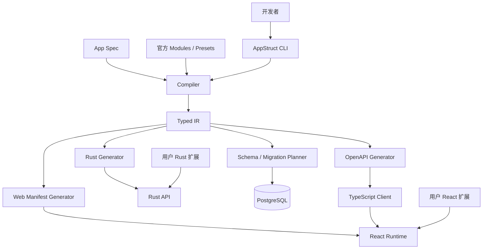

# AppStruct 技术设计文档

> 状态：Implementation Baseline v0.5<br>
> 日期：2026-08-26<br>
> 对应产品文档：[`PRODUCT.md`](PRODUCT.md)<br>
> 目标版本：Technical Preview 至 MVP

## 1. 文档目标

本文档定义 AppStruct 的首版技术架构、核心协议、代码边界和交付顺序，用于指导实现和评审。重点解决以下问题：

- 多文件 App Spec 如何可靠地解析、校验和合并
- 如何以 Typed IR 统一数据库、后端、OpenAPI 和前端生成
- 如何重复生成而不覆盖用户代码
- 如何实现安全的 CRUD、授权、关系查询和数据库迁移
- React Runtime 如何消费 UI Manifest 并允许自定义组件
- Module、Preset 和 Template 如何安装、锁定和升级
- MVP 如何以可验证的垂直切片逐步交付

本文档不定义最终公开插件市场、云托管平台、多数据库适配或可视化编辑器。

### 1.1 当前落地状态

当前实现已经通过 M0 至 M3 验收。编译链保持 `App Spec -> Surface -> Typed IR -> Generators` 单向数据流；M1 后的重构将 Compiler 拆分为加载、命名、字段选项、校验、访问规则和 lowering，将 Backend Generator 拆分为 API、Entity、查询、校验和 manifest，`source_size` 测试对 Rust 源文件执行 400 行上限。

M2 新增独立的 `appstruct-migrate` crate。它从 IR 提取规范化 PostgreSQL schema，持久化确定性 JSON snapshot，按 schema 风险与执行风险分类 diff，并只为 `NonDestructive + Online` 计划生成 SQL。删除表/列、重命名、类型或主键变化、非空收紧、唯一约束变化、已有表新增外键等变更会在 snapshot 写入前阻断。迁移文件与 snapshot 使用 staging 文件提交，局部提交失败时回滚本地新文件。

当前 `migrate dev --accept` 的职责止于创建可审查迁移文件并推进 snapshot；它尚不写数据库迁移历史，也不执行 `migrate apply/status`。这两个状态不能混用：snapshot 表示磁盘迁移链的目标 schema，不代表数据库已经应用。数据库 runner、checksum 和 drift 检测按第 12.4 节协议在后续工程化里程碑实现。

M3 在 IR 中加入 Value Object、Command、Query、自定义页面和字段 UI component 引用。Backend Generator 生成 DTO、Entity Hook/Policy trait、Command/Query handler trait、路由和类型状态 registry；OpenAPI 与 TypeScript Generator 从同一 IR 生成 operation 契约和客户端。Web Generator 生成必需组件/page key，并在存在引用时让生成入口静态导入用户所有的 `app/web/registry.tsx`；该 registry 通过 TypeScript `satisfies` 完整性检查。M3 fixture 同时验证缺少 Rust handler 或 React page 时构建失败、完整实现可构建，并在真实 PostgreSQL 上验证 Hook、Command、Query 和 Policy 行为。

CRUD 一致性加固已完成：写路径在显式 SeaORM 事务中执行，事务内 `RequestContext` 把 Hook/Policy 查询委托到同一 `DatabaseTransaction`；Update/Delete 锁定目标行并比较 `If-Match` revision，Update Policy 在写入前看到最终候选状态。`after_commit` 保持 best-effort 错误隔离。actor/tenant context 和基于身份的数据范围仍由 M4/M6 提供，在这些里程碑完成前不得把默认 allow Policy 当作权限边界。

CLI 生成路径已拆到独立模块。`generated/.appstruct-manifest.json` 使用确定性 JSON 保存 Artifact 路径、类别、Generator 版本和 SHA-256；生成前拒绝未知文件或被人工修改的 owned file。`target/`、`node_modules/`、`dist/`、`.vite/` 和 Cargo 自动创建的 `Cargo.lock` 视为可丢弃构建瞬态，不参与 ownership 冲突。写入使用项目目录中的 sibling staging/backup 交换，失败时立即恢复 backup。当前尚未实现跨进程项目锁和崩溃恢复 journal；检测到遗留 staging/backup 时命令中止，不会猜测或覆盖现场。

## 2. 架构决策摘要

| 主题 | 首版决策 |
| --- | --- |
| 配置入口 | `appstruct.yaml` + 显式 `includes` 领域文件 |
| 配置格式 | YAML，禁止脚本表达式、merge key 和隐式目录扫描 |
| 单一事实来源 | 规范化、版本化的 Typed IR |
| 后端 | Axum + Tokio + SeaORM + PostgreSQL |
| Rust 工具链 | 使用本地最新稳定版启动开发，并通过 `rust-toolchain.toml` 固定为 `1.98.0` |
| API 契约 | 从 IR 直接构建 OpenAPI，Utoipa 提供 OpenAPI 数据模型 |
| 前端 | React + TypeScript + Vite，使用编译期 UI Manifest |
| API 客户端 | 从 OpenAPI 生成 TypeScript 类型和客户端 |
| 前端数据边界 | Resource Definition + DataProvider + headless Controller |
| 生成策略 | Rust 后端生成代码；前端生成 Manifest、路由和客户端 |
| 扩展机制 | Rust trait/handler + TypeScript registry，不修改生成文件 |
| 迁移 | IR schema snapshot diff，生成可审查迁移文件 |
| 打包模型 | Module 提供实现，Preset 组合模块，Template 一次性创建项目 |
| Module 装配 | 构建期 capability graph + 启动期 typed service 与可清理 handle |
| 本地数据库 | `managed` 模式调用 Docker Compose；`external` 模式只连接已有 PostgreSQL |
| 版本策略 | MVP 期间核心、Runtime、官方模块和模板锁步发布 |
| 默认分页 | 页码分页，后续为大数据实体增加游标模式 |
| 安全默认值 | 无授权声明时编译失败，不隐式公开实体 |

## 3. 系统上下文



AppStruct 编译器不运行用户业务逻辑。它只解析声明、解析模块、生成代码和构建契约。业务逻辑在生成应用编译或运行时执行。

## 4. 仓库结构

初期采用 monorepo，保证编译器、Runtime、官方模块和端到端示例可以原子演进。

```text
appstruct/
  Cargo.toml
  PRODUCT.md
  TECHNICAL_DESIGN.md

  crates/
    appstruct-cli/
    appstruct-compiler/
    appstruct-ir/
    appstruct-codegen/
    appstruct-migrate/
    appstruct-runtime/
    appstruct-module-sdk/

  packages/
    react/
    client-runtime/

  modules/
    auth/
    rbac/
    tenant/
    audit/
    mail/
    file/
    jobs/
    billing/
    admin/

  presets/
    base/
    saas/

  templates/
    minimal/
    dashboard/
    saas/

  examples/
    project-manager/
    saas-demo/

  tests/
    fixtures/
      kitchen-sink/
    golden/
    e2e/
```

MVP 前不为每个 Generator 建立独立 crate。只有当编译时间、依赖隔离或独立发布产生实际需求时再拆分 `appstruct-codegen`。

## 5. 核心 crate 职责

### 5.1 `appstruct-cli`

- 工作区发现和命令参数解析
- 调用 Compiler、Migration Planner 和开发进程管理器
- 统一诊断输出、退出码和交互确认
- 不包含 Spec 语义规则和模板渲染逻辑

### 5.2 `appstruct-compiler`

- 读取根配置和领域文件
- 解析带源码位置的 Surface AST
- 解析 include、Preset 和 Module
- 建立符号表、解析引用、应用默认值
- 执行语义校验并生成 Typed IR
- 规划和协调生成任务

### 5.3 `appstruct-ir`

- 定义稳定、可序列化的 IR 类型
- 定义 `EntityId`、`FieldId`、`TypeRef` 等强类型标识
- 负责规范化排序、哈希和 IR 版本迁移
- 不依赖 YAML、Axum、SeaORM 或 React

### 5.4 `appstruct-codegen`

- 从 IR 生成 Rust、OpenAPI、UI Manifest 和 TypeScript 客户端
- 维护生成文件 ownership manifest
- 执行 staging 写入、验证和可恢复的目录事务
- 不重新解释原始 YAML

### 5.5 `appstruct-migrate`

- 从 IR 提取规范化数据库 schema
- 对比 schema snapshot 并分类变更风险
- 生成 SeaQuery/SQL 迁移草稿
- 检查数据库迁移状态

### 5.6 `appstruct-runtime`

- 请求上下文、统一错误和响应格式
- CRUD service pipeline
- 查询参数解析、分页和关系加载
- Policy、Hook、Command 和事务协议
- Runtime 不读取 App Spec

### 5.7 `appstruct-module-sdk`

- Module manifest schema
- 模块 `provides`/`requires` capability 与依赖图声明
- IR fragment 注入协议
- 后端扩展和前端 registry 的兼容性接口
- typed service 装配、Module 启停和资源清理协议
- Generator 扩展权限与 Artifact ownership 约束

该 crate 在 Technical Preview 可以只包含 manifest 类型，待官方第三方模块协议稳定后再公开为 SDK。

## 6. 生成应用结构

`appstruct new` 创建的项目采用依赖单向流，避免生成 crate 和用户 crate 互相依赖。

```text
project-hub/
  appstruct.yaml
  appstruct.lock
  compose.yaml
  rust-toolchain.toml
  pnpm-workspace.yaml
  pnpm-lock.yaml
  prettier.config.mjs
  spec/
  migrations/

  .appstruct/
    schema.snapshot.json
    cache/

  generated/
    .appstruct-manifest.json
    backend/
      Cargo.toml
      src/
    web/
      manifest.ts
      routes.tsx
      api/
    openapi/
      openapi.json

  app/
    backend/
      Cargo.toml
      src/
    web/
      src/

  server/
    Cargo.toml
    src/main.rs

  web/
    package.json
    src/main.tsx
```

Rust 依赖方向：

```text
appstruct-runtime <- generated-backend <- app-backend
                         ^                  ^
                         +------ server ----+
```

- `generated-backend` 定义 Entity、DTO、Policy/Hook trait 和路由构建函数。
- `app-backend` 依赖生成 crate 并实现用户扩展。
- `server` 是 composition root，将用户实现注册给生成路由。
- 生成 crate 不直接引用用户模块路径，因此不存在 crate 循环依赖。

前端依赖方向：

```text
@appstruct/react <- generated/web <- app/web registry
                         ^               ^
                         +---- web ------+
```

## 7. 配置加载

### 7.1 根入口

```yaml
version: 1

app:
  name: project-hub

database:
  provider: postgres
  dev:
    mode: managed

modules:
  auth:
    enabled: true
  rbac:
    enabled: true
    roles: [member, admin]

includes:
  - spec/identity.yaml
  - spec/project.yaml
```

根入口是唯一允许声明以下内容的位置：

- App 元数据
- 数据库 Provider
- Template 来源记录
- Preset 和 Module 配置
- `includes`
- 应用级默认访问策略

领域文件负责 Entity、Value Object、Enum、Command、Query 和页面覆盖。

### 7.2 include 规则

1. 路径相对项目根目录解析。
2. 使用规范化绝对路径检测重复和环依赖。
3. 禁止路径逃逸项目根目录。
4. MVP 不支持 glob、远程 URL 和递归领域 include。
5. 同一个实体或 Command 只能由一个文件拥有。
6. 文件顺序不影响最终 IR 和生成结果。
7. YAML anchor、alias 和 merge key 直接报错。

显式 include 降低隐式行为，也使编辑器、缓存键和诊断信息更加稳定。

### 7.3 带位置的解析

普通 Serde 反序列化不足以提供高质量诊断。解析流程采用两阶段：

```text
YAML text
  -> Spanned YAML AST
  -> Surface Spec + SourceMap
  -> Typed IR
```

`SourceMap` 保存配置路径与源码位置的映射：

```rust
pub struct SourceSpan {
    pub file: SourceFileId,
    pub start: ByteOffset,
    pub end: ByteOffset,
}

pub struct Located<T> {
    pub value: T,
    pub span: SourceSpan,
}
```

YAML parser 必须满足：

- 返回 token/node 的 byte offset
- 能识别 anchor、alias 和 merge key
- 对重复 mapping key 报错
- 支持将 AST 转换为 Serde 可消费的数据结构

Technical Preview 开始前对 `saphyr-parser`、`yaml-rust2` 或其他带 span 的实现做小型验证，不直接使用无法保留位置的纯 `serde_yaml` 路径。

### 7.4 Surface Spec 与默认值

Surface Spec 尽量接近用户输入，其中大量字段为 `Option<T>`。默认值只在构建 IR 时应用，不在 YAML AST 上做文本合并。

```rust
pub struct SurfaceEntity {
    pub name: Located<String>,
    pub table: Option<Located<String>>,
    pub fields: Vec<SurfaceField>,
    pub access: Option<SurfaceAccess>,
    pub views: Option<SurfaceViews>,
}
```

默认值具有固定优先级：

```text
框架默认值
  < Template 默认值
  < Preset 默认值
  < Module 配置
  < App 根配置
  < 领域实体配置
```

只有 schema 明确标记为可覆盖的节点参与覆盖。Entity、Command 和 Query 不做任意深度 merge。

## 8. 编译流水线


### 8.1 工作区发现

CLI 从当前目录向上查找最近的 `appstruct.yaml`。命令可以通过 `--project` 显式指定项目根，CI 中建议总是显式指定。

### 8.2 包解析

- 读取 Template 来源、Preset 和 Module 约束。
- 优先使用 `appstruct.lock` 的精确版本。
- 普通 `check` 和 `generate` 不隐式更新版本。
- `appstruct update` 才允许解析新版本并重写 lock。
- MVP 官方组件锁步发布，不实现通用 SAT 依赖求解器。

### 8.3 符号注册与引用解析

所有声明先注册，再解析关系和类型引用，允许文件顺序无关的前向引用。

符号使用命名空间：

```text
app::Project
app::Task
auth::User
tenant::Organization
```

应用内未限定名称默认解析到 `app::`。模块导出的类型必须使用限定名称或显式 alias，避免模块升级后产生歧义。

### 8.4 语义校验

校验器以阶段执行并尽可能一次返回多个错误：

1. 标识符和保留字校验
2. 类型与字段选项兼容性
3. 表名、列名、路由和枚举值冲突
4. 关系目标、外键和删除策略
5. 默认值与校验约束
6. 权限角色的声明来源、owner 字段和 Policy 引用
7. 页面字段、排序和过滤引用
8. Command/Query 输入输出类型
9. 模块依赖和能力冲突
10. 数据库 Provider 能力限制

警告不应改变生成结果。CI 可以通过 `--deny-warnings` 将警告视为失败。

### 8.5 确定性

- IR 集合按稳定 ID 或规范化名称排序。
- 禁止在输出中写入当前时间和绝对路径。
- 生成头只包含生成器版本和输入 hash。
- 所有文本 Artifact 使用 UTF-8、LF 换行和固定的末尾换行规则，不依赖宿主平台 locale 或路径分隔符。
- `rust-toolchain.toml` 固定 `rustfmt`/Clippy toolchain，`packageManager` 和 `pnpm-lock.yaml` 固定 Node 工具依赖，格式化配置进入输入 hash。
- 相同 Spec、`appstruct.lock`、Rust toolchain、Node lockfile、格式化配置和 AppStruct 版本必须逐字节产生相同输出。

## 9. Typed IR

### 9.1 设计要求

Typed IR 必须：

- 与 YAML 表达方式解耦
- 包含所有默认值，不保留未决 `Option`
- 使用已解析的强类型 ID，不在 Generator 中按字符串查找
- 可序列化和版本迁移
- 能被数据库、后端、OpenAPI 和前端生成器共同消费
- 不包含密码、API key 或环境变量实际值

### 9.2 核心结构

```rust
pub struct AppIr {
    pub ir_version: IrVersion,
    pub app: AppMeta,
    pub database: DatabaseIr,
    pub auth: AuthIr,
    pub enums: Vec<EnumIr>,
    pub value_objects: Vec<ValueObjectIr>,
    pub entities: Vec<EntityIr>,
    pub relations: Vec<RelationIr>,
    pub commands: Vec<CommandIr>,
    pub queries: Vec<QueryIr>,
    pub pages: Vec<PageIr>,
    pub modules: Vec<ResolvedModule>,
}

pub struct EntityIr {
    pub id: EntityId,
    pub rust_name: RustIdent,
    pub api_name: ApiName,
    pub table_name: SqlIdent,
    pub fields: Vec<FieldIr>,
    pub access: CrudAccessIr,
    pub views: EntityViewsIr,
    pub hooks: HooksIr,
    pub concurrency: ConcurrencyIr,
}

pub struct FieldIr {
    pub id: FieldId,
    pub entity: EntityId,
    pub rust_name: RustIdent,
    pub api_name: ApiName,
    pub column_name: SqlIdent,
    pub ty: FieldTypeIr,
    pub nullable: bool,
    pub generated: Option<GeneratedValueIr>,
    pub validation: ValidationIr,
    pub capabilities: FieldCapabilities,
}

pub struct RelationIr {
    pub id: RelationId,
    pub source: EntityId,
    pub target: EntityId,
    pub cardinality: Cardinality,
    pub foreign_key_owner: EntityId,
    pub foreign_key_fields: Vec<FieldId>,
    pub inverse: Option<RelationId>,
    pub required: bool,
    pub unique: bool,
    pub on_delete: OnDeleteIr,
}
```

`RustIdent`、`SqlIdent` 和 `ApiName` 分离，避免一种命名规则污染所有输出。

关系不由各 Generator 根据字段名重新推导。Compiler 必须显式解析正向边、反向边、基数、外键所有权、组成外键、唯一性和删除策略；SeaORM Entity、Repository、Database Schema IR、OpenAPI 和 UI RelationInput 都消费同一 `RelationIr`。显式中间实体仍是普通 Entity，并通过两条关系表达，避免为多对多维护另一套隐式语义。

### 9.3 稳定标识

IR 中的 ID 不能依赖 Vec 下标。MVP 使用命名空间与规范化逻辑名计算稳定 ID，并在 schema snapshot 中保存。重命名必须通过显式迁移提示建立旧 ID 到新 ID 的映射。

### 9.4 IR 版本

- App Spec 版本描述用户配置语法。
- IR 版本描述编译器内部持久化结构。
- Module API 版本描述模块与编译器协议。
- 三者独立演进，不能共用一个版本号。

## 10. 诊断系统

统一诊断结构：

```rust
pub struct Diagnostic {
    pub severity: Severity,
    pub code: DiagnosticCode,
    pub message: String,
    pub primary: Label,
    pub secondary: Vec<Label>,
    pub help: Option<String>,
}
```

错误编号按范围分配：

| 范围 | 类型 |
| --- | --- |
| `AS1xxx` | YAML、include 和 Surface Spec |
| `AS2xxx` | 类型、实体和关系 |
| `AS3xxx` | 权限、模块和扩展 |
| `AS4xxx` | 数据库和迁移 |
| `AS5xxx` | 代码生成和格式化 |
| `AS6xxx` | 开发服务器和环境 |

CLI 文本、JSON 输出和语言服务器使用同一个诊断模型。`--format json` 必须提供稳定字段，方便编辑器和 CI 集成。

## 11. 代码生成

### 11.1 Generator 接口

```rust
pub trait Generator {
    fn name(&self) -> &'static str;
    fn plan(&self, ir: &AppIr, ctx: &GenerateContext)
        -> Result<Vec<Artifact>>;
}

pub struct Artifact {
    pub relative_path: Utf8PathBuf,
    pub content: Vec<u8>,
    pub executable: bool,
    pub kind: ArtifactKind,
}
```

Generator 返回内存中的 Artifact 计划，不直接写最终目录。这使路径冲突、确定性和安全边界可以在统一层校验。

### 11.2 Rust 生成

- 使用 `proc_macro2` 和 `quote` 构建 Rust token。
- 通过 `syn` 重新解析，确保生成语法有效。
- 先使用作为 AppStruct 依赖锁定的 `prettyplease` 规范化语法树，再使用项目 `rust-toolchain.toml` 固定的 `rustfmt` 完成最终格式化。
- 模板只用于 Cargo.toml 等静态骨架，不拼接复杂 Rust 语法。

生成内容包括：

- SeaORM Entity 和 relation 定义
- Create、Update、Read DTO
- 校验类型和转换实现
- Axum route 与 handler glue
- Policy、Hook、Command trait
- UI/OpenAPI 所需的元数据常量

### 11.3 OpenAPI 生成

核心 CRUD、AppStruct Command 和 Query 的 OpenAPI 从 IR 直接构建。Utoipa 仅提供 OpenAPI 类型和序列化，不通过扫描生成 Rust attribute 反向推导契约。

该设计保持依赖方向：

```text
App Spec -> IR -> Rust API
               -> OpenAPI
```

而不是：

```text
App Spec -> Rust API -> OpenAPI -> 前端
```

直接生成可以在 Rust 尚未编译时发现契约冲突，也避免宏行为成为第二套事实来源。

### 11.4 TypeScript 生成

- OpenAPI 负责传输类型和 endpoint 客户端。
- UI Generator 负责资源 Manifest、路由和字段组件引用。
- TypeScript 输出使用项目本地、由 `pnpm-lock.yaml` 固定版本的 Prettier 格式化，并经过 `tsc --noEmit` 验证；禁止调用 PATH 中未锁定的全局工具。
- 自定义组件 registry 使用 `satisfies` 对 Manifest 引用进行编译期校验。

### 11.5 安全写入

```text
获取项目级生成锁
  -> 用现有 manifest 校验 generated/ ownership 和 hash
  -> 校验 Artifact 相对路径和冲突
  -> 写入同文件系统的 sibling staging 目录
  -> 格式化、静态验证并写确定性 manifest
  -> 记录恢复 journal
  -> 将旧目录改名为 backup，再将 staging 改名为 generated/
  -> 删除 journal 和 backup
```

`generated/` 是生成器独占目录，默认与 `generated/.appstruct-manifest.json` 一起进入版本控制。现有目录出现 manifest 未记录的文件，或已记录文件的 hash 与磁盘不符时，普通生成必须中止；CLI 不静默删除未知文件或覆盖人工修改。目录交换任一步骤失败时立即恢复 backup；进程崩溃后，下次命令根据 journal 完成恢复，再开始新的生成。

这里的保证是可恢复的目录事务，而不是依赖“用一次 rename 覆盖非空目录”这一不可移植假设。`app/`、`migrations/` 和其他用户目录永远不进入该事务。

当前 M3 实现覆盖 ownership/hash 校验、路径校验、sibling staging/backup 和同步失败回滚。上图中的项目级锁、恢复 journal、staging 内格式化/静态验证和崩溃后自动恢复是下一阶段增量；在这些能力落地前，CLI 对已有 staging/backup 采取失败关闭策略。

## 12. 数据库模型与迁移

### 12.1 Schema IR

Migration Planner 不直接 diff Entity IR，而是先转换为数据库专用 Schema IR：

```rust
pub struct DatabaseSchema {
    pub provider: DatabaseProvider,
    pub tables: Vec<TableSchema>,
    pub enums: Vec<EnumSchema>,
    pub indexes: Vec<IndexSchema>,
    pub foreign_keys: Vec<ForeignKeySchema>,
}
```

这样 UI 或权限变化不会误触发数据库迁移。

### 12.2 状态文件分离

| 文件 | 是否提交 | 作用 |
| --- | --- | --- |
| `appstruct.lock` | 是 | 锁定 AppStruct、Preset、Module 和模板来源版本 |
| `.appstruct/schema.snapshot.json` | 是 | 保存已接受迁移链对应的规范化目标 schema，不表示数据库执行进度 |
| `generated/.appstruct-manifest.json` | 是 | 确定性记录生成文件 ownership、内容 hash 和 Generator 版本 |
| `.appstruct/cache/` | 否 | 增量编译缓存 |

依赖解析和数据库迁移不能共用一个模糊的 lock 概念。

### 12.3 Diff 分类

```rust
pub enum SchemaRisk {
    NonDestructive,
    RequiresInput,
    Destructive,
}

pub enum ExecutionRisk {
    Online,
    MayLock,
    NonTransactional,
    ManualReview,
}

pub struct ChangeRisk {
    pub schema: SchemaRisk,
    pub execution: ExecutionRisk,
}
```

示例规则：

| 变更 | Schema 风险 | 执行风险 | 默认处理 |
| --- | --- | --- | --- |
| 新增无默认值的可空列 | NonDestructive | Online | 生成迁移 |
| 新增普通索引 | NonDestructive | MayLock | 提示 PostgreSQL 写阻塞风险 |
| `CREATE INDEX CONCURRENTLY` | NonDestructive | NonTransactional | 生成独立的非事务步骤 |
| 新增唯一索引 | NonDestructive | ManualReview | 要求检查重复数据和锁行为 |
| 新增非空列 | RequiresInput | MayLock | 要求 default/backfill 方案 |
| 重命名列 | RequiresInput | Online | 要求 `renamed_from` |
| 删除列 | Destructive | ManualReview | 阻止自动执行 |
| 缩短 varchar | Destructive | MayLock | 阻止自动执行 |
| enum 删除值 | Destructive | ManualReview | 要求手写迁移 |

只有 `NonDestructive + Online` 可以在开发环境默认执行；其他组合均需要明确确认或手工迁移。生产环境始终执行已经审查并提交的迁移文件。Migration Runner 必须允许单个 migration 声明事务边界，不能把 `CREATE INDEX CONCURRENTLY` 包进普通事务。

重命名提示可以临时写入 Spec：

```yaml
name:
  type: string
  renamed_from: title
```

迁移文件和 snapshot 被接受后可以移除该提示，不产生新的 schema diff。目标数据库是否已经执行该迁移仍由迁移历史表判断。

### 12.4 迁移执行

- `appstruct migrate plan` 只计算和展示计划，不连接数据库，也不写迁移文件或 snapshot。
- `appstruct migrate dev` 展示计划；开发者交互确认或传入 `--accept` 后，将迁移文件与 snapshot 作为一次可恢复的本地事务提交，再在开发库执行。
- 如果开发数据库执行失败，迁移文件和 snapshot 保留，数据库被标记为落后或部分失败；重试优先恢复或执行该 pending migration，不再次从同一 diff 生成文件。
- `appstruct migrate apply` 只执行已存在的迁移文件并更新数据库迁移历史表，不修改 Spec 或 snapshot。
- CI/生产环境不允许从未提交的 Spec 直接同步数据库。
- 非 TTY 环境没有 `--accept` 时不得创建迁移文件；危险或需要输入的变更不能只靠通用 `--accept` 绕过所需参数。

### 12.5 数据库漂移

`migrate status` 对比 snapshot、磁盘迁移、迁移历史表和目标数据库。历史表记录 migration ID 和内容 checksum；已经执行的迁移文件被修改时必须报错。数据库实际 schema introspection 用于诊断漂移，不作为覆盖 App Spec 的自动修复来源。

## 13. 后端 Runtime

### 13.1 请求处理流水线


所有 CRUD endpoint 使用同一 pipeline，不能由每个生成 handler 自行拼接安全步骤。

Shape validation 只建立不会触发未定义状态的类型化输入，允许仍待默认化的可选字段；`before_validate` 在无事务阶段补充上下文默认值和规范化内容，随后 constraint validation 执行 required、范围和跨字段约束。Hook 不能修改 actor 或 tenant context。只有最终校验通过的输入才能进入授权和事务阶段。

上图描述写入分支。Create 跳过目标加载；Update/Delete 在事务内使用 read scope 加载并锁定目标，防止授权判断与写入之间出现 TOCTOU。`before_create/update` 可以补充业务字段，但其输出必须重新执行受影响的约束校验；Update 在此后构造 `before + patch -> after`，Policy 对最终候选状态授权，Repository 再使用 revision 条件写入。任何 Hook 都不能在最终授权之后改写待持久化数据。

List、Read、RelationSelect 和 relation include 不进入写事务，但必须把 `read_scope` 下推到数据库查询。After Hook 只能执行同一事务内的派生写入，不得更改主记录并绕过已经完成的最终状态授权。

### 13.2 Request Context

```rust
pub struct RequestContext {
    pub request_id: RequestId,
    pub actor: Option<Actor>,
    pub tenant: Option<TenantId>,
    pub locale: Locale,
}
```

Context 由认证和租户 middleware 构建，通过显式参数传递给 Service、Policy 和 Hook。不得通过进程级全局变量获取当前用户或租户。

### 13.3 Repository

生成的 Repository 负责：

- 将白名单 filter AST 转换为 SeaORM Condition
- 应用 Policy 产生的数据范围
- 分页、稳定排序和 relation loader
- 将数据库模型映射到响应 DTO
- 统一处理 not found 与 forbidden 的泄露边界

MVP 只提供 PostgreSQL 实现，但 Runtime 接口不泄露 PostgreSQL 特有类型给 Policy 和 Hook。

## 14. API 约定

### 14.1 路由

```text
GET    /api/projects
POST   /api/projects
GET    /api/projects/{id}
PATCH  /api/projects/{id}
DELETE /api/projects/{id}
POST   /api/commands/archive-project
GET    /api/queries/project-summary
```

实体路由使用复数 kebab-case。Command 和 Query 名称冲突在编译阶段报错。

### 14.2 列表查询

MVP 使用页码分页，适合后台表格和总数展示：

```text
GET /api/projects?page=1&page_size=25
    &sort=-created_at,name
    &filter[status]=active
    &filter[created_at][gte]=2026-01-01
    &q=search-text
    &include=owner
```

- `page` 从 1 开始。
- 默认 `page_size=25`，最大 100。
- 排序字段必须在 Spec 中允许。
- 每个 filter 操作符按字段类型校验。
- `include` 默认最大深度 1，且必须显式允许。
- 每一种排序都必须形成唯一全序：如果用户排序末尾不包含唯一键，Repository 自动追加主键；不能只在无显式排序时追加。

该规则保证静态数据集上的页码稳定。并发插入或删除仍可能使 offset 页码移动，客户端在完成写操作后应失效并重新获取相关列表。大数据实体后续可声明 `pagination: cursor`，但不进入首版双模式实现。

### 14.3 响应

```json
{
  "data": [],
  "meta": {
    "page": 1,
    "page_size": 25,
    "total": 0
  }
}
```

错误响应：

```json
{
  "error": {
    "code": "VALIDATION_FAILED",
    "message": "The request is invalid.",
    "fields": {
      "name": ["Name is required."]
    },
    "request_id": "req_..."
  }
}
```

错误 code 是稳定机器接口；message 可本地化，不应被客户端用作分支条件。

认证和记录可见性采用固定的状态边界：未认证请求返回 401；按 ID 操作时，记录不存在或不在调用者 `read_scope` 中均返回 404；记录可读但当前操作不允许时返回 403。该顺序同时用于 Read、Update 和 Delete，防止不同 endpoint 通过错误差异泄露不可见记录。

### 14.4 乐观并发控制

所有启用更新或删除的实体默认包含框架管理的 `revision bigint not null`，创建时为 1，每次成功更新原子递增。该字段进入 Database Schema IR，但不作为普通可编辑业务字段暴露。

- 详情读取以及成功的创建、更新响应返回 `ETag: "rev-<revision>"`。
- `PATCH` 和 `DELETE` 必须携带最近一次详情读取得到的 `If-Match`；缺失时返回 `428 PRECONDITION_REQUIRED`。
- Repository 在写事务内用 `SELECT ... FOR UPDATE` 锁定目标行，先执行 read Policy，再比较 revision，成功更新时原子递增 revision。revision 不匹配返回 `412 CONCURRENT_MODIFICATION`；记录不存在或 read Policy 不可见时继续遵守 404 防泄露规则。行锁将同一记录的并发写串行化，因此比较和后续写入之间不会出现丢失更新。
- 生成的 TypeScript client 保存 ETag 并自动发送 `If-Match`。收到 412 时，React Runtime 保留未提交表单值并提供重新加载最新记录的操作。
- 自定义 Command 若修改实体，必须显式接收 expected revision 或调用 Repository 的条件写入 API；不能绕过并发控制后仍声称具备冲突保护。

OpenAPI 必须描述 `ETag`、`If-Match`、428 和 412 响应。

## 15. 认证与授权

### 15.1 默认认证

Web SPA 使用服务端 opaque session 和 `HttpOnly` Cookie：

- 密码使用 Argon2id
- Cookie 默认 `Secure`、`HttpOnly`、`SameSite=Lax`
- 登录和敏感操作具备速率限制入口
- 状态变更请求执行 CSRF/Origin 校验
- Session 支持撤销、过期和设备级登出
- CORS 默认仅同源

Auth Module 还定义窄化的 `AuthMailSender` capability，只允许发送注册验证和密码重置消息。MVP 提供开发捕获器和生产 SMTP adapter；启用依赖邮件的认证流程但未注册 sender 时，扩展装配必须在 server 启动前失败。重置 token 只保存 hash，必须单次使用并具有短过期时间。通用模板、Provider 路由和业务事件邮件属于 V1 Mail Module。

JWT 和 API token 放入后续 Provider，不作为浏览器默认认证方式。

### 15.2 授权模型

```rust
pub enum AccessExprIr {
    Public,
    Authenticated,
    Role(RoleId),
    Owner(FieldId),
    Policy(PolicyId),
    Any(Vec<AccessExprIr>),
    All(Vec<AccessExprIr>),
}
```

`Any` 和 `All` 至少包含一个子表达式；Compiler 负责展平同类嵌套、按稳定 ID 排序并拒绝无意义或冲突的组合。MVP 不提供 `Not`，避免否定规则在查询范围转换时产生难以审查的语义。没有实体级或应用级默认授权声明时，Compiler 报错，`public` 必须显式写出。

### 15.3 查询范围

列表、按 ID 读取、RelationSelect 和 relation include 必须将完整 read `AccessExprIr` 转换为数据库查询范围，`Any` 生成 OR，`All` 生成 AND。禁止先读取整页再逐条过滤，否则会造成分页、总数和数据泄露。

```rust
pub trait EntityPolicy<E>: Send + Sync {
    fn read_scope(&self, ctx: &RequestContext) -> PolicyFilter<E>;
    fn can_create(&self, ctx: &RequestContext, final_input: &E::Create) -> Decision;
    fn can_update(
        &self,
        ctx: &RequestContext,
        before: &E,
        patch: &E::Update,
        after: &E,
    ) -> Decision;
    fn can_delete(&self, ctx: &RequestContext, row: &E) -> Decision;
}
```

Create 的 `final_input` 是默认值和 `before_create` 已应用、约束已重新验证的输入。Update 的 `after` 是 `before` 应用类型化 patch 和 `before_update` 结果后的候选记录，Policy 必须在 Repository 写入前看到它。内置 `owner` 规则对 Create 检查最终输入，对 Update 同时要求旧记录和新状态属于当前 actor；需要转移所有权的操作必须通过其他显式规则或专用 Command 授权。

自定义 `PolicyFilter` 只能组合框架支持的类型化表达式。需要任意 SQL 的业务改为自定义 Query，并由用户承担审查责任。自定义 Query 仍必须声明访问规则，并显式使用 RequestContext；“自定义”不等于跳过认证和租户边界。

### 15.4 关系授权

- relation include 对目标实体再次执行 read scope。
- RelationSelect 搜索 endpoint 同样执行目标实体权限。
- 数据库关系字段生成独立的引用值，例如必填的 `owner_id`；展开对象 `owner` 在响应契约中始终是可选或可空的。
- 未请求展开或无权读取目标实体时，展开对象统一为未提供状态；不能用 `required: true` 推导展开对象必定存在。
- 关系引用本身是否进入响应由字段敏感性和读取能力决定，不能借此绕过目标实体授权。
- 禁止通过计数、错误差异或 autocomplete 推断无权访问的记录。

## 16. Hook、Command 与 Query

### 16.1 Hook 阶段

| Hook | 事务状态 | 用途 |
| --- | --- | --- |
| `before_validate` | 无事务 | 补充上下文默认值、规范化输入 |
| `before_create/update/delete` | 事务内 | 业务校验和同事务修改 |
| `after_create/update/delete` | 事务内 | 写关联记录和审计信息 |
| `after_commit` | 已提交 | 邮件、消息和第三方副作用 |

MVP 的 `after_commit` 是 best-effort，而不是端到端 at-most-once：进程可能在 commit 后、调用前崩溃，请求或 Command 重试也可能重复触发。Runtime 对 handler 失败记录结构化日志和指标，但不能回滚已提交事务，也不能把已成功的数据库写伪装成失败。handler 必须幂等且只能承载非关键副作用；需要可靠投递的模块必须在 Jobs/Outbox 可用后写入事务 outbox。

### 16.2 Command

Command 是有副作用的业务操作，必须声明输入、输出和权限。输入输出只能引用已经解析到 IR 的 Entity、Enum 或 Value Object；Compiler 不扫描用户 Rust 类型，也不把用户模块路径写入生成 crate。生成代码根据 Command 的稳定 ID 定义 handler trait 和注册键，用户 crate 实现：

```rust
#[async_trait]
pub trait ArchiveProjectHandler: Send + Sync {
    async fn execute(
        &self,
        ctx: &RequestContext,
        input: ArchiveProjectInput,
    ) -> AppResult<ProjectDto>;
}
```

### 16.3 Query

Query 是只读业务查询。默认在只读事务或普通连接上执行，不允许通过 Query 绕过权限。复杂报表可以返回 Spec 声明的 Value Object，而不要求映射到 Entity。

### 16.4 扩展注册

生成 crate 暴露带类型状态的聚合注册接口，server 在启动时完成装配。M3 使用一个 handler bundle 承载全部必需 Command/Query trait；`RequiredHandlers` 的 blanket implementation 只有在 bundle 实现全部 trait 时才成立：

```rust
let extensions = AppExtensions::builder()
    .handlers(ApplicationHandlers::new())
    .project_hooks(ProjectHooksImpl::new())
    .project_policy(ProjectPolicyImpl::new())
    .build();

let app = generated::router(state, extensions);
```

Builder 从 `Missing` 进入 `Present<H>` 后才提供 `build()`，且 `H: RequiredHandlers`。因此新增 Command/Query 后，现有 handler bundle 缺失对应 trait implementation 会造成 Rust 编译错误，而不是 server 启动错误或第一次请求时的 500。Entity Hook 和 Policy 有 no-op/allow 默认实现，可以按实体替换，不进入必需状态集合。

## 17. React Runtime

### 17.1 边界

React 是首个官方 Renderer，App Spec 和核心 IR 不保存 React component、hook 或 JSX。UI IR 使用资源、字段、动作、布局和组件能力等框架无关概念。

```text
UI IR
  -> React Manifest Generator
  -> @appstruct/react
  -> 用户 Component Registry
```

### 17.2 编译期 Manifest

MVP 将 Manifest 生成成 TypeScript，而不是运行时从 API 下载：

- 能在 CI 中完成类型检查
- 能对自定义组件进行 tree-shaking
- 首屏不依赖额外元数据请求
- 前后端版本在同一构建中固定
- UI Manifest 不承担安全授权

未来需要动态租户定制时，可新增受限的运行时 UI 配置层，但不能直接下发任意组件代码。

### 17.3 Manifest 示例

```ts
export const projectResource = defineResource({
  name: "Project",
  label: "项目",
  api: projectApi,
  fields: {
    name: { kind: "string", required: true },
    status: {
      kind: "enum",
      options: ["draft", "active", "archived"],
    },
  },
  views: {
    list: {
      columns: ["name", "status"],
      defaultSort: [{ field: "created_at", direction: "desc" }],
    },
  },
});
```

### 17.4 组件 Registry

```ts
export const registry = defineAppStructRegistry({
  fields: {
    MapPicker,
  },
  pages: {
    ProjectDashboard,
  },
});
```

Registry key 由生成类型限制。Manifest 引用不存在的组件时 `tsc` 失败。

### 17.5 状态管理

- 服务端状态由 TanStack Query 管理。
- 列表筛选、分页和排序同步到 URL。
- 表单局部状态由 React Hook Form 管理。
- 不为 MVP 引入全局 Redux 类 store。
- 权限信息用于显示和禁用操作，但后端仍执行完整授权。

### 17.6 UI 质量基线

- 键盘可以完成主要 CRUD 流程。
- 表单控件具备 label、description 和可关联错误。
- 加载、空数据、无权限、网络错误和提交冲突都有独立状态。
- 固定格式组件使用稳定尺寸，避免加载后布局跳动。
- 默认信息密度适合重复操作的后台，而不是营销页面布局。

## 18. Module、Preset 与 Template

### 18.1 Module

Module 是可执行能力单元：

```text
modules/auth/
  module.yaml
  backend/
  migrations/
  web/
  manifest/
  templates/
```

概念性 manifest：

```yaml
api_version: 1
name: appstruct/auth
version: 0.1.0

requires:
  appstruct: ">=0.1,<0.2"

exports:
  entities: [auth::User, auth::Session]
  capabilities: [auth.principal]

backend:
  crate: appstruct-module-auth

web:
  package: "@appstruct/module-auth"
```

模块可以贡献 IR fragment，但不能覆盖其他模块或应用拥有的 Entity。跨模块协作通过 capability 和显式依赖完成。

### 18.2 Preset

Preset 只组合模块和默认配置，不复制模块实现：

```yaml
name: appstruct/saas
version: 1

modules:
  auth: {}
  rbac: {}
  tenant: {}
  billing: {}
  mail: {}
  jobs: {}
  audit: {}
  admin: {}
```

用户配置可以覆盖 schema 标记为 overridable 的值，也可以禁用标记为 optional 的模块。必需模块不能在不满足依赖的情况下关闭。

### 18.3 Template

Template 是一次性创建项目的用户代码骨架：

```bash
appstruct new acme --template saas
```

Template 可以提供：

- 初始 `appstruct.yaml` 和领域配置
- 用户可修改的 landing、邮件模板和品牌资源
- 本地开发环境配置
- 示例 Hook、Command 和测试
- 对某个 Preset 的引用

Template 文件复制后归用户所有，`generate` 永不覆盖。升级 Template 不自动合并用户文件；长期升级通过 Runtime、Module 和 Preset 版本完成。

### 18.4 发布边界

AppStruct Core 不包含 SaaS 特定 Entity 或支付逻辑。`templates/saas`、`presets/saas` 和 `examples/saas-demo` 初期放在同一 monorepo，但必须通过公开 Module API 使用 Core。

MVP 期间所有官方包锁步版本，避免过早建设复杂模块解析器和兼容矩阵。第三方模块发布在 Module API 稳定后开放。

## 19. CLI 设计

### 19.1 命令

```text
appstruct new <name> --template <name>
appstruct check [--deny-warnings] [--format text|json]
appstruct generate [--check]
appstruct dev
appstruct build
appstruct doctor

appstruct migrate plan
appstruct migrate dev
appstruct migrate apply
appstruct migrate status

appstruct preset show [--expanded]
appstruct update [package]
```

### 19.2 退出码

| 退出码 | 含义 |
| --- | --- |
| 0 | 成功 |
| 1 | Spec 或生成校验失败 |
| 2 | CLI 参数错误 |
| 3 | 环境或依赖缺失 |
| 4 | 数据库连接或迁移失败 |
| 5 | 用户拒绝需要确认的操作 |

### 19.3 非交互模式

CI 中检测到非 TTY 时：

- 不发起交互问题
- 需要确认的操作直接失败
- 通过显式 flag 提供输入
- 输出不包含颜色控制符，除非强制开启

## 20. 开发服务器

`appstruct dev` 是进程协调器，不重新实现 Vite、Cargo、Docker Compose 或数据库服务器。

职责：

- 检查工具链和环境变量
- 初次生成并启动后端和 Vite
- 根据 `database.dev.mode` 协调 managed PostgreSQL 或检查 external PostgreSQL
- 监听 App Spec 与用户代码
- 配置变化时触发编译和生成；实现支持时复用增量缓存
- 生成失败时保持上一次成功产物运行
- 聚合日志并标明服务来源
- 优雅终止所有子进程

数据库开发模式：

| 模式 | 启动行为 | 退出行为 | 前置条件 |
| --- | --- | --- | --- |
| `managed` | 调用 Template 提供的 `docker compose up` 启动 PostgreSQL | 停止本次 session 启动的容器，保留命名 volume | Docker 与 Compose 可用 |
| `external` | 校验 `DATABASE_URL`、连通性和迁移状态 | 不管理数据库进程 | 外部 PostgreSQL 可连接 |

`dashboard` Template 默认使用 managed 模式；生产环境没有 managed 模式。数据库密码只从运行时环境读取，不进入 Surface Spec、IR、日志或构建指纹。`appstruct doctor` 根据所选模式检查依赖，并在 Docker 不可用时给出 external 模式配置指引。

文件变化分类：

| 变化 | 动作 |
| --- | --- |
| App Spec | 重新编译 IR；MVP 可重新规划全部 Artifact，但只提交内容变化的文件 |
| 用户 Rust | 交给 Cargo watch/rebuild |
| 用户 React | 交给 Vite HMR |
| Module/Preset lock | 完整重新生成 |
| migrations | 刷新状态，不自动执行危险变更 |

MVP 可以先完整重新生成，在输出确定后再通过 IR 节点 hash 做增量优化。

## 21. 缓存与构建指纹

构建指纹至少包含：

- AppStruct 版本
- IR 版本
- App Spec 内容 hash
- `appstruct.lock` hash
- `rust-toolchain.toml`、Rustfmt 配置和实际 formatter 版本
- `pnpm-lock.yaml`、`packageManager`、Prettier 配置和实际 formatter 版本
- Generator 名称和版本
- Template/Module 静态资源 hash
- 影响该 Artifact 的 IR 节点 hash

缓存只提升速度，不参与正确性。删除 `.appstruct/cache` 后必须能够完整重建。

## 22. 版本与升级

### 22.1 版本维度

```text
AppStruct CLI/Compiler version
App Spec schema version
Typed IR version
Module API version
React Manifest version
Runtime API version
```

MVP 使用锁步发布减少组合数量，但在文件和协议中保留独立版本字段。

### 22.2 升级流程

```text
appstruct update
  -> 解析候选版本
  -> 展示 breaking change 和配置迁移
  -> 在 staging workspace 更新 lock 并运行 Spec upgrader
  -> 在 staging workspace 重新生成
  -> 执行编译、测试和迁移风险检查
  -> 一次性提交 lock、Spec 和生成物
```

Spec upgrader 只处理可确定的语法变化。涉及业务语义和危险迁移时必须停止并提供人工步骤。staging 中任何步骤失败时删除 staging，当前 workspace 的 lock、Spec、snapshot 和生成物均保持不变；升级不得以“项目已由 Git 管理”代替自身的失败恢复。

## 23. 安全设计

### 23.1 编译期安全

- include 和 Template 路径必须留在允许根目录内。
- Artifact 路径必须为规范化相对路径，禁止 `..` 和符号链接逃逸。
- Module 安装阶段校验 checksum；普通 generate 不联网。
- Spec 不展开 shell、环境变量模板或任意表达式。
- secret 只以运行时环境变量引用存在，不写入 IR、OpenAPI 和 Manifest。

### 23.2 运行时安全

- 默认 deny 或要求显式应用级授权默认值。
- 查询字段和操作符白名单。
- 请求体大小、分页大小和 relation 深度限制。
- 数据库查询参数化。
- 统一日志脱敏。
- 认证 endpoint 和高成本查询预留限流 middleware。
- 上传、邮件和 webhook 模块分别进行威胁建模。

### 23.3 供应链

- Rust 和 Node lockfile 进入版本控制。
- 官方 Template 固定依赖版本范围。
- CI 生成 SBOM 并执行依赖漏洞扫描。
- Module manifest 记录来源和 checksum。

## 24. 可观测性

生成后端默认使用 `tracing`：

- JSON 结构化日志
- request ID span
- route、status、latency 和 actor/tenant 的安全标识
- 数据库慢查询 span，不记录敏感参数
- `/health/live` 与 `/health/ready`

OpenTelemetry 接口在 Runtime 中预留 feature，不作为 MVP 默认依赖。

## 25. 测试策略

### 25.1 单元测试

- YAML 位置和诊断
- include cycle、路径逃逸和重复声明
- 类型、关系、权限和页面校验
- 命名规范化和冲突检测
- filter parser 与 Policy 组合
- schema diff 风险分类

### 25.2 Golden tests

固定 Spec 输入，比较：

- 规范化 IR JSON
- 生成 Rust
- OpenAPI JSON
- UI Manifest
- migration plan
- 诊断文本和 JSON

Golden 更新必须显式执行，测试运行不得自动覆盖期望文件。

### 25.3 编译测试

每个关键 fixture 需要验证：

- `cargo fmt --check`
- `cargo check`
- `cargo clippy -- -D warnings`
- TypeScript typecheck
- 前端 build

### 25.4 集成测试

使用临时 PostgreSQL 验证 CRUD、事务、关系、迁移和权限。集成测试必须覆盖 ETag 条件更新、陈旧 revision 的 412、缺少 `If-Match` 的 428，以及已执行 migration checksum 被修改后的拒绝路径。测试数据库必须独立创建并在测试完成后回收。

### 25.5 端到端测试

`examples/project-manager` 作为 MVP 主验收应用，覆盖：

- 注册和登录
- 列表、筛选、创建、编辑和删除
- owner 权限
- 自定义 Command
- 自定义字段组件
- 配置修改和重复生成

使用 Playwright 验证桌面和移动视口的关键流程。

### 25.6 确定性测试

同一 fixture 连续生成两次，第二次工作区必须无差异，ownership manifest 的内容 hash 也必须一致。改变不相关 UI 配置时，数据库 snapshot 和迁移计划必须保持不变。CI 使用锁定的 Rust toolchain 和 Node lockfile，并至少在两个受支持平台验证文本 Artifact 逐字节一致。

## 26. CI 流水线

```text
format
  -> lint
  -> unit tests
  -> golden tests
  -> generated compile tests
  -> PostgreSQL integration tests
  -> frontend tests
  -> example E2E
  -> package checks
```

Pull Request 使用最小必要矩阵；主分支和发布构建运行完整示例与安全扫描。

## 27. 实施里程碑

### M0：编译器骨架

- 工作区和 CLI
- 带 span 的 YAML AST
- include loader
- Surface Spec、Typed IR 和诊断系统
- canonical IR golden tests
- 从 IR 生成并编译最小 Rust artifact

验收：两个领域文件能解析为稳定 IR，错误能定位到行列，最小生成 crate 通过锁定工具链的 `cargo check`。

### M1：无认证垂直切片

- 单个 Project 实体
- PostgreSQL schema 和迁移草稿
- SeaORM Entity 和 Axum CRUD
- OpenAPI 与 TypeScript client
- React 列表和表单

验收：一份 Spec 可以完成从数据库到浏览器的完整 CRUD。该阶段只用于技术验证，不作为公开安全默认值。

### M2：数据模型与查询

- 字段校验、枚举和关系
- 分页、排序、过滤和搜索
- schema snapshot diff
- 详情页和 RelationSelect

验收：Project/Task 关系应用完整运行，危险迁移被阻止。

### M3：扩展边界

状态：已完成。

- Hook、Command、Query 和 Policy trait
- Rust extension registry
- React component/page registry
- 生成 ownership manifest

验收：重新生成后用户扩展不变，缺失扩展在构建期失败。

### M4：认证与权限

- Auth Module
- server-side session
- 密码重置 token、开发邮件捕获器和生产 SMTP adapter
- RBAC 和 owner scope
- 登录 UI 和路由守卫
- 权限安全集成测试

验收：未登录、普通成员、owner 和 admin 的数据范围符合 Spec。

### M5：MVP 工程化

- `minimal` 和 `dashboard` Template
- dev server、doctor、JSON diagnostics
- 确定性、性能和 E2E 门禁
- 安装、升级和部署文档

验收：新用户在 15 分钟内运行示例，并在 30 分钟内新增带权限实体。

### M6：SaaS 基础

- Tenant、Audit、Mail、Jobs 和 File Module
- `appstruct/saas` Preset 初版
- `saas` Template 和端到端示例

Billing 和运营 Admin 在对应模块达到生产安全标准后加入完整 SaaS Template，不阻塞 Core MVP。

## 28. 性能预算

| 操作 | 目标 |
| --- | --- |
| 10 实体完整 IR 编译 | 小于 500 ms |
| 10 实体配置变更到生成完成 | 小于 1 s，MVP 允许完整规划 |
| 100 实体完整生成 | 小于 10 s |
| CLI 无操作检查 | 小于 300 ms，缓存命中后 |
| 默认列表 API | 本地数据库 p95 小于 200 ms，不含网络 |

性能测试使用固定硬件和数据集记录，目标是回归门槛而不是跨机器绝对承诺。

## 29. 已知风险

### 29.1 YAML span 与 Serde 兼容

高质量诊断要求保留位置，可能需要维护自定义 AST 到 Surface Spec 的解码层。M0 必须先验证，不能在 Generator 完成后补做。

### 29.2 SeaORM 生成与复杂查询

标准 CRUD 适合 SeaORM，但复杂报表和数据库特性可能需要 SeaQuery 或 SQLx。Repository 和自定义 Query 必须保留逃生口，Migration Planner 不依赖 ORM 自动同步。

### 29.3 Rust 扩展类型循环

若生成 crate 直接依赖用户 crate，会产生循环。必须坚持 generated -> app -> server 的 composition root 方向，并在 M3 用真实 Command 验证。

### 29.4 前后端契约漂移

OpenAPI、Rust API 和 UI 必须在同一次 IR 编译中生成。禁止从运行中的服务反向抓取 OpenAPI 作为普通开发流程。

### 29.5 模块协议过早泛化

MVP 只支持 monorepo 官方模块和锁步版本。先验证 Auth、Tenant 和 Billing 三类差异明显的模块，再冻结第三方 SDK。

### 29.6 SaaS Template 范围膨胀

完整 SaaS 涉及支付、邮件送达、任务可靠性、租户隔离和运营权限。SaaS Template 独立于 Core MVP 发布，并为每个模块设置安全验收门槛。

## 30. 需要 ADR 的问题

以下问题在对应里程碑开始前形成独立 ADR：

1. YAML span parser 最终选型。
2. SeaORM Entity 生成形式和 Repository trait 边界。
3. 自定义 Query 是否直接暴露 SeaORM connection。
4. Session 存储使用 PostgreSQL、Redis Provider 还是两者接口。
5. 可靠 `after_commit` 的 Outbox 与 Jobs 协议。
6. Module artifact 的本地布局和远程分发格式。
7. `.appstruct/schema.snapshot.json` 的兼容迁移策略。

## 31. Definition of Done

一个 AppStruct 功能只有在满足以下条件后才算完成：

- App Spec schema、Typed IR 和诊断已定义
- 后端、OpenAPI 和 UI 输出保持一致
- 生成结果可重复且不修改用户文件
- 安全默认值和权限路径经过测试
- 数据库变化具有明确风险分类
- 示例应用覆盖成功路径和失败路径
- 产品文档、技术文档和用户文档同步更新

## 32. 首个实现任务

首个代码任务不应直接生成 Axum CRUD，而应完成最小编译器闭环：

```text
appstruct.yaml + spec/project.yaml
  -> 带 SourceSpan 的 Surface Spec
  -> 语义校验
  -> canonical AppIr JSON
  -> golden test
  -> 最小 Rust artifact
  -> cargo check
```

这一步决定后续所有 Generator 的输入质量，也是最难在后期无成本替换的基础。
